# Product Requirements Document

| Field            | Value                                                  |
| ---------------- | ------------------------------------------------------ |
| Project          | HaloFin                                                |
| Document Version | 3.0                                                    |
| Status           | Active Draft                                           |
| Last Updated     | 2026-03-11                                             |
| Owner Product    | Rio Ferdana Sudrajat                                   |
| Audience         | Founder, Product, Design, Engineering, AI Coding Agent |

## Change Summary

| Date       | Change                                                                                                                         |
| ---------- | ------------------------------------------------------------------------------------------------------------------------------ |
| 2026-03-11 | Added 5 new core features (Reporting, Notifications, Onboarding, Data Export, Multi-Currency). Added MoSCoW prioritization, persona cards, RACI matrix, product risk register, module dependency graph, quantitative metric targets, and open question deadlines. |
| 2026-03-09 | Clarified current mobile frontend cluster for Wave 1 without introducing implementation detail.                                |
| 2026-03-09 | Added application inventory, delivery phases, mobile-first frontend-first strategy, and delivery-level acceptance criteria.    |
| 2026-03-08 | Reframed PRD to be product-only, added canonical terminology, acceptance criteria, non-goals, assumptions, and open questions. |

## 1. Product Summary

HaloFin adalah aplikasi manajemen keuangan pribadi yang menggabungkan pencatatan manual, percepatan input berbasis AI, sinkronisasi data finansial dari provider pihak ketiga, rekomendasi finansial kontekstual, dan marketplace konsultasi dengan ahli terverifikasi.

Tujuan produk adalah membantu pengguna:

1. Mencatat keuangan harian dengan cepat tanpa kehilangan kontrol.
2. Melihat posisi uang lintas wallet secara lebih akurat.
3. Mendapatkan dorongan tindakan finansial yang aman dan relevan.
4. Terhubung ke konsultan yang kredibel saat membutuhkan bantuan manusia.
5. Memahami pola keuangan sendiri melalui laporan dan analitik yang jelas.
6. Tidak pernah lupa tagihan atau jadwal finansial penting.

## 2. Application Inventory

HaloFin pada end-state produk terdiri dari empat application surface yang berbeda.

| AppSurface   | Primary Audience        | Primary Purpose                                                               | Delivery Priority |
| ------------ | ----------------------- | ----------------------------------------------------------------------------- | ----------------- |
| `mobile`     | End user                | Pencatatan, wallet, AI draft, sync review, recommendation, booking konsultasi | 1                 |
| `admin`      | Internal admin team     | Verifikasi konsultan, monitoring operasional, audit support                   | 2                 |
| `consultant` | Konsultan terverifikasi | Kelola sesi, lihat client data yang diizinkan, jalankan workflow konsultasi   | 3                 |
| `landing`    | Public visitor          | Pengenalan bisnis, edukasi produk, akuisisi user atau lead                    | 4                 |

Aturan prioritas delivery:

1. Mobile app adalah aplikasi utama.
2. Admin app baru dikerjakan setelah mobile app menyelesaikan frontend, backend/integration, dan testing/bug fixing.
3. Consultant app baru dikerjakan setelah admin app melewati urutan fase yang sama.
4. Landing page dikerjakan paling akhir pada rangkaian ini.

## 3. Product Vision And Principles

### Vision

Menjadi asisten keuangan yang paling akurat dan terpercaya untuk Gen Z dan Milenial Indonesia dalam membangun kebiasaan finansial yang sehat.

### Product Principles

1. AI mempercepat, bukan mengambil alih keputusan pengguna.
2. Semua transaksi yang berasal dari AI atau sinkronisasi eksternal harus melewati validasi pengguna.
3. Rekomendasi finansial harus edukatif, tidak manipulatif, dan tidak mendorong spekulasi.
4. Kepercayaan pengguna lebih penting daripada automasi yang agresif.
5. Data yang dibagikan ke konsultan harus berbasis consent yang eksplisit dan dapat dicabut.
6. Urutan delivery tidak boleh membalik kontrak produk yang sudah disetujui dari frontend.
7. Data pengguna harus bisa diekspor dan dihapus sesuai hak pengguna di bawah regulasi yang berlaku.

## 4. Goals And Non-Goals

### Product Goals

1. Mengurangi friksi pencatatan transaksi harian.
2. Meningkatkan akurasi posisi kas lintas wallet.
3. Mendorong pengguna bertindak pada dana mengendap secara aman.
4. Menyediakan jalur konsultasi dari insight ke aksi nyata.
5. Menjaga agar urutan delivery produk tetap fokus dan tidak mengerjakan semua surface sekaligus.
6. Memberikan visibilitas pola pengeluaran dan pemasukan melalui laporan yang mudah dipahami.
7. Memastikan pengguna tidak lupa kewajiban finansial melalui sistem notifikasi yang tepat waktu.

### Non-Goals For This MVP

1. Menjadi aplikasi untuk trading aktif atau spekulasi aset berisiko tinggi.
2. Menjalankan transfer dana keluar dari rekening pengguna.
3. Mengotomatiskan commit transaksi tanpa review pengguna.
4. Menyediakan fitur akuntansi bisnis penuh.
5. Mengerjakan backend implementation saat fase aktif masih frontend-only.
6. Menyediakan konversi mata uang real-time atau forex trading.
7. Menyediakan fitur split bills atau shared wallet pada MVP.

## 5. Target Users And Jobs To Be Done

### Primary User: End Customer

#### Persona Card: Rizky

| Field | Detail |
| --- | --- |
| Nama | Rizky (representatif) |
| Usia | 23-30 tahun |
| Profil | First-jobber atau young professional di kota besar Indonesia |
| Penghasilan | Rp 5-20 juta per bulan |
| Device | Android mid-range atau iPhone SE/standard, koneksi 4G |
| Rekening | 2-4 rekening: 1-2 bank, 1-2 e-wallet (GoPay, OVO, DANA), kadang punya akun investasi |
| Perilaku | Pengeluaran kecil (kopi, ojol, makan) sering tidak tercatat; ingin mulai menabung tapi belum disiplin; cek saldo di 3-4 app berbeda; suka konten edukasi keuangan di sosmed |
| Frustrasi | "Gaji masuk langsung habis dan gue ga tau kemana"; "Pengen nabung tapi ga pernah jalan"; "Males input manual tapi takut ga akurat" |
| Job to be done | "Bantu saya mencatat dan memahami uang saya dengan cepat, lalu arahkan saya ke langkah yang aman saat saya siap." |

#### Persona Card: Anisa

| Field | Detail |
| --- | --- |
| Nama | Anisa (representatif) |
| Usia | 27-35 tahun |
| Profil | Young professional dengan income lebih stabil, mulai serius soal investasi |
| Penghasilan | Rp 15-40 juta per bulan |
| Device | iPhone atau Android flagship, koneksi WiFi + 4G/5G |
| Rekening | 3-5 rekening: bank utama, bank digital, 1-2 e-wallet, akun saham/reksadana, kadang punya income USD (freelance) |
| Perilaku | Sudah pernah pakai budgeting app tapi berhenti karena ribet; punya beberapa goals (DP rumah, dana darurat); ingin konsultasi tapi ragu apakah worth it |
| Frustrasi | "Saldo gue tersebar di mana-mana, susah tau net worth sebenarnya"; "Pengen cari financial planner tapi ga tau yang beneran kredibel" |
| Job to be done | "Bantu saya melihat semua uang saya di satu tempat, pahami pola pengeluaran saya, dan arahkan saya ke langkah investasi yang aman." |

### Secondary User: Consultant

- Profil: Perencana keuangan atau konsultan tersertifikasi yang membutuhkan data klien yang lebih rapi.
- Perilaku: Ingin mendapat klien baru dan mengurangi waktu mengumpulkan konteks dasar kondisi finansial klien.
- Job to be done: "Bantu saya menerima klien baru dan menganalisis kondisi mereka dengan data yang sudah disetujui klien."

### Internal User: Admin Team

- Profil: Tim operasional internal yang memverifikasi konsultan dan memantau aktivitas sistem.
- Job to be done: "Bantu saya menjalankan kontrol operasional dan audit tanpa mengganggu pengalaman end user."

## 6. Problems To Solve

| Problem                                           | Why It Matters                                       | Product Response                                                           |
| ------------------------------------------------- | ---------------------------------------------------- | -------------------------------------------------------------------------- |
| Manual input terasa ribet                         | Pengguna berhenti mencatat transaksi kecil           | Sediakan input manual cepat, smart chat, voice, dan OCR dengan validasi    |
| Saldo antar aplikasi tidak sinkron                | Pengguna tidak percaya pada laporan keuangan pribadi | Sediakan sinkronisasi transaksi dari provider pihak ketiga ke draft review |
| Dana mengendap tidak dimanfaatkan                 | Pengguna kehilangan kesempatan bertumbuh secara aman | Sediakan recommendation dan nudge berbasis konteks wallet                  |
| Kategori transaksi otomatis sering salah          | Pengguna kehilangan kepercayaan pada sistem          | Gunakan draft transaction dan human-in-the-loop                            |
| Konsultan yang kredibel sulit dibedakan           | Risiko advice menyesatkan tinggi                     | Sediakan marketplace ahli terverifikasi                                    |
| Konsultasi tanpa data kurang efektif              | Diagnosis dan saran menjadi generik                  | Sediakan client vault berbasis consent                                     |
| Delivery semua surface sekaligus terlalu berisiko | Fokus tim pecah dan integrasi mudah kacau            | Terapkan mobile-first, frontend-first, lalu sequential app delivery        |
| User tidak tahu pola keuangan sendiri             | Tidak bisa membuat keputusan finansial yang informed  | Sediakan laporan dan analitik yang mudah dipahami                          |
| User lupa tagihan dan jadwal finansial            | Terkena denda, keterlambatan, stres                  | Sediakan notification system yang proaktif dan tepat waktu                 |
| First-time user bingung mulai dari mana           | Drop-off tinggi di awal, user uninstall sebelum paham value | Sediakan onboarding flow yang menuntun user setup awal dengan cepat    |

## 7. Canonical Terminology

Gunakan istilah berikut secara konsisten di seluruh dokumen produk dan teknis. Referensi lengkap termasuk data dictionary tersedia di [glossary.md](./glossary.md).

| Term                | Definition                                                                                                              |
| ------------------- | ----------------------------------------------------------------------------------------------------------------------- |
| Wallet              | Tempat penyimpanan saldo yang dilihat pengguna, seperti cash, rekening bank, e-wallet, atau akun investasi.             |
| Transaction         | Catatan finansial final yang sudah dikonfirmasi pengguna dan memengaruhi saldo.                                         |
| DraftTransaction    | Hasil input AI atau sinkronisasi eksternal yang masih menunggu review pengguna.                                         |
| ProviderConnection  | Hubungan aktif antara akun pengguna dan provider data finansial pihak ketiga.                                           |
| Recommendation      | Saran kontekstual yang muncul berdasarkan kondisi wallet atau profil pengguna.                                          |
| ConsultationSession | Sesi layanan antara pengguna dan konsultan, termasuk chat atau video call.                                              |
| ClientVault         | Ringkasan data finansial pengguna yang dapat diakses konsultan hanya selama consent aktif.                              |
| Idle Cash           | Dana pada wallet yang dianggap mengendap dan layak diberi nudge sesuai aturan produk.                                   |
| AppSurface          | Salah satu aplikasi produk: `mobile`, `admin`, `consultant`, atau `landing`.                                            |
| DeliveryPhase       | Fase delivery resmi yang dikerjakan tim pada urutan implementasi tertentu.                                              |
| MockContract        | Bentuk request/response placeholder yang dipakai frontend selama fase frontend-only sebelum real API diimplementasikan. |
| Report              | Ringkasan analitik keuangan pengguna berdasarkan periode, kategori, atau wallet.                                        |
| Notification        | Pesan proaktif dari sistem ke pengguna tentang event finansial yang membutuhkan perhatian.                              |
| OnboardingFlow      | Rangkaian langkah pertama kali saat pengguna baru mendaftar dan menyiapkan akun.                                        |

## 8. Delivery Strategy

Strategi delivery HaloFin bersifat berurutan dan terfokus. Satu app surface diselesaikan melalui tiga fase besar sebelum pindah ke app berikutnya.

### Delivery Rules

1. Mulai dari `mobile` sebagai app utama.
2. Selama fase frontend-only, tim hanya membangun UI, interaction flow, local state, dan mock contracts.
3. Backend implementation dan integrasi real API dikerjakan hanya setelah seluruh frontend flow untuk app surface aktif disetujui.
4. Setelah backend dan integrasi selesai, fase berikutnya adalah testing dan bug fixing.
5. Hanya setelah satu app surface melewati tiga fase itu, tim pindah ke app surface berikutnya.

### Official DeliveryPhase

| DeliveryPhase                    | Description                                                                          |
| -------------------------------- | ------------------------------------------------------------------------------------ |
| `mobile_frontend`                | Bangun seluruh mobile UI dan flow dengan mock contracts tanpa backend implementation |
| `mobile_backend_integration`     | Implementasi backend dan integrasi berdasarkan frontend mobile yang sudah approved   |
| `mobile_test_fix`                | QA, bug fixing, stabilisasi mobile                                                   |
| `admin_frontend`                 | Bangun admin app frontend-only dengan mock contracts                                 |
| `admin_backend_integration`      | Implementasi backend dan integrasi untuk admin app                                   |
| `admin_test_fix`                 | QA dan bug fixing admin app                                                          |
| `consultant_frontend`            | Bangun consultant app frontend-only dengan mock contracts                            |
| `consultant_backend_integration` | Implementasi backend dan integrasi untuk consultant app                              |
| `consultant_test_fix`            | QA dan bug fixing consultant app                                                     |
| `landing_frontend`               | Bangun landing page setelah surface operasional utama selesai                        |

```mermaid
flowchart LR
    A["mobile_frontend"] --> B["mobile_backend_integration"]
    B --> C["mobile_test_fix"]
    C --> D["admin_frontend"]
    D --> E["admin_backend_integration"]
    E --> F["admin_test_fix"]
    F --> G["consultant_frontend"]
    G --> H["consultant_backend_integration"]
    H --> I["consultant_test_fix"]
    I --> J["landing_frontend"]
```

## 9. Release Waves

### Wave 1: Mobile App

Target outcome:

1. Mobile frontend complete dengan mock contracts.
2. Mobile backend dan integrasi complete berdasarkan frontend yang sudah disetujui.
3. Mobile stabil setelah testing dan bug fixing.

Validasi produk minimum pada fase mobile frontend saat ini mencakup cluster berikut:

1. Onboarding dan auth flow
2. Dashboard atau home
3. Wallet overview
4. Planning cluster: budget, goals, dan bills
5. Consult discovery dan consult detail
6. Transaction entry dan transaction history
7. Reporting dan analytics
8. Notification center

### Wave 2: Admin App

Target outcome:

1. Admin workflow disusun setelah kebutuhan mobile operational support jelas.
2. Admin frontend dan backend mengikuti pola delivery yang sama.

### Wave 3: Consultant App

Target outcome:

1. Consultant workflow dibangun setelah kebutuhan data sharing dan booking flow telah tervalidasi dari mobile.

### Wave 4: Landing Page

Target outcome:

1. Landing page menyesuaikan positioning bisnis dan value proposition yang sudah tervalidasi dari aplikasi inti.

## 10. MVP Scope

Semua fitur di bawah tetap termasuk MVP produk. Prioritas implementasi mengikuti delivery strategy, tetapi definisi produk tidak berubah.

### MoSCoW Prioritization

| Priority | Feature | Rationale |
| --- | --- | --- |
| **Must** | Core Tracker | Fondasi produk; tanpa ini tidak ada product value |
| **Must** | Onboarding Flow | Tanpa onboarding, user tidak bisa mulai pakai produk |
| **Must** | Notification System | Retention driver utama, bill reminder, draft alert |
| **Must** | Reporting & Analytics | Core expectation user fintech; data tanpa insight = setengah jadi |
| **Should** | AI Quick Actions | Key differentiator, tapi produk tetap bisa berfungsi tanpa ini |
| **Should** | Automated Account Sync | Meningkatkan akurasi tapi manual entry sudah cukup untuk start |
| **Should** | Data Export | Compliance (UU PDP portability), user trust enabler |
| **Could** | Smart Recommendation | Nice-to-have untuk MVP; lebih impactful setelah data base terbentuk |
| **Could** | Multi-Currency Awareness | Relevan untuk segmen tertentu, bisa ditambahkan bertahap |
| **Could** | Consultant Marketplace | Paling kompleks, bisa diluncurkan setelah core stabil |

### Module Dependency Graph

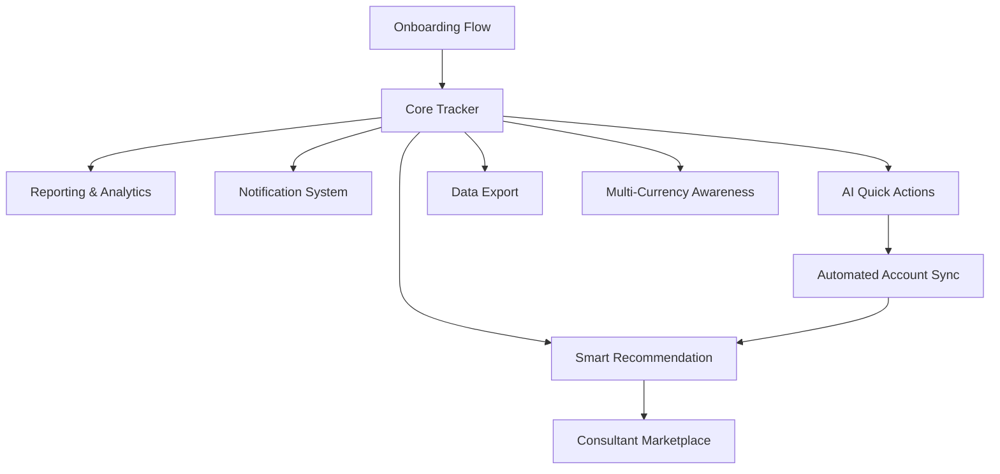

### 10.1 Core Tracker

#### Requirements

1. Pengguna dapat membuat transaksi pemasukan, pengeluaran, dan transfer secara manual.
2. Pengguna dapat mengelola wallet dan saldo awal.
3. Pengguna dapat menetapkan budgeting per kategori.
4. Pengguna dapat membuat goals tabungan.
5. Pengguna dapat membuat pengingat tagihan rutin.

#### Acceptance Criteria

1. Pengguna dapat menyimpan transaksi manual dengan minimal kategori, nominal, tanggal, dan wallet.
2. Perubahan transaksi final memperbarui saldo wallet terkait.
3. Transfer antar-wallet tercatat sebagai perpindahan nilai, bukan pengeluaran ganda.
4. Pengguna dapat melihat sisa budget per kategori dalam periode aktif.
5. Pengingat tagihan dapat dibuat, diubah, dan dinonaktifkan tanpa menghapus histori transaksi.

### 10.2 Onboarding Flow

#### Requirements

1. Pengguna baru dapat mendaftar dan login dengan alur yang sederhana.
2. Setelah registrasi, pengguna dipandu untuk membuat wallet pertama dan mengisi saldo awal.
3. Pengguna dapat memilih kategori pengeluaran yang relevan untuk personalisasi awal.
4. Pengguna dapat melewati langkah opsional tanpa memblokir akses ke fitur utama.
5. Progress onboarding harus jelas dan tidak membuat user merasa terjebak.

#### Acceptance Criteria

1. User baru dapat menyelesaikan onboarding dalam waktu kurang dari 3 menit.
2. Minimal satu wallet terbuat dan saldo awal terisi sebelum user masuk ke dashboard.
3. Pengguna dapat skip langkah opsional (misal: pilih kategori, set budget awal) dan mengerjakannya nanti.
4. State onboarding disimpan, sehingga user yang keluar di tengah bisa melanjutkan saat kembali.
5. Setelah onboarding selesai, user langsung melihat dashboard dengan data awalnya.

### 10.3 Notification System

#### Requirements

1. Pengguna menerima notifikasi untuk pengingat tagihan yang mendekati jatuh tempo.
2. Pengguna menerima notifikasi saat ada DraftTransaction baru yang perlu di-review.
3. Pengguna menerima notifikasi saat budget mendekati atau melewati batas.
4. Pengguna menerima notifikasi terkait status sesi konsultasi.
5. Pengguna dapat mengatur preferensi jenis notifikasi yang ingin diterima.
6. Notifikasi harus bisa dilihat di notification center dalam aplikasi.

#### Acceptance Criteria

1. Notifikasi tagihan dikirim minimal H-3, H-1, dan H-day dari jatuh tempo.
2. Notifikasi draft review muncul dalam waktu kurang dari 1 menit setelah draft dibuat.
3. Notifikasi budget alert muncul saat pengeluaran mencapai 80% dan 100% dari batas.
4. Setiap notifikasi memiliki deep link ke screen atau flow yang relevan.
5. Pengguna dapat mematikan jenis notifikasi tertentu tanpa menghilangkan semua notifikasi.
6. Notification center menampilkan riwayat notifikasi dengan status read/unread.
7. Tidak ada notifikasi spam; satu event hanya menghasilkan satu notifikasi.

### 10.4 Reporting And Analytics

#### Requirements

1. Pengguna dapat melihat ringkasan pemasukan dan pengeluaran per periode (mingguan, bulanan).
2. Pengguna dapat melihat breakdown pengeluaran per kategori dalam bentuk chart.
3. Pengguna dapat membandingkan pengeluaran bulan ini dengan bulan sebelumnya.
4. Pengguna dapat melihat trend tabungan atau net worth dari waktu ke waktu.
5. Laporan harus tersedia tanpa effort tambahan dari pengguna; sistem menghitung otomatis dari data transaksi.

#### Acceptance Criteria

1. Laporan bulanan menampilkan total income, total expense, dan net balance.
2. Breakdown kategori menampilkan minimal top 5 kategori pengeluaran terbesar.
3. Trend chart menampilkan minimal data 3 bulan terakhir jika tersedia.
4. Laporan dapat difilter berdasarkan wallet tertentu atau semua wallet.
5. Laporan tidak menampilkan data dari DraftTransaction; hanya Transaction final.
6. Laporan auto-refresh saat ada transaksi baru tanpa perlu reload manual.

### 10.5 Automated Account Sync

#### Requirements

1. Pengguna dapat menghubungkan akun finansial melalui provider pihak ketiga yang memenuhi syarat bisnis dan kepatuhan.
2. Transaksi hasil sinkronisasi masuk sebagai DraftTransaction, bukan Transaction final.
3. Pengguna melihat status koneksi dan status sinkronisasi terbaru.
4. Sistem membantu kategorisasi awal transaksi yang masuk.

#### Acceptance Criteria

1. Setiap transaksi hasil sinkronisasi memiliki status awal `review_needed`.
2. Pengguna dapat meninjau, mengonfirmasi, mengedit, atau menolak DraftTransaction.
3. Tidak ada auto-commit transaksi hasil sinkronisasi.
4. Pengguna dapat mengetahui kapan sinkronisasi terakhir berhasil, gagal, atau membutuhkan re-auth.
5. DraftTransaction yang ditolak tidak memengaruhi saldo final.

### 10.6 AI Quick Actions

#### Requirements

1. Pengguna dapat membuat draft transaksi melalui chat, voice, atau foto struk.
2. Sistem mengekstrak field penting dari input bebas menjadi DraftTransaction.
3. Sistem selalu menampilkan langkah konfirmasi sebelum data menjadi transaksi final.

#### Acceptance Criteria

1. Smart chat mampu mengubah instruksi bahasa natural menjadi draft yang bisa diedit.
2. Voice input menghasilkan draft yang dapat dikoreksi sebelum disimpan.
3. OCR struk menghasilkan draft minimal merchant, total, dan tanggal jika tersedia.
4. Pengguna selalu memiliki opsi `OK`, `Edit`, atau `Cancel` sebelum commit.
5. Draft yang dibatalkan tidak tersimpan sebagai transaksi final.

### 10.7 Data Export

#### Requirements

1. Pengguna dapat mengekspor data transaksi dalam format yang dapat dibaca (CSV).
2. Pengguna dapat memilih rentang waktu dan wallet untuk ekspor.
3. Pengguna dapat mengekspor laporan bulanan dalam format PDF.
4. Fitur ini mendukung hak portabilitas data pengguna sesuai UU PDP.

#### Acceptance Criteria

1. Ekspor CSV mencakup minimal: tanggal, kategori, nominal, wallet, catatan.
2. Ekspor dapat di-trigger dari screen reporting atau dari settings.
3. File hasil ekspor dikirim langsung ke device tanpa upload ke server pihak ketiga.
4. Ekspor berjalan di background dan memberi notifikasi saat selesai.
5. Data yang diekspor hanya mencakup Transaction final, bukan DraftTransaction.

### 10.8 Smart Recommendation

#### Requirements

1. Sistem mendeteksi wallet yang memenuhi syarat untuk menerima nudge.
2. Recommendation hanya berfokus pada instrumen yang aman dan terkurasi.
3. Rekomendasi muncul secara kontekstual, bukan mengganggu seluruh pengalaman aplikasi.
4. Pengguna dapat melanjutkan dari nudge ke penjelasan AI yang lebih mendalam.

#### Acceptance Criteria

1. Recommendation hanya muncul pada konteks wallet yang relevan.
2. Pengguna dapat menutup nudge tanpa memblokir penggunaan aplikasi.
3. Penjelasan AI menampilkan manfaat, risiko, dan sifat edukatif dari instrumen yang disarankan.
4. Produk tidak merekomendasikan kripto individu, saham spekulatif, judi, atau instrumen di luar whitelist kebijakan.
5. Status interaksi recommendation minimal dapat dilacak sebagai `eligible`, `dismissed`, atau `clicked`.

### 10.9 Multi-Currency Awareness

#### Requirements

1. Pengguna dapat membuat wallet dengan mata uang selain IDR (minimal USD).
2. Wallet non-IDR menampilkan saldo dalam mata uang aslinya.
3. Total balance di dashboard menampilkan aggregasi dalam IDR menggunakan kurs referensi.
4. Kurs referensi bersifat display-only dan bukan untuk tujuan trading.

#### Acceptance Criteria

1. User dapat memilih currency saat membuat wallet baru (IDR sebagai default).
2. Total balance di home screen menampilkan semua wallet di-convert ke IDR.
3. Kurs referensi diperbarui minimal harian dari sumber terpercaya.
4. Kurs yang dipakai untuk display harus ditampilkan sebagai informasi ke user.
5. Sistem tidak menyediakan fitur konversi/transfer antar mata uang.
6. Asset distribution chart tetap menampilkan proporsi yang benar dengan konversi IDR.

### 10.10 Consultant Marketplace

#### Requirements

1. Pengguna dapat melihat daftar konsultan terverifikasi dari berbagai spesialisasi (financial planning, tax, government compliance).
2. Pengguna dapat memilih paket layanan konsultasi berdasarkan kebutuhan.
3. Pengguna dapat memesan sesi konsultasi dengan slot waktu yang tersedia.
4. Pengguna dapat memberikan akses ClientVault kepada konsultan **keuangan terverifikasi** selama sesi aktif.
5. Pengguna dapat mengunggah dokumen tambahan untuk konsultan non-keuangan.
6. Booking flow harus melewati 4 tahap: pilih layanan → pilih waktu → pre-konsultasi → konfirmasi pembayaran.

#### Service Tiers

| Package | Channel | Durasi Akses | Deliverable | Range Harga |
| --- | --- | --- | --- | --- |
| **Quick Consult** | 1× chat session (60 min) | 1 hari | Post-session summary | Rp 75K-150K |
| **Deep Dive** | 3× chat sessions + 1× video call (45 min) | 7 hari | Financial review + action plan | Rp 300K-500K |
| **Full Planning** | Unlimited chat 30 hari + 3× video call + 1× in-person (opsional) | 30 hari | Full financial review + personalized plan | Rp 800K-1.5M |

Aturan service tier:

1. Harga spesifik **ditentukan per consultant** dalam range tier.
2. Video call menggunakan integrasi pihak ketiga (Zoom/Google Meet) pada fase awal.
3. In-person hanya tersedia pada tier Full Planning dan bergantung pada ketersediaan consultant.
4. Setiap tier memiliki deliverable yang jelas sehingga user tahu apa yang didapat.

#### Consultant Types

| Type | Verification | ClientVault Access | Document Upload |
| --- | --- | --- | --- |
| Financial Planner | Sertifikasi keuangan (CFP, etc.) | ✅ Selama sesi aktif, dicabut saat selesai | Opsional |
| Tax Consultant | Sertifikasi pajak/legal | ❌ Tidak ada akses keuangan app | ✅ Wajib (SPT, NPWP, dll) |
| Government/Compliance | Sertifikasi relevan | ❌ Tidak ada akses keuangan app | ✅ Wajib (dokumen terkait) |

Aturan data access per consultant type:

1. **Financial Planner** — dapat melihat dashboard keuangan user (via ClientVault) **hanya selama sesi aktif**. Setelah sesi selesai, akses dicabut otomatis.
2. **Consultant non-keuangan** — **tidak pernah** mendapat akses ke data keuangan app. Mereka hanya mendapat dokumen yang secara eksplisit di-upload oleh user di pre-konsultasi.

#### Booking Flow (4 Steps)

| Step | Halaman | Aksi User |
| --- | --- | --- |
| 1 | **Booking — Layanan** | Pilih paket layanan (Quick Consult / Deep Dive / Full Planning) |
| 2 | **Booking — Waktu** | Pilih tanggal dan slot waktu yang tersedia dari jadwal consultant |
| 3 | **Pre-Konsultasi** | Pilih topik, tulis deskripsi masalah, tulis harapan setelah sesi, upload dokumen (opsional), setuju agreement data policy |
| 4 | **Konfirmasi Pembayaran** | Review rincian booking, pilih metode pembayaran, konfirmasi bayar |

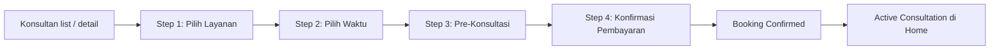

#### Acceptance Criteria

1. Listing konsultan menampilkan spesialisasi, tipe (financial/tax/government), sertifikasi, rating, dan range harga.
2. Booking flow dapat dimulai dari halaman consultant list (CTA langsung) maupun dari halaman consultant detail.
3. Setiap tier layanan menampilkan benefit, harga, dan durasi akses yang jelas.
4. Slot waktu hanya menampilkan jadwal yang masih available dari consultant terpilih.
5. Pre-konsultasi menyediakan pilihan topik yang sesuai dengan expertise consultant.
6. Pre-konsultasi menyediakan input notes (deskripsi masalah dan harapan setelah sesi).
7. Pre-konsultasi menyediakan upload dokumen (opsional, max 5 file, format PDF/image).
8. Pre-konsultasi menyediakan agreement checkbox terkait kebijakan penggunaan data saat sesi.
9. Konfirmasi pembayaran menampilkan rincian lengkap (consultant, layanan, waktu, topik, total harga).
10. Booking hanya dianggap aktif setelah pembayaran berhasil.
11. Consent akses ClientVault hanya berlaku untuk consultant **financial planner terverifikasi** dan hanya selama sesi aktif.
12. Setelah booking selesai, section "Active Consultation" muncul di home screen.
13. Konsultan non-keuangan tidak dapat melihat data pengguna di luar dokumen yang di-upload user.

## 11. Delivery-Level Acceptance Criteria

Kriteria ini berlaku di level fase development, bukan hanya di level fitur.

### Frontend-Only Phase Acceptance

1. Semua screen utama untuk app surface aktif telah tersedia.
2. Seluruh flow user dapat dijalankan dengan mock data atau local fixtures.
3. Tidak ada backend implementation, real auth integration, atau provider integration yang dikerjakan pada fase ini.
4. MockContract untuk flow kritis sudah cukup jelas untuk menjadi acuan backend phase.
5. UI states untuk loading, empty, success, dan error sudah terwakili minimal pada flow utama.
6. Untuk fase mobile saat ini, cakupan minimum harus sudah mencakup onboarding, dashboard, wallet overview, planning cluster, consultant discovery and detail, transaction entry and history, reporting, dan notification center.

### Backend And Integration Phase Acceptance

1. Backend implementation mengikuti frontend flow dan MockContract yang sudah approved.
2. Integrasi real API, database, auth, dan provider dilakukan tanpa mengubah intent UX utama secara sepihak.
3. MockContract digantikan atau dipetakan ke real API contract secara eksplisit.
4. Fitur end-to-end berjalan sesuai flow frontend yang telah disetujui.

### Testing And Bug Fixing Phase Acceptance

1. Flow utama app surface aktif lulus pengujian end-to-end.
2. Bug blocker dan bug high severity diselesaikan sebelum pindah ke app surface berikutnya.
3. Tidak ada keputusan product flow besar yang dibuka ulang kecuali ditemukan blocker nyata.

## 12. Core User Journeys

### Journey 1: Onboarding

`Buka aplikasi pertama kali -> Register atau login -> Setup wallet pertama -> Isi saldo awal -> Pilih kategori relevan (opsional) -> Masuk dashboard`

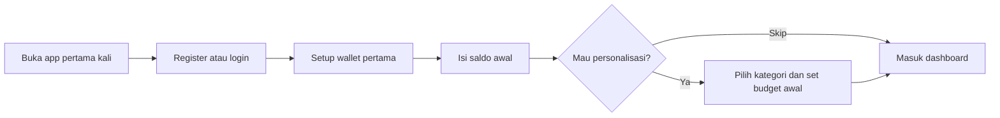

### Journey 2: Manual Entry

`Buka aplikasi -> Tambah transaksi -> Isi field wajib -> Pilih wallet -> Simpan -> Saldo terbarui`

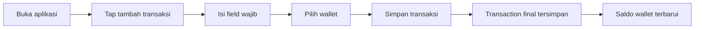

### Journey 3: AI Draft Entry

`Buka AI input -> Kirim perintah teks/suara/foto -> Sistem membuat DraftTransaction -> User review -> OK/Edit/Cancel -> Jika OK maka menjadi Transaction`

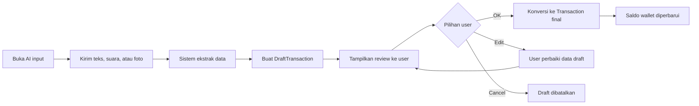

### Journey 4: Bank Sync Review

`Hubungkan akun -> Provider mengirim transaksi -> Sistem membuat DraftTransaction -> User menerima notifikasi -> User review -> Confirm/Edit/Reject`

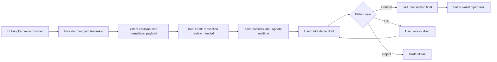

### Journey 5: Wallet Recommendation

`Buka detail wallet -> Sistem menilai eligibility -> Nudge tampil jika relevan -> User dismiss atau klik -> Jika klik maka masuk ke penjelasan AI -> User lanjut melihat opsi produk`

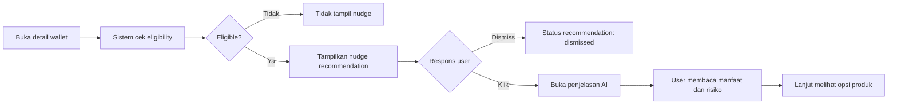

### Journey 6: Consultation Booking

`Pilih konsultan -> Pilih layanan -> Pilih slot waktu -> Lakukan pembayaran -> Sesi terkonfirmasi -> Consent ClientVault saat diperlukan -> Jalankan sesi`

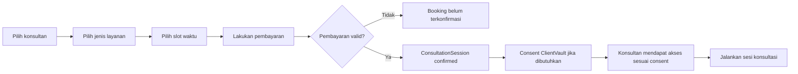

### Journey 7: View Monthly Report

`Buka reporting -> Pilih periode -> Lihat income vs expense -> Drill down ke kategori -> Export jika diperlukan`

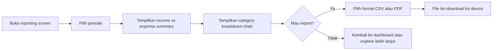

### Journey 8: Notification Flow

`Sistem mendeteksi event -> Kirim notifikasi -> User tap notifikasi -> Deep link ke screen terkait -> User take action`

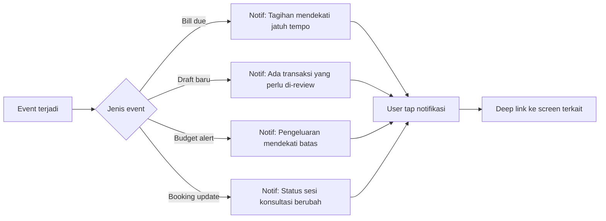

## 13. Success Metrics

| Metric                       | Definition                                                                     | Target MVP Baseline |
| ---------------------------- | ------------------------------------------------------------------------------ | ------------------- |
| Onboarding Completion Rate   | Persentase user baru yang menyelesaikan onboarding sampai dashboard            | > 70%               |
| Accuracy Rate                | Persentase DraftTransaction AI yang dikonfirmasi tanpa edit besar              | > 60%               |
| Sync Success Rate            | Persentase koneksi provider yang berhasil sinkron dan menghasilkan draft valid | > 80%               |
| Review Completion Rate       | Persentase draft hasil sync yang benar-benar ditinjau pengguna                 | > 50%               |
| Nudge CTR                    | Persentase recommendation yang diklik saat memenuhi syarat                     | > 10%               |
| Time Saved                   | Selisih median waktu input manual vs AI/sync-assisted flow                     | > 40% faster        |
| Weekly Active Tracking Users | Pengguna yang mencatat atau mereview transaksi minimal 3 kali seminggu         | Track baseline      |
| Booking Conversion           | Persentase active tracker users yang melakukan booking konsultasi              | > 5%                |
| Reporting View Rate          | Persentase MAU yang membuka reporting minimal 1x per bulan                     | > 30%               |
| Notification Open Rate       | Persentase notifikasi yang di-tap oleh user                                    | > 25%               |
| D7 Retention                 | Persentase user yang kembali dalam 7 hari setelah onboarding                   | > 40%               |
| Data Export Usage             | Persentase MAU yang melakukan export minimal 1x per bulan                     | Track baseline      |

## 14. RACI Matrix

| Activity | Product Owner | Engineering Lead | Design | QA | Security |
| --- | --- | --- | --- | --- | --- |
| Feature prioritization | **A** | C | C | I | I |
| PRD approval | **A/R** | C | C | I | I |
| UX flow design | C | C | **A/R** | I | I |
| Frontend implementation | I | **A/R** | C | I | I |
| MockContract approval | **A** | **R** | C | I | I |
| Backend implementation | I | **A/R** | I | I | C |
| Security review | C | C | I | I | **A/R** |
| QA test execution | I | C | I | **A/R** | I |
| Provider selection | **A** | C | I | I | C |
| Go/no-go per wave | **A** | **R** | C | **R** | **R** |

Legend: **R** = Responsible, **A** = Accountable, **C** = Consulted, **I** = Informed.

## 15. Product Risk Register

| # | Risk | Likelihood | Impact | Mitigation |
| --- | --- | --- | --- | --- |
| 1 | **Low adoption** — user tidak mau input manual, merasa masih ribet | Medium | High | Onboarding flow yang berfokus ke quick-win (setup 1 wallet, 1 transaksi); AI quick actions mengurangi friction |
| 2 | **Provider coverage gap** — institusi keuangan target user tidak di-cover provider | High | High | Survey institusi target user sebelum pilih provider; sediakan manual input sebagai fallback |
| 3 | **Regulatory risk** — UU PDP enforcement bisa berubah sebelum launch | Medium | High | Implement data export, consent management, dan audit trail dari awal; konsultasi legal periodik |
| 4 | **AI accuracy rendah** — OCR/NLP gagal parsing dengan benar | Medium | Medium | Draft-first approach (tidak auto-commit); user selalu review; iterasi model berdasarkan feedback |
| 5 | **Consultant supply** — kurang konsultan mau onboard ke platform baru | High | Medium | Mulai dengan 10-20 konsultan curated; bangun value proposition lewat data client yang sudah organized |
| 6 | **Security breach** — data finansial user bocor | Low | Critical | Implement multi-layer security; tidak simpan credential provider; regular security audit; incident response plan |
| 7 | **Feature creep** — terlalu banyak fitur masuk MVP, delivery delay | Medium | High | Enforcekan MoSCoW strictly; sequential delivery; jangan mulai surface baru sebelum yang aktif selesai |
| 8 | **Multi-currency complexity** — edge cases konversi menyulitkan reporting | Medium | Medium | Limit ke display-only; kurs referensi harian; tidak support trading/conversion |

## 16. Compliance And Business Constraints

1. Sistem dilarang menyimpan username, PIN, atau password rekening pengguna.
2. Semua aliran data finansial harus mengikuti prinsip minimal data access.
3. Sistem dilarang melakukan auto-commit transaksi dari AI maupun sinkronisasi eksternal.
4. Semua akses konsultan ke data finansial pengguna harus berbasis consent aktif.
5. Seluruh rekomendasi harus mengikuti kebijakan anti-spekulasi produk.
6. Sistem harus mendukung kebutuhan audit trail untuk aktivitas konsultasi dan perubahan status draft.
7. Produk harus dirancang selaras dengan UU PDP dan kebutuhan kepatuhan yang berlaku untuk data finansial.
8. Pengguna harus dapat mengekspor dan menghapus data pribadinya sesuai hak portabilitas data.
9. Notifikasi tidak boleh bersifat manipulatif atau mendorong FOMO yang tidak berbasis data nyata.

## 17. Assumptions

1. End-state produk terdiri dari empat app surface: mobile, admin, consultant, dan landing.
2. Delivery dilakukan berurutan, bukan paralel.
3. Fase aktif pertama adalah `mobile_frontend`.
4. Pada fase frontend-only, MockContract diperbolehkan dan direkomendasikan.
5. Backend implementation, auth integration, database integration, dan provider integration ditunda sampai frontend app terkait selesai.
6. User base awal mayoritas berbahasa Indonesia dengan device Android mid-range.
7. Multi-currency awalnya hanya support IDR dan USD, currency lain ditambahkan sesuai demand.
8. Notification delivery pada MVP menggunakan in-app notification; push notification di-evaluate setelah base retention terukur.

## 18. Open Questions

| # | Question | Decision Owner | Deadline | Status |
| --- | --- | --- | --- | --- |
| 1 | Provider data finansial mana yang akan dipilih sebagai primary provider untuk auto-sync MVP? | Product Owner + Engineering Lead | Sebelum `mobile_backend_integration` dimulai | **Narrowed** — Kandidat utama: **Brick** dan **Ayoconnect** (aggregator bank + e-wallet). Coverage investasi (saham/crypto) perlu evaluasi terpisah. |
| 2 | Payment gateway mana yang akan dipilih sebagai primary provider untuk booking? | Product Owner + Engineering Lead | Sebelum `mobile_backend_integration` dimulai | **Narrowed** — Kandidat: **Midtrans** dan **Xendit**. Pilih berdasarkan dukungan QRIS, transfer bank, dan pricing. |
| 3 | Berapa nilai threshold Idle Cash per jenis wallet pada launch awal? | Product Owner | Sebelum Recommendation flow di-implement | Open |
| 4 | Sertifikasi konsultan apa saja yang wajib untuk lolos verifikasi marketplace? Per tipe consultant (financial, tax, government). | Product Owner + Legal | Sebelum `consultant_frontend` dimulai | Open |
| 5 | ~~Apakah seluruh konsultasi video dilakukan in-app atau lewat integrasi pihak ketiga pada fase awal?~~ | Product Owner + Engineering Lead | — | **Resolved** — Fase awal menggunakan **third-party** (Zoom/Google Meet). Consultant share meeting link. |
| 6 | Kurs referensi multi-currency diambil dari provider mana? | Engineering Lead | Sebelum Multi-Currency di-implement di backend | Open |
| 7 | Apakah push notification diaktifkan di MVP atau hanya in-app notification? | Product Owner | Sebelum `mobile_backend_integration` dimulai | Open |
