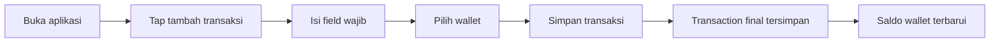
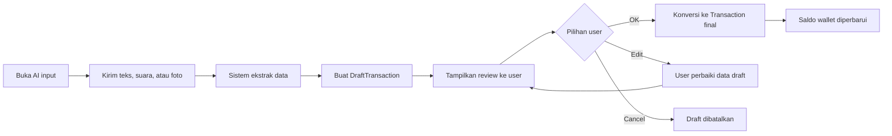
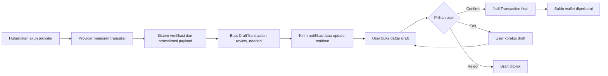
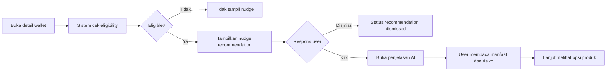
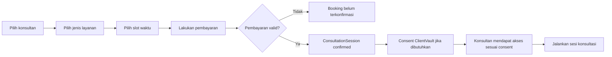

# Product Requirements Document

| Field            | Value                                                  |
| ---------------- | ------------------------------------------------------ |
| Project          | HaloFin                                                |
| Document Version | 2.2                                                    |
| Status           | Active Draft                                           |
| Last Updated     | 2026-03-09                                             |
| Owner Product    | Rio Ferdana Sudrajat                                   |
| Audience         | Founder, Product, Design, Engineering, AI Coding Agent |

## Change Summary

| Date       | Change                                                                                                                         |
| ---------- | ------------------------------------------------------------------------------------------------------------------------------ |
| 2026-03-09 | Clarified current mobile frontend cluster for Wave 1 without introducing implementation detail.                                |
| 2026-03-09 | Added application inventory, delivery phases, mobile-first frontend-first strategy, and delivery-level acceptance criteria.    |
| 2026-03-08 | Reframed PRD to be product-only, added canonical terminology, acceptance criteria, non-goals, assumptions, and open questions. |

## 1. Product Summary

HaloFin adalah aplikasi manajemen keuangan pribadi yang menggabungkan pencatatan manual, percepatan input berbasis AI, sinkronisasi data finansial dari provider pihak ketiga, rekomendasi finansial kontekstual, dan marketplace konsultasi dengan ahli terverifikasi.

Tujuan produk adalah membantu pengguna:

1. Mencatat keuangan harian dengan cepat tanpa kehilangan kontrol.
2. Melihat posisi uang lintas wallet secara lebih akurat.
3. Mendapatkan dorongan tindakan finansial yang aman dan relevan.
4. Terhubung ke konsultan yang kredibel saat membutuhkan bantuan manusia.

## 2. Application Inventory

HaloFin pada end-state produk terdiri dari empat application surface yang berbeda.

| AppSurface   | Primary Audience        | Primary Purpose                                                               | Delivery Priority |
| ------------ | ----------------------- | ----------------------------------------------------------------------------- | ----------------- |
| `mobile`     | End user                | Pencatatan, wallet, AI draft, sync review, recommendation, booking konsultasi | 1                 |
| `admin`      | Internal admin team     | Verifikasi konsultan, monitoring operasional, audit support                   | 2                 |
| `consultant` | Konsultan terverifikasi | Kelola sesi, lihat client data yang diizinkan, jalankan workflow konsultasi   | 3                 |
| `landing`    | Public visitor          | Pengenalan bisnis, edukasi produk, akuisisi user atau lead                    | 4                 |

Aturan prioritas delivery:

1. Mobile app adalah aplikasi utama.
2. Admin app baru dikerjakan setelah mobile app menyelesaikan frontend, backend/integration, dan testing/bug fixing.
3. Consultant app baru dikerjakan setelah admin app melewati urutan fase yang sama.
4. Landing page dikerjakan paling akhir pada rangkaian ini.

## 3. Product Vision And Principles

### Vision

Menjadi asisten keuangan yang paling akurat dan terpercaya untuk Gen Z dan Milenial Indonesia dalam membangun kebiasaan finansial yang sehat.

### Product Principles

1. AI mempercepat, bukan mengambil alih keputusan pengguna.
2. Semua transaksi yang berasal dari AI atau sinkronisasi eksternal harus melewati validasi pengguna.
3. Rekomendasi finansial harus edukatif, tidak manipulatif, dan tidak mendorong spekulasi.
4. Kepercayaan pengguna lebih penting daripada automasi yang agresif.
5. Data yang dibagikan ke konsultan harus berbasis consent yang eksplisit dan dapat dicabut.
6. Urutan delivery tidak boleh membalik kontrak produk yang sudah disetujui dari frontend.

## 4. Goals And Non-Goals

### Product Goals

1. Mengurangi friksi pencatatan transaksi harian.
2. Meningkatkan akurasi posisi kas lintas wallet.
3. Mendorong pengguna bertindak pada dana mengendap secara aman.
4. Menyediakan jalur konsultasi dari insight ke aksi nyata.
5. Menjaga agar urutan delivery produk tetap fokus dan tidak mengerjakan semua surface sekaligus.

### Non-Goals For This MVP

1. Menjadi aplikasi untuk trading aktif atau spekulasi aset berisiko tinggi.
2. Menjalankan transfer dana keluar dari rekening pengguna.
3. Mengotomatiskan commit transaksi tanpa review pengguna.
4. Menyediakan fitur akuntansi bisnis penuh.
5. Mengerjakan backend implementation saat fase aktif masih frontend-only.

## 5. Target Users And Jobs To Be Done

### Primary User: End Customer

- Profil: First-jobber atau young professional dengan beberapa rekening bank dan e-wallet.
- Perilaku: Pengeluaran kecil sering tidak tercatat; ingin mulai menabung atau berinvestasi tetapi belum disiplin.
- Job to be done: "Bantu saya mencatat dan memahami uang saya dengan cepat, lalu arahkan saya ke langkah yang aman saat saya siap."

### Secondary User: Consultant

- Profil: Perencana keuangan atau konsultan tersertifikasi yang membutuhkan data klien yang lebih rapi.
- Perilaku: Ingin mendapat klien baru dan mengurangi waktu mengumpulkan konteks dasar kondisi finansial klien.
- Job to be done: "Bantu saya menerima klien baru dan menganalisis kondisi mereka dengan data yang sudah disetujui klien."

### Internal User: Admin Team

- Profil: Tim operasional internal yang memverifikasi konsultan dan memantau aktivitas sistem.
- Job to be done: "Bantu saya menjalankan kontrol operasional dan audit tanpa mengganggu pengalaman end user."

## 6. Problems To Solve

| Problem                                           | Why It Matters                                       | Product Response                                                           |
| ------------------------------------------------- | ---------------------------------------------------- | -------------------------------------------------------------------------- |
| Manual input terasa ribet                         | Pengguna berhenti mencatat transaksi kecil           | Sediakan input manual cepat, smart chat, voice, dan OCR dengan validasi    |
| Saldo antar aplikasi tidak sinkron                | Pengguna tidak percaya pada laporan keuangan pribadi | Sediakan sinkronisasi transaksi dari provider pihak ketiga ke draft review |
| Dana mengendap tidak dimanfaatkan                 | Pengguna kehilangan kesempatan bertumbuh secara aman | Sediakan recommendation dan nudge berbasis konteks wallet                  |
| Kategori transaksi otomatis sering salah          | Pengguna kehilangan kepercayaan pada sistem          | Gunakan draft transaction dan human-in-the-loop                            |
| Konsultan yang kredibel sulit dibedakan           | Risiko advice menyesatkan tinggi                     | Sediakan marketplace ahli terverifikasi                                    |
| Konsultasi tanpa data kurang efektif              | Diagnosis dan saran menjadi generik                  | Sediakan client vault berbasis consent                                     |
| Delivery semua surface sekaligus terlalu berisiko | Fokus tim pecah dan integrasi mudah kacau            | Terapkan mobile-first, frontend-first, lalu sequential app delivery        |

## 7. Canonical Terminology

Gunakan istilah berikut secara konsisten di seluruh dokumen produk dan teknis.

| Term                | Definition                                                                                                              |
| ------------------- | ----------------------------------------------------------------------------------------------------------------------- |
| Wallet              | Tempat penyimpanan saldo yang dilihat pengguna, seperti cash, rekening bank, e-wallet, atau akun investasi.             |
| Transaction         | Catatan finansial final yang sudah dikonfirmasi pengguna dan memengaruhi saldo.                                         |
| DraftTransaction    | Hasil input AI atau sinkronisasi eksternal yang masih menunggu review pengguna.                                         |
| ProviderConnection  | Hubungan aktif antara akun pengguna dan provider data finansial pihak ketiga.                                           |
| Recommendation      | Saran kontekstual yang muncul berdasarkan kondisi wallet atau profil pengguna.                                          |
| ConsultationSession | Sesi layanan antara pengguna dan konsultan, termasuk chat atau video call.                                              |
| ClientVault         | Ringkasan data finansial pengguna yang dapat diakses konsultan hanya selama consent aktif.                              |
| Idle Cash           | Dana pada wallet yang dianggap mengendap dan layak diberi nudge sesuai aturan produk.                                   |
| AppSurface          | Salah satu aplikasi produk: `mobile`, `admin`, `consultant`, atau `landing`.                                            |
| DeliveryPhase       | Fase delivery resmi yang dikerjakan tim pada urutan implementasi tertentu.                                              |
| MockContract        | Bentuk request/response placeholder yang dipakai frontend selama fase frontend-only sebelum real API diimplementasikan. |

## 8. Delivery Strategy

Strategi delivery HaloFin bersifat berurutan dan terfokus. Satu app surface diselesaikan melalui tiga fase besar sebelum pindah ke app berikutnya.

### Delivery Rules

1. Mulai dari `mobile` sebagai app utama.
2. Selama fase frontend-only, tim hanya membangun UI, interaction flow, local state, dan mock contracts.
3. Backend implementation dan integrasi real API dikerjakan hanya setelah seluruh frontend flow untuk app surface aktif disetujui.
4. Setelah backend dan integrasi selesai, fase berikutnya adalah testing dan bug fixing.
5. Hanya setelah satu app surface melewati tiga fase itu, tim pindah ke app surface berikutnya.

### Official DeliveryPhase

| DeliveryPhase                    | Description                                                                          |
| -------------------------------- | ------------------------------------------------------------------------------------ |
| `mobile_frontend`                | Bangun seluruh mobile UI dan flow dengan mock contracts tanpa backend implementation |
| `mobile_backend_integration`     | Implementasi backend dan integrasi berdasarkan frontend mobile yang sudah approved   |
| `mobile_test_fix`                | QA, bug fixing, stabilisasi mobile                                                   |
| `admin_frontend`                 | Bangun admin app frontend-only dengan mock contracts                                 |
| `admin_backend_integration`      | Implementasi backend dan integrasi untuk admin app                                   |
| `admin_test_fix`                 | QA dan bug fixing admin app                                                          |
| `consultant_frontend`            | Bangun consultant app frontend-only dengan mock contracts                            |
| `consultant_backend_integration` | Implementasi backend dan integrasi untuk consultant app                              |
| `consultant_test_fix`            | QA dan bug fixing consultant app                                                     |
| `landing_frontend`               | Bangun landing page setelah surface operasional utama selesai                        |

```mermaid
flowchart LR
    A["mobile_frontend"] --> B["mobile_backend_integration"]
    B --> C["mobile_test_fix"]
    C --> D["admin_frontend"]
    D --> E["admin_backend_integration"]
    E --> F["admin_test_fix"]
    F --> G["consultant_frontend"]
    G --> H["consultant_backend_integration"]
    H --> I["consultant_test_fix"]
    I --> J["landing_frontend"]
```

## 9. Release Waves

### Wave 1: Mobile App

Target outcome:

1. Mobile frontend complete dengan mock contracts.
2. Mobile backend dan integrasi complete berdasarkan frontend yang sudah disetujui.
3. Mobile stabil setelah testing dan bug fixing.

Validasi produk minimum pada fase mobile frontend saat ini mencakup cluster berikut:

1. Dashboard atau home
2. Wallet overview
3. Planning cluster: budget, goals, dan bills
4. Consult discovery dan consult detail
5. Transaction entry dan transaction history

### Wave 2: Admin App

Target outcome:

1. Admin workflow disusun setelah kebutuhan mobile operational support jelas.
2. Admin frontend dan backend mengikuti pola delivery yang sama.

### Wave 3: Consultant App

Target outcome:

1. Consultant workflow dibangun setelah kebutuhan data sharing dan booking flow telah tervalidasi dari mobile.

### Wave 4: Landing Page

Target outcome:

1. Landing page menyesuaikan positioning bisnis dan value proposition yang sudah tervalidasi dari aplikasi inti.

## 10. MVP Scope

Semua fitur di bawah tetap termasuk MVP produk. Prioritas implementasi mengikuti delivery strategy, tetapi definisi produk tidak berubah.

### 10.1 Core Tracker

#### Requirements

1. Pengguna dapat membuat transaksi pemasukan, pengeluaran, dan transfer secara manual.
2. Pengguna dapat mengelola wallet dan saldo awal.
3. Pengguna dapat menetapkan budgeting per kategori.
4. Pengguna dapat membuat goals tabungan.
5. Pengguna dapat membuat pengingat tagihan rutin.

#### Acceptance Criteria

1. Pengguna dapat menyimpan transaksi manual dengan minimal kategori, nominal, tanggal, dan wallet.
2. Perubahan transaksi final memperbarui saldo wallet terkait.
3. Transfer antar-wallet tercatat sebagai perpindahan nilai, bukan pengeluaran ganda.
4. Pengguna dapat melihat sisa budget per kategori dalam periode aktif.
5. Pengingat tagihan dapat dibuat, diubah, dan dinonaktifkan tanpa menghapus histori transaksi.

### 10.2 Automated Account Sync

#### Requirements

1. Pengguna dapat menghubungkan akun finansial melalui provider pihak ketiga yang memenuhi syarat bisnis dan kepatuhan.
2. Transaksi hasil sinkronisasi masuk sebagai DraftTransaction, bukan Transaction final.
3. Pengguna melihat status koneksi dan status sinkronisasi terbaru.
4. Sistem membantu kategorisasi awal transaksi yang masuk.

#### Acceptance Criteria

1. Setiap transaksi hasil sinkronisasi memiliki status awal `review_needed`.
2. Pengguna dapat meninjau, mengonfirmasi, mengedit, atau menolak DraftTransaction.
3. Tidak ada auto-commit transaksi hasil sinkronisasi.
4. Pengguna dapat mengetahui kapan sinkronisasi terakhir berhasil, gagal, atau membutuhkan re-auth.
5. DraftTransaction yang ditolak tidak memengaruhi saldo final.

### 10.3 AI Quick Actions

#### Requirements

1. Pengguna dapat membuat draft transaksi melalui chat, voice, atau foto struk.
2. Sistem mengekstrak field penting dari input bebas menjadi DraftTransaction.
3. Sistem selalu menampilkan langkah konfirmasi sebelum data menjadi transaksi final.

#### Acceptance Criteria

1. Smart chat mampu mengubah instruksi bahasa natural menjadi draft yang bisa diedit.
2. Voice input menghasilkan draft yang dapat dikoreksi sebelum disimpan.
3. OCR struk menghasilkan draft minimal merchant, total, dan tanggal jika tersedia.
4. Pengguna selalu memiliki opsi `OK`, `Edit`, atau `Cancel` sebelum commit.
5. Draft yang dibatalkan tidak tersimpan sebagai transaksi final.

### 10.4 Smart Recommendation

#### Requirements

1. Sistem mendeteksi wallet yang memenuhi syarat untuk menerima nudge.
2. Recommendation hanya berfokus pada instrumen yang aman dan terkurasi.
3. Rekomendasi muncul secara kontekstual, bukan mengganggu seluruh pengalaman aplikasi.
4. Pengguna dapat melanjutkan dari nudge ke penjelasan AI yang lebih mendalam.

#### Acceptance Criteria

1. Recommendation hanya muncul pada konteks wallet yang relevan.
2. Pengguna dapat menutup nudge tanpa memblokir penggunaan aplikasi.
3. Penjelasan AI menampilkan manfaat, risiko, dan sifat edukatif dari instrumen yang disarankan.
4. Produk tidak merekomendasikan kripto individu, saham spekulatif, judi, atau instrumen di luar whitelist kebijakan.
5. Status interaksi recommendation minimal dapat dilacak sebagai `eligible`, `dismissed`, atau `clicked`.

### 10.5 Consultant Marketplace

#### Requirements

1. Pengguna dapat melihat daftar konsultan terverifikasi.
2. Pengguna dapat memilih jenis layanan konsultasi.
3. Pengguna dapat memesan sesi konsultasi dengan slot waktu yang tersedia.
4. Pengguna dapat memberikan akses ClientVault kepada konsultan selama sesi aktif.

#### Acceptance Criteria

1. Listing konsultan menampilkan spesialisasi, sertifikasi, rating, dan harga.
2. Jenis layanan minimal mencakup chat consultation dan video call.
3. Booking hanya dianggap aktif setelah pembayaran dan konfirmasi sesi berhasil.
4. Consent akses ClientVault dapat diberikan dan dicabut oleh pengguna.
5. Konsultan tidak dapat melihat data pengguna di luar ruang lingkup consent aktif.

## 11. Delivery-Level Acceptance Criteria

Kriteria ini berlaku di level fase development, bukan hanya di level fitur.

### Frontend-Only Phase Acceptance

1. Semua screen utama untuk app surface aktif telah tersedia.
2. Seluruh flow user dapat dijalankan dengan mock data atau local fixtures.
3. Tidak ada backend implementation, real auth integration, atau provider integration yang dikerjakan pada fase ini.
4. MockContract untuk flow kritis sudah cukup jelas untuk menjadi acuan backend phase.
5. UI states untuk loading, empty, success, dan error sudah terwakili minimal pada flow utama.
6. Untuk fase mobile saat ini, cakupan minimum harus sudah mencakup dashboard, wallet overview, planning cluster, consultant discovery and detail, serta transaction entry and history.

### Backend And Integration Phase Acceptance

1. Backend implementation mengikuti frontend flow dan MockContract yang sudah approved.
2. Integrasi real API, database, auth, dan provider dilakukan tanpa mengubah intent UX utama secara sepihak.
3. MockContract digantikan atau dipetakan ke real API contract secara eksplisit.
4. Fitur end-to-end berjalan sesuai flow frontend yang telah disetujui.

### Testing And Bug Fixing Phase Acceptance

1. Flow utama app surface aktif lulus pengujian end-to-end.
2. Bug blocker dan bug high severity diselesaikan sebelum pindah ke app surface berikutnya.
3. Tidak ada keputusan product flow besar yang dibuka ulang kecuali ditemukan blocker nyata.

## 12. Core User Journeys

### Journey 1: Manual Entry

`Buka aplikasi -> Tambah transaksi -> Isi field wajib -> Pilih wallet -> Simpan -> Saldo terbarui`

### Journey 2: AI Draft Entry

`Buka AI input -> Kirim perintah teks/suara/foto -> Sistem membuat DraftTransaction -> User review -> OK/Edit/Cancel -> Jika OK maka menjadi Transaction`

### Journey 3: Bank Sync Review

`Hubungkan akun -> Provider mengirim transaksi -> Sistem membuat DraftTransaction -> User menerima notifikasi -> User review -> Confirm/Edit/Reject`

### Journey 4: Wallet Recommendation

`Buka detail wallet -> Sistem menilai eligibility -> Nudge tampil jika relevan -> User dismiss atau klik -> Jika klik maka masuk ke penjelasan AI -> User lanjut melihat opsi produk`

### Journey 5: Consultation Booking

`Pilih konsultan -> Pilih layanan -> Pilih slot waktu -> Lakukan pembayaran -> Sesi terkonfirmasi -> Consent ClientVault saat diperlukan -> Jalankan sesi`

## 13. Success Metrics

| Metric                       | Definition                                                                     |
| ---------------------------- | ------------------------------------------------------------------------------ |
| Accuracy Rate                | Persentase DraftTransaction AI yang dikonfirmasi tanpa edit besar              |
| Sync Success Rate            | Persentase koneksi provider yang berhasil sinkron dan menghasilkan draft valid |
| Review Completion Rate       | Persentase draft hasil sync yang benar-benar ditinjau pengguna                 |
| Nudge CTR                    | Persentase recommendation yang diklik saat memenuhi syarat                     |
| Time Saved                   | Selisih median waktu input manual vs AI/sync-assisted flow                     |
| Weekly Active Tracking Users | Pengguna yang mencatat atau mereview transaksi minimal 3 kali seminggu         |
| Booking Conversion           | Persentase active tracker users yang melakukan booking konsultasi              |

## 14. Compliance And Business Constraints

1. Sistem dilarang menyimpan username, PIN, atau password rekening pengguna.
2. Semua aliran data finansial harus mengikuti prinsip minimal data access.
3. Sistem dilarang melakukan auto-commit transaksi dari AI maupun sinkronisasi eksternal.
4. Semua akses konsultan ke data finansial pengguna harus berbasis consent aktif.
5. Seluruh rekomendasi harus mengikuti kebijakan anti-spekulasi produk.
6. Sistem harus mendukung kebutuhan audit trail untuk aktivitas konsultasi dan perubahan status draft.
7. Produk harus dirancang selaras dengan UU PDP dan kebutuhan kepatuhan yang berlaku untuk data finansial.

## 15. Assumptions

1. End-state produk terdiri dari empat app surface: mobile, admin, consultant, dan landing.
2. Delivery dilakukan berurutan, bukan paralel.
3. Fase aktif pertama adalah `mobile_frontend`.
4. Pada fase frontend-only, MockContract diperbolehkan dan direkomendasikan.
5. Backend implementation, auth integration, database integration, dan provider integration ditunda sampai frontend app terkait selesai.

## 16. Open Questions

1. Provider data finansial mana yang akan dipilih sebagai primary provider untuk MVP?
2. Payment gateway mana yang akan dipilih sebagai primary provider untuk booking?
3. Berapa nilai threshold Idle Cash per jenis wallet pada launch awal?
4. Sertifikasi konsultan apa saja yang wajib untuk lolos verifikasi marketplace?
5. Apakah seluruh konsultasi video dilakukan in-app atau lewat integrasi pihak ketiga pada fase awal?
