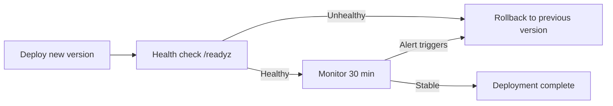

# CI/CD Pipeline Design

| Field | Value |
| --- | --- |
| Project | HaloFin |
| Last Updated | 2026-03-11 |

## 1. Platform

GitHub Actions — selected as CI/CD platform.

## 2. Pipeline Overview

```mermaid
flowchart TD
    subgraph PR["Pull Request Pipeline"]
        Lint["Lint & Format"] --> UnitTest["Unit Tests"]
        UnitTest --> IntTest["Integration Tests"]
        IntTest --> Coverage["Coverage Check"]
        Coverage --> Build["Build"]
        Build --> Security["Security Scan"]
    end

    subgraph Deploy["Deployment Pipeline (on merge to develop)"]
        BuildImage["Build Docker Image"] --> DeployStaging["Deploy to Staging"]
        DeployStaging --> SmokeTest["Smoke Tests"]
        SmokeTest --> E2E["E2E Tests"]
    end

    subgraph Release["Release Pipeline (on tag)"]
        ReleaseBuild["Production Build"] --> DeployProd["Deploy to Production"]
        DeployProd --> HealthCheck["Health Check"]
        HealthCheck --> Monitor["Monitor for 30 min"]
    end
```



## 3. Pipeline Per Surface

### Mobile (Flutter)

```yaml
# Trigger: PR to develop
name: Mobile CI
on:
  pull_request:
    paths: ['apps/mobile/**']

jobs:
  lint:
    - flutter analyze
    - dart format --set-exit-if-changed .
  test:
    - flutter test --coverage
  coverage:
    - check coverage threshold (80% domain, 60% UI)
  build:
    - flutter build apk --debug (validation only)
```

### Web Apps (Next.js)

```yaml
# Trigger: PR to develop
name: Web CI
on:
  pull_request:
    paths: ['apps/admin/**', 'apps/consultant/**', 'apps/landing/**']

jobs:
  lint:
    - pnpm lint
    - pnpm format:check
  test:
    - pnpm test -- --coverage
  coverage:
    - check coverage threshold (70%)
  build:
    - pnpm build
```

### Backend (Go)

```yaml
# Trigger: PR to develop
name: Backend CI
on:
  pull_request:
    paths: ['services/api/**']

jobs:
  lint:
    - gofmt -l .
    - go vet ./...
    - golangci-lint run
  test:
    - go test ./... -coverprofile=coverage.out
  coverage:
    - check coverage threshold (80% service, 60% handler)
  security:
    - govulncheck ./...
  build:
    - go build -o /dev/null ./cmd/server
```

## 4. Deployment Stages

| Stage | Trigger | Environment | Approval |
| --- | --- | --- | --- |
| CI (lint, test, build) | Every PR | CI runners | Automatic |
| Deploy to Staging | Merge to `develop` | Staging | Automatic |
| Smoke + E2E tests | After staging deploy | Staging | Automatic |
| Deploy to Production | Tag `v*.*.*` on `main` | Production | Manual approval |
| Rollback | Manual trigger or health check failure | Production | Manual |

## 5. Environment Variables Management

| Environment | Source | How |
| --- | --- | --- |
| CI | GitHub Secrets | Configured in repo settings |
| Staging | Secret manager | Injected at deploy time |
| Production | Secret manager | Injected at deploy time |

### Required Secrets Per Environment

```
DATABASE_URL
REDIS_URL
SUPABASE_URL
SUPABASE_JWT_SECRET
AI_PROVIDER_URL
AI_API_KEY
AI_MODEL_NAME
```

## 6. Docker Build

```dockerfile
# Multi-stage build for Go service
FROM golang:1.26.1-alpine AS builder
WORKDIR /app
COPY go.mod go.sum ./
RUN go mod download
COPY . .
RUN CGO_ENABLED=0 go build -o server ./cmd/server

FROM gcr.io/distroless/static:nonroot
COPY --from=builder /app/server /server
USER nonroot:nonroot
ENTRYPOINT ["/server"]
```

### Image Tagging

```
halofin-api:latest
halofin-api:{git-sha}
halofin-api:{semver}
```

## 7. Rollback Procedure

1. **Automatic rollback**: if health check fails within 5 minutes of deployment, auto-revert to previous version.
2. **Manual rollback**: re-deploy previous tagged version.
3. **Database rollback**: run `down` migration for the specific version (only if migration was part of the release).



## 8. Pipeline Rules

1. All pipelines must complete in under 10 minutes (excluding E2E).
2. Failed CI blocks PR merge.
3. Staging deployment is automatic on develop merge.
4. Production deployment requires manual approval.
5. No direct push to main or develop.
6. Cache dependencies aggressively (pub cache, pnpm store, go module cache).
