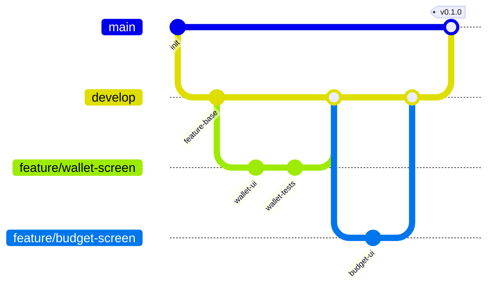

# Engineering Standards

| Field | Value |
| --- | --- |
| Project | HaloFin |
| Last Updated | 2026-03-11 |

## 1. Branching Model



| Branch | Purpose | Naming | Merge Target |
| --- | --- | --- | --- |
| `main` | Production-ready code | `main` | — |
| `develop` | Integration branch for features | `develop` | `main` (via release) |
| Feature | New feature work | `feature/{short-description}` | `develop` |
| Bugfix | Bug fixes | `fix/{short-description}` | `develop` |
| Hotfix | Urgent production fixes | `hotfix/{short-description}` | `main` + `develop` |
| Release | Release preparation | `release/{version}` | `main` + `develop` |

### Rules

1. Never push directly to `main` or `develop`.
2. All changes go through Pull Request.
3. Feature branches are short-lived (< 1 week preferred).
4. Delete branch after merge.

## 2. Commit Convention

Follow [Conventional Commits](https://www.conventionalcommits.org/):

```
<type>(<scope>): <short description>

[optional body]

[optional footer]
```

### Types

| Type | When |
| --- | --- |
| `feat` | New feature |
| `fix` | Bug fix |
| `docs` | Documentation only |
| `style` | Code style (formatting, no logic change) |
| `refactor` | Code restructure without changing behavior |
| `test` | Adding or updating tests |
| `chore` | Build, CI, tooling changes |
| `perf` | Performance improvement |

### Scopes (examples)

`mobile`, `admin`, `api`, `docs`, `ci`, `wallet`, `transaction`, `auth`, `notification`

### Examples

```
feat(mobile): add wallet overview screen
fix(api): prevent duplicate draft transaction on webhook retry
docs: update Architecture.md with ERD
test(mobile): add unit tests for balance calculation
chore(ci): add Flutter build step to pipeline
```

## 3. Pull Request Guidelines

### PR Title

Same format as commit convention.

### PR Template

```markdown
## What does this PR do?
Brief description of changes.

## Type of change
- [ ] Feature
- [ ] Bug fix
- [ ] Refactor
- [ ] Documentation
- [ ] Test

## Checklist
- [ ] Code follows project style guidelines
- [ ] Tests added/updated
- [ ] Documentation updated if needed
- [ ] No sensitive data in code or comments
- [ ] Self-reviewed the code

## Screenshots (if UI change)
Before | After
```

### Review Rules

1. Minimum 1 approval required before merge.
2. Author cannot approve their own PR.
3. All CI checks must pass.
4. Address all review comments (resolve or discuss).
5. Use squash merge for feature branches.

## 4. Code Style

### Dart (Mobile)

1. Follow [Effective Dart](https://dart.dev/guides/language/effective-dart) guidelines.
2. `dart format` enforced (line length 80).
3. `dart analyze` must pass with zero issues.
4. Prefer `final` over `var` when possible.
5. Use trailing commas for better diffs.

### TypeScript (Web)

1. Strict mode enabled in `tsconfig.json`.
2. ESLint + Prettier enforced.
3. No `any` type without explicit justification comment.
4. Prefer `const` over `let`.
5. Use named exports over default exports.

### Go (Backend)

1. `gofmt` enforced (standard).
2. `go vet` must pass.
3. Follow [Go Code Review Comments](https://go.dev/wiki/CodeReviewComments).
4. Error handling: always check errors, never ignore with `_`.
5. Exported functions must have doc comments.

## 5. Code Coverage Targets

| Surface | Layer | Minimum | Enforced |
| --- | --- | --- | --- |
| Mobile | Domain/Service | 80% | CI |
| Mobile | UI Components | 60% | CI |
| Web | Shared Components | 70% | CI |
| Backend | Service Layer | 80% | CI |
| Backend | Handler Layer | 60% | CI |

Coverage must not decrease on merge. If adding new code, tests are expected.

## 6. File And Folder Naming

| Surface | Convention | Example |
| --- | --- | --- |
| Dart | snake_case | `wallet_screen.dart`, `balance_provider.dart` |
| TypeScript | kebab-case for files, PascalCase for components | `consultant-card.tsx`, `use-wallet.ts` |
| Go | snake_case | `transaction_handler.go`, `draft_service.go` |
| SQL migrations | numeric prefix + snake_case | `001_initial_schema.up.sql` |
| Test files | Same name + `_test` suffix | `balance_provider_test.dart`, `draft_service_test.go` |

## 7. Documentation Requirements

1. All public APIs (functions, classes, methods) must have doc comments.
2. Complex business logic must have inline comments explaining "why", not "what".
3. README per app directory explaining how to run and test.
4. Architecture decisions documented in `docs/decisions/`.
5. Mock contracts documented per route key.

## 8. Security Coding Standards

1. No secrets or credentials in code, comments, or test fixtures.
2. No logging of sensitive data (tokens, passwords, account numbers).
3. All user input validated server-side, even if validated client-side.
4. SQL queries via sqlc (parameterized) — no string concatenation.
5. HTTP responses include security headers (see Security.md).
6. Dependencies scanned for vulnerabilities in CI.
