# System Architecture

| Field | Value |
| --- | --- |
| Project | HaloFin |
| Document Version | 2.2 |
| Status | Approved For MVP Planning |
| Last Updated | 2026-03-09 |
| Audience | Engineering, Product, Security, AI Coding Agent |

## Change Summary

| Date | Change |
| --- | --- |
| 2026-03-09 | Synced current mobile phase architecture with frontend-approved screen clusters, route keys, and mock data boundaries. |
| 2026-03-09 | Added target-vs-current delivery architecture, four app surfaces, frontend-only mode, mock contract boundary, and phase delivery diagrams. |
| 2026-03-08 | Reframed architecture from vague microservice wording into a concrete MVP architecture: managed backend plus one Go application service plus external providers. |

## 1. Architecture Summary

HaloFin end-state menggunakan arsitektur:

`mobile app + admin app + consultant app + landing page + managed Supabase backend + single Go application service + Redis + external providers`

Dokumen ini sengaja tidak menyebut sistem sebagai microservices, karena pada tahap MVP hanya ada satu application service yang menjalankan orkestrasi bisnis di luar managed platform. Jika di masa depan service dipecah, perubahan itu harus dinyatakan eksplisit sebagai evolusi arsitektur, bukan diasumsikan sejak awal.

## 2. Architectural Principles

1. Managed services dipakai untuk mempercepat time-to-market pada kapabilitas standar.
2. Logika finansial sensitif, orkestrasi AI, dan integrasi provider ditempatkan pada application service yang terkontrol.
3. AI dan provider eksternal hanya boleh menghasilkan draft, bukan transaksi final.
4. Consent, audit trail, dan access boundary lebih penting daripada automasi penuh.
5. Semua webhook provider harus idempotent.
6. Pada fase frontend-only, tidak ada backend implementation yang dikerjakan.
7. Real API harus mengikuti frontend flow dan MockContract yang sudah approved pada phase sebelumnya.

## 3. Target Architecture Topology

Ini adalah bentuk sistem final saat seluruh app surface sudah selesai dibangun.

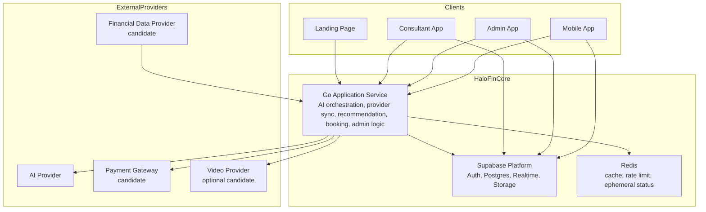

## 4. Delivery Architecture Strategy

Dokumen ini membedakan dua bentuk arsitektur yang harus dipahami terpisah.

### 4.1 Target Architecture

Target architecture adalah bentuk final sistem saat semua app surface selesai dan semua integrasi aktif.

### 4.2 Current Delivery Phase Architecture

Current delivery phase architecture adalah bentuk sistem yang relevan untuk fase aktif saat ini. Pada saat dokumen ini diperbarui, fase aktif adalah `mobile_frontend`.

Konsekuensi fase aktif:

1. Hanya `mobile app` yang sedang dikerjakan.
2. Fokus pekerjaan adalah UI, interaction flow, screen states, mock contracts, local fixtures, dan state management.
3. `Go Application Service`, real auth, database integration, dan provider integration belum diimplementasikan pada fase ini.
4. App surface lain belum menjadi target implementation aktif.

### 4.3 Current Mobile Screen Cluster

Pada fase aktif, mobile app tidak lagi diperlakukan sebagai kumpulan screen generik. Frontend-approved cluster saat ini adalah:

| MobileRouteKey | Screen Cluster | Mock Data Boundary |
| --- | --- | --- |
| `home` | Dashboard utama, quick actions, expert help, recent activity | dashboard summary, expert help preview, recent activity preview |
| `wallet` | Wallet overview with asset distribution | wallet list, asset distribution, sort and filter state |
| `budget` | Budget summary and category list | budget summary, budget category list |
| `goals` | Goals overview and create-goal entry point | goals list, goal progress, smart tip |
| `bills` | Bills summary, upcoming payments, paid bills | bills summary, upcoming bills, paid bills |
| `consult_list` | Consultant discovery and filter | consultant list, category filters, search result state |
| `consult_detail` | Consultant profile and booking CTA | consultant detail, reviews, pricing summary |
| `transaction_entry` | Manual entry flow | transaction draft input, wallet options, category state |
| `transaction_history` | Search and filtered history | transaction history query state, grouped transaction list, totals |

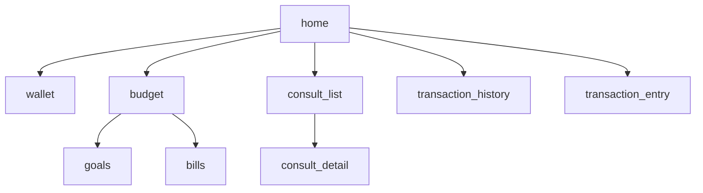

Arsitektur fase aktif harus membaca cluster di atas sebagai unit delivery UI yang sudah tervalidasi. Selama `mobile_frontend`, relasi antar-cluster ini hanya bergantung pada navigation, local state, dan MockContract, bukan pada backend implementation.

```mermaid
flowchart LR
    A["mobile_frontend"] --> B["mobile_backend_integration"]
    B --> C["mobile_test_fix"]
    C --> D["admin_frontend"]
    D --> E["admin_backend_integration"]
    E --> F["admin_test_fix"]
    F --> G["consultant_frontend"]
    G --> H["consultant_backend_integration"]
    H --> I["consultant_test_fix"]
    I --> J["landing_frontend"]
```

## 5. Frontend-Only Development Mode

Frontend-only mode adalah mode delivery saat UI dikembangkan tanpa backend implementation.

### Allowed In Frontend-Only Mode

1. Screen building
2. Navigation and interaction flow
3. Local state and view model
4. Mock JSON and local fixtures
5. MockContract request and response placeholder
6. Error, loading, empty, and success state simulation

Contoh boundary mock yang relevan untuk fase aktif saat ini:

1. `dashboard_summary` dan `recent_activity_preview`
2. `wallet_list` dan `asset_distribution`
3. `budget_summary`, `goal_list`, dan `bills_list`
4. `consultant_list` dan `consultant_detail`
5. `transaction_entry_draft` dan `transaction_history_query`

### Not Allowed In Frontend-Only Mode

1. Real backend endpoint implementation
2. Database schema implementation
3. Provider webhook handling
4. Real auth integration
5. Secret management for production integration

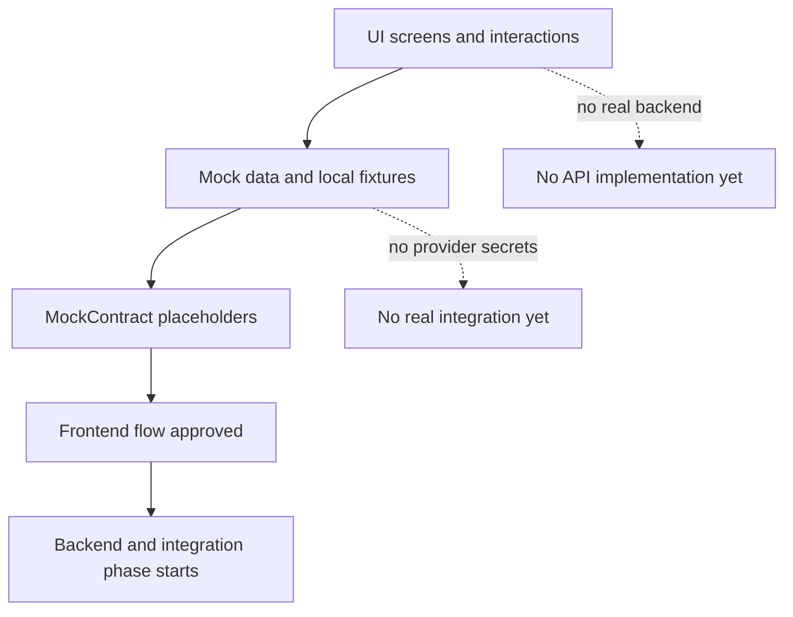

## 6. Component Responsibilities And Boundaries

| Component | Responsibilities | Must Not Own |
| --- | --- | --- |
| Mobile App | User transaction entry, draft review, wallet view, sync connection flow, recommendation view, consultation experience | Provider credentials, business rules source of truth |
| Admin App | Verifikasi konsultan, monitoring operasional, audit support, operational dashboards | End-user product flow ownership |
| Consultant App | Session management, client access based on consent, consultant workflow | Platform-wide admin controls |
| Landing Page | Brand communication, public information, lead or user acquisition | Authenticated user transaction domain |
| Supabase | Auth, primary relational data, realtime events, storage, row-level access control | AI orchestration, provider normalization logic |
| Go Application Service | Provider webhook intake, AI orchestration, recommendation eligibility, booking/payment orchestration, audit logging hooks | Long-term user session UI state |
| Redis | Cache, rate limiting, transient sync state, short-lived coordination data | Source of truth for financial records |
| External Providers | Data ingestion, payment processing, optional meeting/session services | HaloFin domain ownership |

## 7. Canonical Domain And Delivery Objects

| Object | Purpose | Canonical Status |
| --- | --- | --- |
| Wallet | Menyimpan saldo yang ditampilkan ke user | `active`, `archived` |
| Transaction | Catatan finansial final yang memengaruhi saldo | `posted`, `voided` |
| DraftTransaction | Draft dari AI atau provider yang menunggu review | `review_needed`, `confirmed`, `rejected` |
| ProviderConnection | Hubungan user dengan provider finansial | `connected`, `syncing`, `needs_reauth`, `failed` |
| Recommendation | Saran kontekstual yang dihasilkan sistem | `eligible`, `dismissed`, `clicked` |
| ConsultationSession | Sesi layanan user dan konsultan | `pending_payment`, `confirmed`, `completed`, `cancelled` |
| ConsentGrant | Izin akses data untuk konsultan | `active`, `revoked`, `expired` |
| AppSurface | Surface aplikasi yang sedang dibahas | `mobile`, `admin`, `consultant`, `landing` |
| DeliveryPhase | Fase delivery implementasi | lihat daftar fase resmi pada PRD |
| MockContract | Placeholder interface frontend sebelum real API | `draft`, `approved`, `implemented` |

## 8. Data Ownership Rules

1. Postgres adalah source of truth untuk wallet, transaction, draft transaction, provider connection metadata, recommendation events, booking, dan audit records.
2. Redis hanya boleh menyimpan data sementara seperti rate-limit counters, sync progress, dan cache yang dapat direkonstruksi.
3. Provider credentials tidak boleh disimpan oleh HaloFin.
4. AI request or response yang berisi data sensitif harus diperlakukan sebagai data terkontrol dan tidak menjadi source of truth tanpa review user.
5. Konsultan hanya dapat melihat data yang dicakup oleh ConsentGrant aktif.
6. Pada frontend-only phase, source of truth hanya berada pada mock fixtures atau local state sementara, bukan backend domain implementation.

## 9. Auth And Access Model

### End User

1. User login melalui managed auth platform pada fase integrasi.
2. Mobile app membaca data user langsung dari platform data untuk operasi yang diizinkan.
3. Untuk operasi yang memerlukan orkestrasi bisnis atau provider interaction, mobile app memanggil Go application service dengan token user.

### Consultant

1. Consultant login melalui managed auth platform saat consultant app memasuki fase backend/integration.
2. Consultant app memuat data yang diizinkan berdasarkan role dan consent.

### Admin

1. Admin menggunakan admin app dengan role terpisah.
2. Aksi administratif harus diaudit.

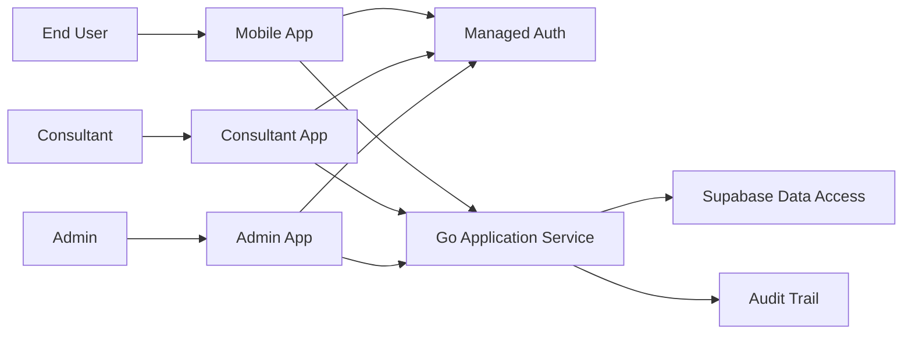

## 10. Canonical Flows

### 10.1 AI Draft Transaction Flow

1. User mengirim input teks, suara, atau gambar dari mobile app.
2. Mobile app mengirim request ke Go application service.
3. Service membersihkan payload, mengirim bagian relevan ke AI provider, lalu memetakan hasil ke DraftTransaction.
4. DraftTransaction disimpan dengan status `review_needed`.
5. Mobile app menampilkan hasil review ke user.
6. Hanya setelah user mengonfirmasi, DraftTransaction dikonversi menjadi Transaction final.

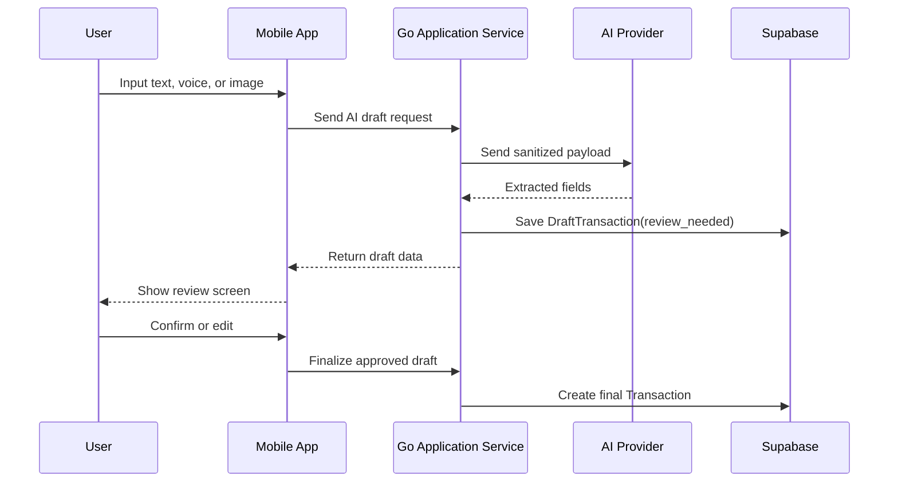

### 10.2 Provider Sync Review Flow

1. User memulai koneksi akun melalui provider flow yang di-embed di client.
2. Provider mengelola autentikasi dan mengirim callback atau webhook ke Go application service.
3. Service memverifikasi signature, melakukan deduplication, menormalisasi payload, lalu membuat DraftTransaction.
4. ProviderConnection dan sync status diperbarui.
5. Event realtime atau polling memberi tahu client bahwa ada draft baru untuk ditinjau.
6. User mengonfirmasi, mengedit, atau menolak draft satu per satu atau secara bulk sesuai aturan produk.

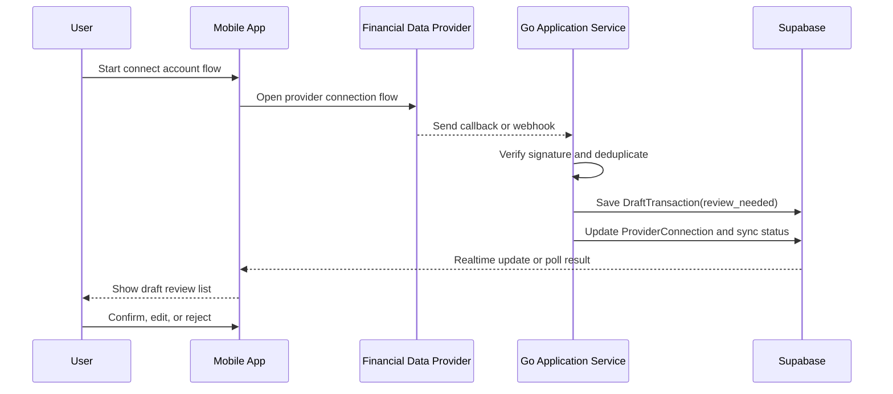

### 10.3 Recommendation Eligibility Flow

1. User membuka detail wallet.
2. Client meminta eligibility check ke Go application service.
3. Service membaca saldo wallet, tipe wallet, dan aturan recommendation aktif.
4. Jika syarat terpenuhi, service membuat payload Recommendation dengan status `eligible`.
5. Client menampilkan nudge. Jika user dismiss atau klik, event direkam untuk analytics dan audit.
6. Jika user meminta penjelasan lanjutan, AI provider hanya memberi penjelasan edukatif; bukan keputusan investasi final.

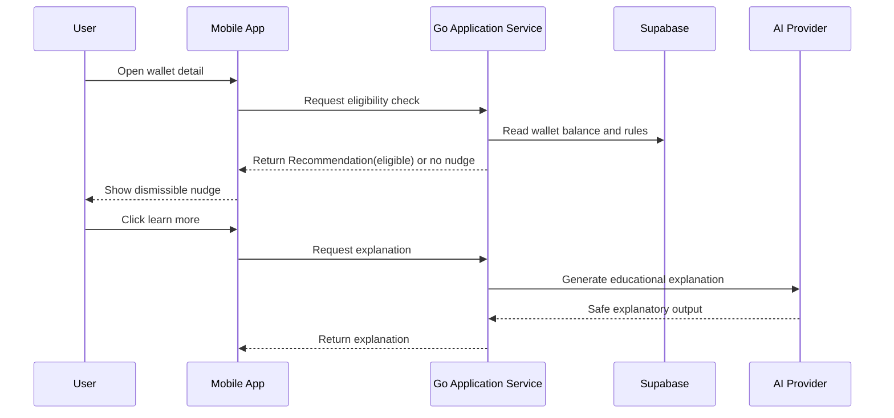

### 10.4 Consultation Booking Flow

1. User memilih konsultan, layanan, dan slot.
2. Client meminta service membuat booking intent.
3. Service memanggil payment gateway candidate dan menunggu hasil pembayaran.
4. Setelah pembayaran valid, ConsultationSession menjadi `confirmed`.
5. ConsentGrant untuk ClientVault dibuat hanya jika dibutuhkan sesi dan disetujui user.
6. Saat sesi selesai atau consent dicabut, akses consultant ke data tersebut berhenti.

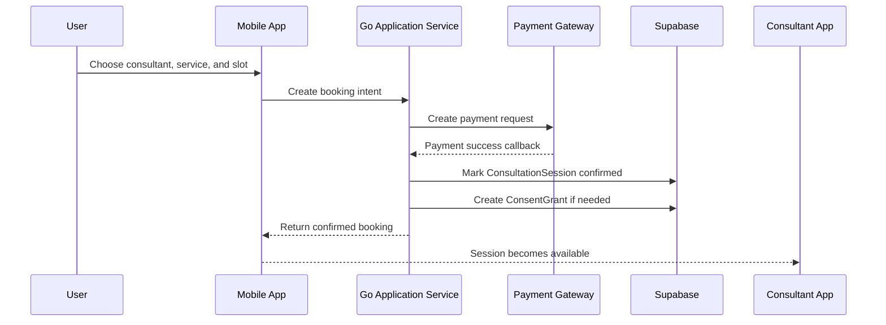

## 11. Draft To Final Transaction Lifecycle

| Source | Initial State | User Action | Result |
| --- | --- | --- | --- |
| AI input | `review_needed` | Confirm | Menjadi `Transaction` final |
| AI input | `review_needed` | Edit + Confirm | Draft diperbarui lalu menjadi `Transaction` final |
| AI input | `review_needed` | Cancel | Tidak menjadi transaksi final |
| Provider sync | `review_needed` | Confirm | Menjadi `Transaction` final |
| Provider sync | `review_needed` | Reject | Menjadi `rejected`, tidak memengaruhi saldo |

Aturan utama:

1. Tidak ada auto-commit dari AI atau provider sync.
2. Hanya Transaction final yang memengaruhi saldo utama.
3. DraftTransaction yang ditolak tetap dapat disimpan untuk audit sesuai kebijakan retensi.

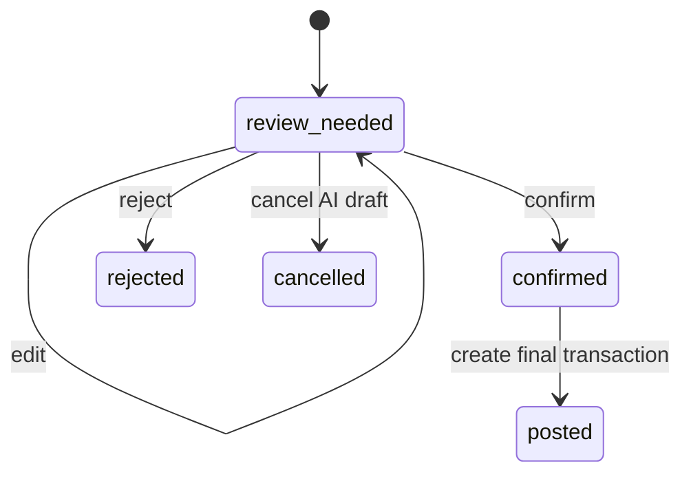

## 12. Mock Contract Boundary

MockContract adalah boundary resmi antara frontend-only phase dan backend-integration phase.

### Rules

1. Frontend boleh membuat placeholder request and response shape.
2. MockContract dipakai untuk menguji flow UX, state transitions, dan screen logic.
3. Backend implementation tidak boleh dimulai sebelum MockContract disetujui untuk flow utama app surface aktif.
4. Saat backend phase dimulai, real API harus memetakan dirinya ke MockContract yang approved atau mendokumentasikan perubahan yang disetujui.

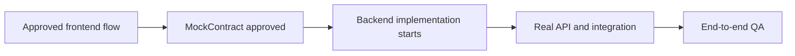

## 13. Reliability, Idempotency, And Failure Handling

### Webhook And Provider Rules

1. Semua webhook provider wajib diverifikasi signature atau mekanisme autentikasi ekuivalen.
2. Event provider harus idempotent berdasarkan kombinasi provider event id, provider connection, dan fingerprint payload.
3. Retry dari provider tidak boleh membuat duplicate DraftTransaction.
4. Jika provider payload tidak valid, event ditolak dan dicatat dengan alasan.

### AI And Internal Processing Rules

1. Jika AI gagal merespons, user menerima error yang dapat ditangani dan tidak ada transaksi final yang dibuat.
2. Jika parsing AI sebagian berhasil, sistem boleh membuat draft parsial selama user masih diwajibkan review.
3. Rate limit ke AI dan provider dikelola di application service dengan dukungan Redis.

### Reconciliation Rules

1. Draft hasil sync yang sama tidak boleh mengurangi saldo dua kali.
2. ProviderConnection dengan error berulang harus berpindah ke `needs_reauth` atau `failed`.
3. Sync status harus dapat dibedakan antara sukses terakhir, gagal terakhir, dan proses sedang berjalan.

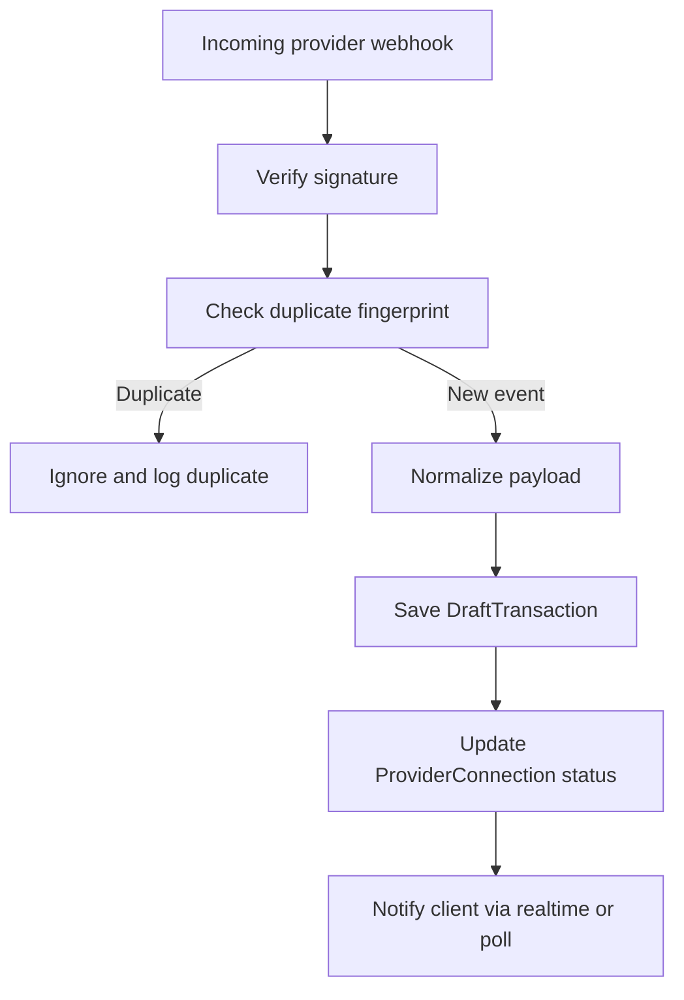

## 14. Security And Compliance Controls

1. HaloFin tidak menyimpan username, PIN, atau password akun finansial pengguna.
2. Semua akses data harus dibatasi dengan role dan row-level access control.
3. Data sensitif dienkripsi in transit dan memanfaatkan enkripsi at-rest dari managed platform.
4. Deskripsi transaksi yang mengandung referensi sensitif harus disanitasi sebelum dipakai untuk analytics atau AI.
5. Semua akses consultant ke ClientVault harus berbasis ConsentGrant aktif dan tercatat.
6. Semua keputusan recommendation tunduk pada anti-speculation rule dari PRD.

## 15. Audit And Observability

### Audit Trail Minimum

1. Perubahan status DraftTransaction.
2. Pembuatan, aktivasi, dan pencabutan ConsentGrant.
3. Booking, pembayaran, dan perubahan status ConsultationSession.
4. Provider webhook yang diterima, ditolak, atau dianggap duplikat.
5. Aksi administratif seperti verifikasi konsultan.

### Observability Minimum

1. Structured logging untuk semua call ke provider dan AI.
2. Metrics untuk sync success rate, AI parse success rate, webhook dedup rate, dan payment success rate.
3. Alert untuk lonjakan webhook failure, payment failure, atau AI latency tinggi.

## 16. Deployment Topology

| Environment | Purpose | Notes |
| --- | --- | --- |
| Local | Pengembangan individual | Menggunakan managed service dev project atau sandbox, local Redis, dan stub provider bila perlu |
| Staging | Uji integrasi end-to-end | Harus menggunakan provider sandbox dan data non-produksi |
| Production | Aplikasi live | Semua secret dikelola di secret manager, observability aktif, audit retention berlaku |

## 17. Provider Decision Status

| Capability | Status | Decision Rule |
| --- | --- | --- |
| Financial data provider | Candidate | Pilih provider yang memenuhi coverage institusi target, keamanan, sandbox quality, webhook reliability, dan kepatuhan bisnis |
| Payment gateway | Candidate | Pilih provider dengan dukungan escrow atau flow pembayaran yang cocok untuk booking konsultasi |
| Video provider | Candidate | Hanya diperlukan jika sesi video dilakukan in-app pada MVP |
| AI provider | Selected at architecture level | Model name harus dikonfigurasi di runtime, bukan di-hardcode dalam dokumen ini |

## 18. Architecture Risks To Track

1. Coverage provider finansial mungkin tidak merata antar institusi yang dibutuhkan user awal.
2. AI extraction quality untuk OCR dan bahasa natural bisa berbeda menurut kualitas input user.
3. Consent dan audit scope untuk consultant workflow harus direview bersama legal dan compliance sebelum launch.
4. Frontend contracts yang terlalu longgar dapat membuat fase backend ambigu jika tidak disetujui lebih awal.
