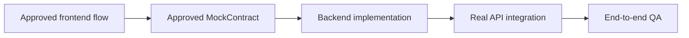
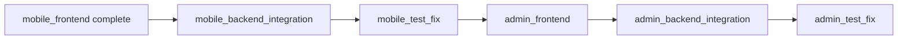

# Backend And Integration Strategy

| Field | Value |
| --- | --- |
| Project | HaloFin |
| Document Version | 1.1 |
| Status | Pending Until Frontend Approval |
| Last Updated | 2026-03-09 |

## 1. Purpose

Dokumen ini menjelaskan bagaimana backend HaloFin dimulai setelah frontend app surface tertentu selesai. Backend bukan phase pertama; ia mengikuti approved frontend contracts.

## 2. Activation Rule

Backend phase untuk sebuah app surface hanya boleh dimulai jika:

1. Frontend phase untuk app surface itu sudah complete.
2. MockContract flow utama sudah approved.
3. Tidak ada perubahan UX mayor yang masih terbuka.

## 3. Integration Order

Untuk `mobile_backend_integration`, urutan implementasi minimal adalah:

1. Auth integration
2. Dashboard, wallet, dan transaction read surfaces yang sudah tervalidasi di frontend
3. Transaction create and transaction history query
4. Planning surfaces: budget, goals, bills
5. Consultant discovery and consultant detail
6. Draft transaction flow
7. Provider sync flow
8. Recommendation flow
9. Consultation booking flow

## 4. Frontend-Approved Mobile Contract Surfaces

Backend phase harus mulai dari surface yang sudah implied dan distabilkan oleh `Frontend.md`, bukan dari asumsi domain yang terlalu abstrak.

| MobileRouteKey | Frontend-Approved Surface | Backend Output Minimum |
| --- | --- | --- |
| `home` | dashboard summary, recent activity preview, expert help preview | endpoint atau query untuk ringkasan dashboard, transaksi terbaru, preview consultant |
| `wallet` | wallet list, asset distribution | endpoint atau query untuk daftar wallet dan distribusi aset |
| `budget` | budget summary, budget category list | endpoint atau query untuk summary budget dan kategori |
| `goals` | goals list and goal progress | endpoint atau query untuk daftar goal dan progres |
| `bills` | bills summary, upcoming bills, paid bills | endpoint atau query untuk daftar tagihan dan statusnya |
| `consult_list` | consultant discovery and search | endpoint atau query untuk listing, filter, dan search konsultan |
| `consult_detail` | consultant profile, reviews, pricing | endpoint atau query untuk detail konsultan |
| `transaction_entry` | transaction create draft state | contract untuk create transaction dan metadata input |
| `transaction_history` | transaction history query and totals | endpoint atau query untuk histori transaksi, filter, dan summary totals |

## 5. Backend Responsibilities By AppSurface

| AppSurface | Backend Focus |
| --- | --- |
| `mobile` | Auth, dashboard summary, wallet, transaction, planning, draft, sync, recommendation, booking, consultant discovery |
| `admin` | Operational endpoints, consultant verification, monitoring, audit views |
| `consultant` | Session management, consent-bound client data access |
| `landing` | Minimal or none at first, depending on business needs |

## 6. Contract-Driven Implementation Rule

1. Backend implementation harus mengikuti MockContract yang telah approved.
2. Bila backend butuh perubahan shape data, perubahan itu harus kembali ke review contract, bukan diam-diam diimplementasikan.
3. Integrasi harus mempertahankan UX intent yang sudah diputuskan di frontend.
4. Prioritas backend mobile harus mengikuti urutan screen cluster yang sudah tervalidasi di frontend, bukan dimulai dari fitur yang belum punya approved flow.

## 7. Definition Of Done: Backend And Integration

Backend and integration dianggap selesai bila:

1. Semua MockContract utama telah dipetakan ke real API.
2. Auth, database, dan provider integration berjalan pada flow yang relevan.
3. Frontend tidak lagi bergantung pada placeholder untuk flow utama.
4. Error handling dasar dan observability minimum sudah aktif.
5. End-to-end flow lulus smoke test.
6. Surface `home`, `wallet`, `budget/goals/bills`, `consult_list/detail`, dan `transaction_entry/history` telah terhubung ke real backend sesuai approved contract.

## 8. Rollout Sequence

## 9. Backend Risks

1. Contract drift antara frontend dan backend.
2. Backend dimulai terlalu cepat saat UX mobile belum stabil.
3. Integrasi provider mengubah asumsi flow yang sudah disetujui di frontend.
4. Surface dashboard atau planning diimplementasikan tanpa mengikuti cluster route yang sudah menjadi source of truth pada fase mobile frontend.
