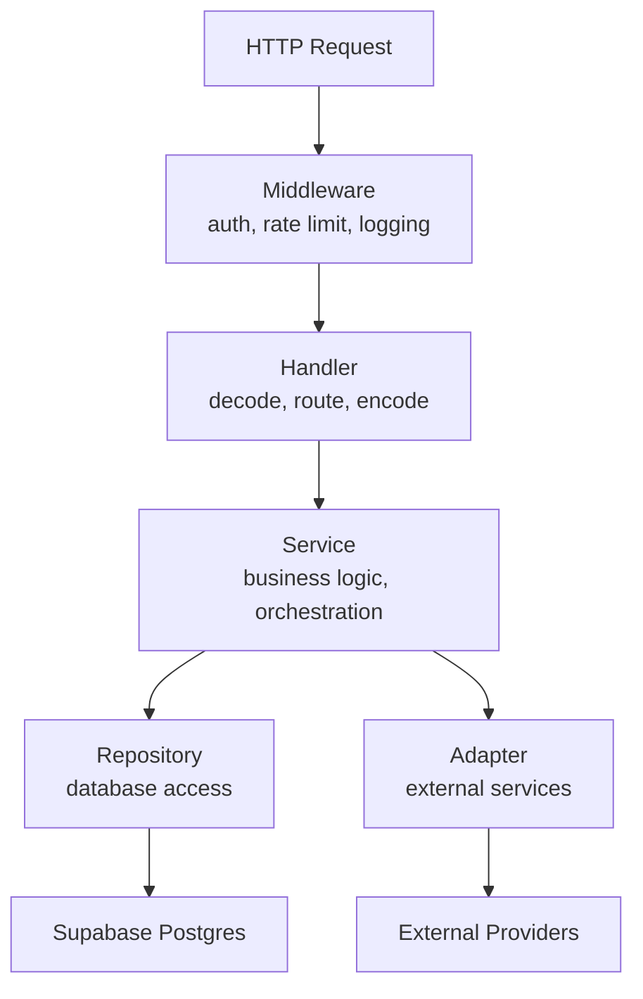
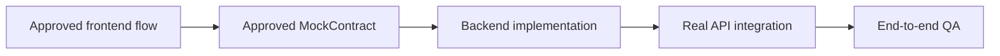
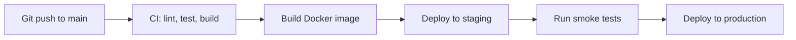
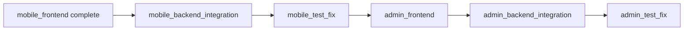

# Backend And Integration Strategy

| Field | Value |
| --- | --- |
| Project | HaloFin |
| Document Version | 2.0 |
| Status | Pending Until Frontend Approval |
| Last Updated | 2026-03-11 |

## Change Summary

| Date | Change |
| --- | --- |
| 2026-03-11 | Enriched with internal service architecture, folder structure, database migration strategy, environment management, error handling conventions, deployment architecture, and backend testing strategy. Added new surfaces for reporting, notifications, data export, and multi-currency. |
| 2026-03-09 | Initial version with activation rules and contract-driven implementation. |

## 1. Purpose

Dokumen ini menjelaskan bagaimana backend HaloFin dimulai setelah frontend app surface tertentu selesai. Backend bukan phase pertama; ia mengikuti approved frontend contracts. Dokumen ini juga menjelaskan internal architecture, conventions, dan operational requirements backend.

## 2. Activation Rule

Backend phase untuk sebuah app surface hanya boleh dimulai jika:

1. Frontend phase untuk app surface itu sudah complete.
2. MockContract flow utama sudah approved.
3. Tidak ada perubahan UX mayor yang masih terbuka.

## 3. Integration Order

Untuk `mobile_backend_integration`, urutan implementasi minimal adalah:

1. Auth integration
2. Dashboard, wallet, dan transaction read surfaces yang sudah tervalidasi di frontend
3. Transaction create and transaction history query
4. Planning surfaces: budget, goals, bills
5. Notification system (delivery and preferences)
6. Reporting and analytics endpoints
7. Consultant discovery and consultant detail
8. Draft transaction flow
9. Provider sync flow
10. Recommendation flow
11. Data export (CSV, PDF)
12. Multi-currency rate management
13. Consultation booking flow

## 4. Frontend-Approved Mobile Contract Surfaces

Backend phase harus mulai dari surface yang sudah implied dan distabilkan oleh `Frontend.md`, bukan dari asumsi domain yang terlalu abstrak.

| MobileRouteKey | Frontend-Approved Surface | Backend Output Minimum |
| --- | --- | --- |
| `onboarding` | registration, wallet setup, category selection | auth endpoints, wallet creation API, default category seed |
| `home` | dashboard summary, recent activity preview, expert help preview | endpoint atau query untuk ringkasan dashboard, transaksi terbaru, preview consultant |
| `wallet` | wallet list, asset distribution | endpoint atau query untuk daftar wallet dan distribusi aset |
| `budget` | budget summary, budget category list | endpoint atau query untuk summary budget dan kategori |
| `goals` | goals list and goal progress | endpoint atau query untuk daftar goal dan progres |
| `bills` | bills summary, upcoming bills, paid bills | endpoint atau query untuk daftar tagihan dan statusnya |
| `consult_list` | consultant discovery and search | endpoint atau query untuk listing, filter, dan search konsultan |
| `consult_detail` | consultant profile, reviews, pricing | endpoint atau query untuk detail konsultan |
| `transaction_entry` | transaction create draft state | contract untuk create transaction dan metadata input |
| `transaction_history` | transaction history query and totals | endpoint atau query untuk histori transaksi, filter, dan summary totals |
| `reporting` | income vs expense, category breakdown, trend | endpoint untuk report aggregation, chart data, period filtering |
| `notifications` | notification list, read/unread, preferences | endpoint untuk list, mark-read, preferences CRUD |

## 5. Internal Service Architecture

### Folder Structure

```
services/api/
├── cmd/
│   └── server/
│       └── main.go              # Entry point
├── internal/
│   ├── config/                   # Configuration loading
│   │   └── config.go
│   ├── middleware/                # HTTP middleware
│   │   ├── auth.go               # Token validation
│   │   ├── ratelimit.go          # Rate limiting
│   │   ├── cors.go               # CORS handling
│   │   └── logging.go            # Request logging
│   ├── handler/                   # HTTP handlers (thin layer)
│   │   ├── transaction.go
│   │   ├── wallet.go
│   │   ├── draft.go
│   │   ├── budget.go
│   │   ├── goal.go
│   │   ├── bill.go
│   │   ├── consultant.go
│   │   ├── booking.go
│   │   ├── report.go
│   │   ├── notification.go
│   │   ├── currency.go
│   │   ├── export.go
│   │   └── admin.go
│   ├── service/                   # Business logic layer
│   │   ├── finance.go            # Balance calculation, budget tracking
│   │   ├── draft.go              # AI parsing, provider normalization
│   │   ├── consent.go            # Grant management
│   │   ├── audit.go              # Event logging
│   │   ├── notification.go       # Rule engine, delivery dispatch
│   │   ├── report.go             # Aggregation queries
│   │   ├── currency.go           # Rate management
│   │   └── export.go             # CSV/PDF generation
│   ├── repository/                # Database access (sqlc generated + custom)
│   │   ├── queries/              # SQL files for sqlc
│   │   └── db.go                 # Generated code
│   ├── adapter/                   # External service adapters
│   │   ├── ai.go                 # AI provider client
│   │   ├── payment.go            # Payment gateway client
│   │   ├── sync_provider.go      # Financial data provider client
│   │   ├── currency_rate.go      # Currency rate provider client
│   │   └── storage.go            # Supabase storage client
│   └── model/                     # Domain models and DTOs
│       ├── transaction.go
│       ├── wallet.go
│       ├── draft.go
│       ├── notification.go
│       └── report.go
├── migrations/                    # Database migration files
│   ├── 001_initial_schema.up.sql
│   ├── 001_initial_schema.down.sql
│   └── ...
├── sqlc.yaml                      # sqlc configuration
├── Dockerfile
├── go.mod
└── go.sum
```

### Layering Rules

1. **Handler layer** — HTTP-only concerns: decode request, call service, encode response. No business logic.
2. **Service layer** — All business logic, validation, orchestration. No HTTP concerns. No direct SQL.
3. **Repository layer** — Database queries only. Generated by sqlc where possible. No business logic.
4. **Adapter layer** — External service communication. Encapsulates HTTP calls, retries, circuit breakers.



## 6. Database Migration Strategy

| Aspect | Decision |
| --- | --- |
| Migration tool | `golang-migrate` or `goose` (pin in go.mod at bootstrap) |
| Migration file format | SQL up/down pairs, numbered sequentially |
| Migration environment | Migrations run in CI before deployment; manual run prohibited in production |
| Rollback policy | Every up migration must have a corresponding down migration |
| Schema testing | CI validates all migrations can run up and down cleanly on empty database |
| Seed data | Separate seed files per environment (dev, staging); never auto-seed production |
| Schema review | SQL migrations are code-reviewed like any other code change |

### Migration Naming Convention

```
{sequence}_{description}.up.sql
{sequence}_{description}.down.sql
```

Example:
```
001_initial_schema.up.sql
001_initial_schema.down.sql
002_add_notification_table.up.sql
002_add_notification_table.down.sql
```

## 7. Environment And Configuration Management

| Environment | Config Source | Secret Source |
| --- | --- | --- |
| Local | `.env` file (gitignored) + `config.yaml` | `.env` file |
| Staging | Environment variables from CI/CD | Secret manager (e.g., GCP Secret Manager, Doppler) |
| Production | Environment variables from runtime platform | Secret manager |

### Configuration Structure

```yaml
server:
  port: 8080
  read_timeout: 30s
  write_timeout: 30s

database:
  url: "${DATABASE_URL}"
  max_open_conns: 25
  max_idle_conns: 5

redis:
  url: "${REDIS_URL}"

auth:
  supabase_url: "${SUPABASE_URL}"
  supabase_jwt_secret: "${SUPABASE_JWT_SECRET}"

ai:
  provider_url: "${AI_PROVIDER_URL}"
  api_key: "${AI_API_KEY}"
  model: "${AI_MODEL_NAME}"

currency:
  provider_url: "${CURRENCY_RATE_URL}"
  update_interval: "24h"
```

### Rules

1. No secrets in code or documentation.
2. All secrets loaded from environment variables or secret manager.
3. Configuration validation happens at startup — fail fast on missing required config.
4. Feature flags for new features during progressive rollout.

## 8. Error Handling Conventions

### Error Response Format

```json
{
  "error": {
    "code": "VALIDATION_ERROR",
    "message": "Amount must be greater than zero",
    "details": [
      {
        "field": "amount",
        "reason": "must be positive"
      }
    ],
    "request_id": "req_abc123"
  }
}
```

### Error Code Taxonomy

| Code | HTTP Status | Meaning |
| --- | --- | --- |
| `VALIDATION_ERROR` | 400 | Input validation failed |
| `UNAUTHORIZED` | 401 | Missing or invalid auth token |
| `FORBIDDEN` | 403 | Authenticated but not authorized |
| `NOT_FOUND` | 404 | Resource not found |
| `CONFLICT` | 409 | Duplicate or conflicting state |
| `RATE_LIMITED` | 429 | Too many requests |
| `INTERNAL_ERROR` | 500 | Unexpected server error |
| `PROVIDER_ERROR` | 502 | External provider failure |
| `SERVICE_UNAVAILABLE` | 503 | Temporarily unavailable |

### Logging Convention

1. All errors logged with structured JSON via `zap`.
2. Request ID attached to every log entry for traceability.
3. Sensitive data (tokens, passwords, account numbers) NEVER logged.
4. Error severity levels: `debug`, `info`, `warn`, `error`, `fatal`.
5. External provider call failures logged at `error` level with response body (sanitized).

## 9. Backend Responsibilities By AppSurface

| AppSurface | Backend Focus |
| --- | --- |
| `mobile` | Auth, dashboard summary, wallet, transaction, planning, draft, sync, recommendation, booking, consultant discovery, reporting, notifications, data export, currency |
| `admin` | Operational endpoints, consultant verification, monitoring, audit views |
| `consultant` | Session management, consent-bound client data access |
| `landing` | Minimal or none at first, depending on business needs |

## 10. Contract-Driven Implementation Rule

1. Backend implementation harus mengikuti MockContract yang telah approved.
2. Bila backend butuh perubahan shape data, perubahan itu harus kembali ke review contract, bukan diam-diam diimplementasikan.
3. Integrasi harus mempertahankan UX intent yang sudah diputuskan di frontend.
4. Prioritas backend mobile harus mengikuti urutan screen cluster yang sudah tervalidasi di frontend, bukan dimulai dari fitur yang belum punya approved flow.



## 11. Deployment Architecture

### Containerization

1. Go service di-build sebagai single static binary dalam Docker container.
2. Multi-stage Dockerfile: build stage (Go compiler) → runtime stage (minimal base, e.g., `gcr.io/distroless/static`).
3. Container image tagged dengan git commit SHA dan semantic version.

### Deployment Target

| Option | Status | Notes |
| --- | --- | --- |
| Google Cloud Run | Primary candidate | Serverless, auto-scaling, simple deployment |
| Docker Compose (staging) | Selected for staging | Easy to set up with Supabase local |
| Kubernetes | Deferred | Overkill for MVP |

### Health Check

1. `GET /healthz` — liveness check (service running)
2. `GET /readyz` — readiness check (database connected, Redis connected)
3. Health endpoints tidak memerlukan authentication.

### Deployment Flow



## 12. Backend Testing Strategy

| Level | Tool | What To Test | Coverage Target |
| --- | --- | --- | --- |
| Unit test | `testing` | Service layer business logic, pure functions, model validation | > 80% for service layer |
| Integration test | `testing` + `httptest` | Handler → Service → Repository with test database | Critical happy paths + error cases |
| Database test | Testcontainers or test schema | SQL queries via sqlc, migration up/down | All generated queries |
| External adapter test | Mock/stub | AI, payment, provider adapter error handling | All adapter methods |
| Smoke test | HTTP client script | End-to-end health and critical path validation post-deploy | All critical user flows |

### Testing Rules

1. Unit tests MUST NOT depend on database, network, or external services.
2. Integration tests use isolated test database (Testcontainers preferred).
3. All tests run in CI before merge.
4. Test data is generated per test, not shared between tests.
5. External providers are always mocked/stubbed in tests.

## 13. Definition Of Done: Backend And Integration

Backend and integration dianggap selesai bila:

1. Semua MockContract utama telah dipetakan ke real API.
2. Auth, database, dan provider integration berjalan pada flow yang relevan.
3. Frontend tidak lagi bergantung pada placeholder untuk flow utama.
4. Error handling dasar dan observability minimum sudah aktif.
5. End-to-end flow lulus smoke test.
6. Surface `onboarding`, `home`, `wallet`, `budget/goals/bills`, `consult_list/detail`, `transaction_entry/history`, `reporting`, dan `notifications` telah terhubung ke real backend sesuai approved contract.
7. Data export endpoints (CSV/PDF) functional.
8. Currency rate management active and tested.
9. Health check endpoints (`/healthz`, `/readyz`) responding correctly.
10. Audit trail logging active for all critical operations.

## 14. Rollout Sequence



## 15. Backend Risks

1. Contract drift antara frontend dan backend.
2. Backend dimulai terlalu cepat saat UX mobile belum stabil.
3. Integrasi provider mengubah asumsi flow yang sudah disetujui di frontend.
4. Surface dashboard atau planning diimplementasikan tanpa mengikuti cluster route yang sudah menjadi source of truth pada fase mobile frontend.
5. Migration conflicts saat multiple developers work on schema simultaneously.
6. Currency rate provider downtime causing stale data in production.
7. Notification volume overwhelming user if rules are too aggressive.
