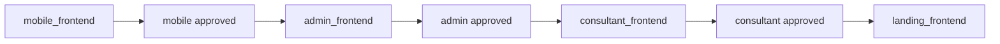
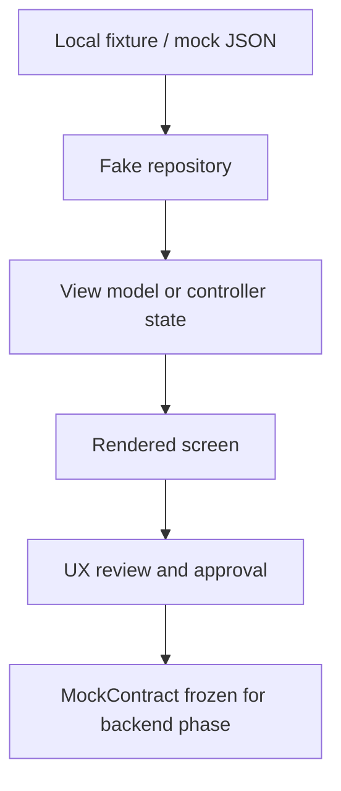
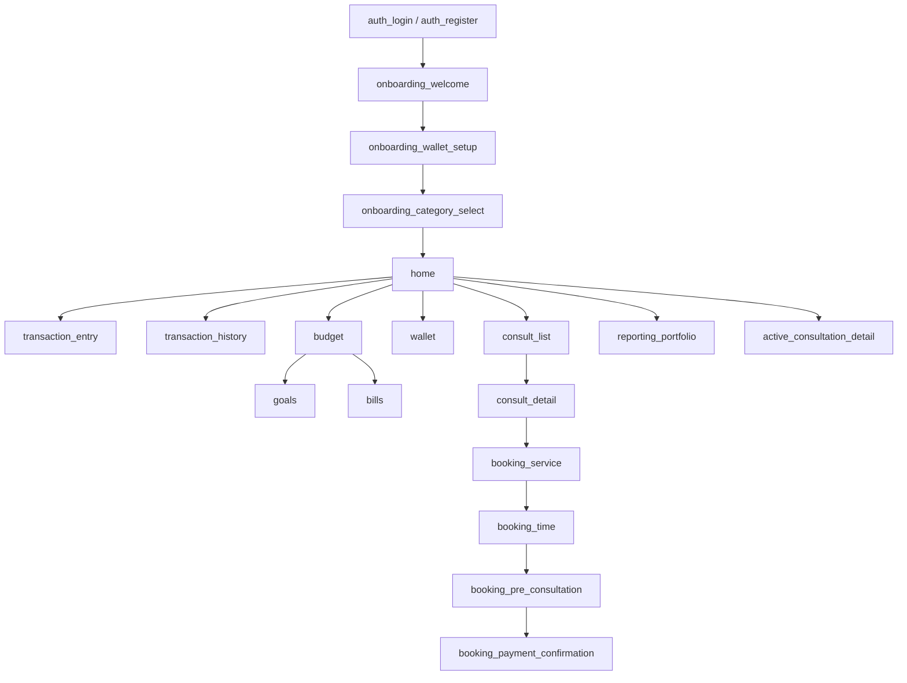

# Frontend Delivery Strategy

| Field | Value |
| --- | --- |
| Project | HaloFin |
| Document Version | 1.2 |
| Status | Active For `mobile_frontend` |
| Last Updated | 2026-03-11 |

## 1. Purpose

Dokumen ini menjadi panduan utama untuk strategi frontend-first HaloFin. Fokus saat ini adalah menyelesaikan `mobile_frontend` terlebih dahulu sebelum backend implementation dimulai.

## 2. AppSurface Matrix

| AppSurface | UI Goal | Delivery Order | Current Action |
| --- | --- | --- | --- |
| `mobile` | End-user product experience utama | 1 | Active |
| `admin` | Internal operations and monitoring | 2 | Not started |
| `consultant` | Consultant workflow and session handling | 3 | Not started |
| `landing` | Business introduction and acquisition | 4 | Not started |

## 3. Frontend-First Rules

1. Selama phase frontend-only, tim hanya mengerjakan UI, state, flow, navigation, empty state, loading state, dan error state.
2. Backend implementation tidak boleh disentuh pada phase ini.
3. Semua kebutuhan data eksternal harus dimodelkan sebagai MockContract.
4. Real API integration baru dimulai setelah seluruh frontend flow app surface aktif disetujui.

## 4. Delivery Order By App



## 5. Mobile Frontend Scope

Pada fase aktif `mobile_frontend`, minimal yang harus selesai:

1. Onboarding and authentication screens (registration, wallet setup, category selection)
2. Dashboard (home) with quick actions, expert help, recent activity
3. Wallet and balance views with asset distribution
4. Planning cluster: budget summary, goals, bills
5. Manual transaction entry screens
6. Transaction history with search and filter
7. AI draft entry screens
8. Draft review screens
9. Recommendation and wallet detail screens
10. Consultant listing and booking screens
11. Reporting and analytics screens (income vs expense, category breakdown, trend)
12. Notification center (notification list, read/unread state, preferences)
13. Data export trigger (from reporting or settings)
14. Multi-currency wallet display
15. Core empty, loading, success, and error states for all screens above

Referensi komponen reusable yang sudah teridentifikasi tersedia di [Component Catalog](../guides/component-catalog.md).

## 6. Mock State Strategy

### Approved Mock Sources

1. Local JSON fixtures
2. Fake repositories
3. In-memory service layer
4. Static response builders

### Mock Contract Requirements

1. Harus cukup jelas untuk memodelkan request, response, loading, success, dan error.
2. Harus cukup stabil sebelum backend phase dimulai.
3. Harus dapat dipetakan ke real API tanpa mengubah intent UX utama.



## 7. Design System And Shared UI Principles

1. Gunakan pola layout, spacing, dan typography yang konsisten lintas mobile dan web.
2. Pisahkan presentational component dari flow-specific container bila masuk akal.
3. Prioritaskan readability state machine dan screen flow dibanding premature abstraction.
4. Semua critical screen harus memiliki empty, loading, success, dan error state.

## 8. Contract-First Frontend Conventions

1. Semua data dependency untuk screen utama harus dideklarasikan sebagai MockContract.
2. Nama field dan shape data harus disepakati sebelum backend phase dimulai.
3. Jika frontend menemukan kebutuhan data baru, update MockContract terlebih dahulu, bukan langsung mengasumsikan API.

## 9. Definition Of Done: Frontend

Frontend untuk app surface tertentu dianggap selesai bila:

1. Seluruh flow utama dapat dijalankan end-to-end dengan mock data.
2. Navigation final untuk app surface tersebut sudah stabil.
3. Semua state penting sudah terwakili.
4. MockContract utama sudah disetujui.
5. Tidak ada blocker UX besar yang tersisa.

## 10. Frontend Risks

1. MockContract yang terlalu kasar akan menyulitkan backend mapping.
2. Terlalu banyak improvisasi visual tanpa flow approval dapat memperlambat backend phase.
3. Memulai app surface lain sebelum mobile selesai akan memecah fokus dan meningkatkan rework.

## 11. Design Source Inventory

Bagian slicing UI mobile pada dokumen ini mengacu langsung ke aset lokal yang sudah tersedia di `docs/assets/ui_halofin`.

| Screen Key | Asset Folder | Current Role |
| --- | --- | --- |
| `screen_home` | `Halofin Home` | Dashboard utama dan pintu masuk fitur lain |
| `screen_consult_list` | `Halofin Consult` | Listing konsultan dan discovery |
| `screen_consult_detail` | `Halofin Consult Detail` | Detail profil konsultan dan CTA booking |
| `screen_transaction_entry` | `Halofin trannsaction` | Form pencatatan transaksi |
| `screen_wallet` | `Halofin Wallet` | Distribusi aset dan daftar wallet |
| `screen_budget` | `Halofin Budget` | Budget summary dan kategori budget |
| `screen_goals` | `Halofin Goals` | Saving goals overview |
| `screen_bills` | `Halofin Bills` | Bills overview dan payment list |
| `screen_transaction_history` | `Halofin Transaction History` | Riwayat transaksi terfilter |

Aturan sumber desain:

1. Nama folder lokal dipakai sebagai referensi operasional utama.
2. `screen.png` menjadi acuan struktur layout utama.
3. `code.html` dipakai untuk membantu label, section naming, dan pola UI.
4. Jika title HTML terlihat generik atau legacy, struktur visual PNG tetap menjadi acuan utama.
5. Jika ada label user-facing yang sudah diputuskan berubah, dokumentasi boleh menormalkan label final tanpa mengubah aset sumber.

## 12. Standard Slicing Rules

### Global Visual Patterns

1. Font family utama adalah `Manrope`.
2. Active state dan CTA utama memakai aksen lime terang.
3. Card, chip, dan tab memakai sudut membulat besar.
4. Bottom navigation konsisten muncul pada screen utama.
5. Tema dominan adalah light theme dengan soft shadow dan spacing longgar.
6. Hierarki visual mengandalkan hero card besar di atas, lalu section modular ke bawah.

### Reusable Mobile Primitives

1. App header variants
2. Segmented tab switcher
3. Filter chips
4. Summary or hero cards
5. List item cards
6. Consultant cards
7. Wallet cards
8. Goal or budget progress cards
9. Bottom nav item
10. Sticky CTA bar

### Naming Convention For Slicing

1. `screen_` untuk level screen.
2. `section_` untuk block layout besar dalam satu screen.
3. `component_` untuk reusable UI unit.
4. `state_` untuk representasi loading, empty, success, atau error.

### Frontend-Only Constraint

1. Dokumen slicing ini hanya membahas UI structure, local state, navigation, dan mock contracts.
2. Tidak ada backend implementation detail.
3. Tidak ada real auth integration.
4. Tidak ada provider integration detail.
5. Label final bottom nav untuk item terakhir adalah `Wallet`, walau aset sumber lama masih menulis `Asset`.

## 13. Mobile Route Map And Feature Map

### Mobile Route Keys

| MobileRouteKey | Main Feature |
| --- | --- |
| `home` | Dashboard dan summary entry point |
| `consult_list` | Discovery konsultan |
| `consult_detail` | Detail konsultan |
| `transaction_entry` | Catat transaksi |
| `wallet` | Wallet overview with asset distribution |
| `budget` | Budget monitoring |
| `goals` | Saving goals |
| `bills` | Bills tracking |
| `transaction_history` | Riwayat transaksi |

### Route Map



Diagram di atas adalah route map desain yang sudah tervalidasi secara visual, bukan real router implementation.

### Screen-To-Feature Map

| Feature Group | Screen Key |
| --- | --- |
| Auth | `screen_auth_login`, `screen_auth_register` |
| Onboarding | `screen_onboarding_welcome`, `screen_onboarding_wallet_setup`, `screen_onboarding_category_select` |
| Dashboard | `screen_home` |
| Consult discovery | `screen_consult_list`, `screen_consult_detail` |
| Booking flow | `screen_booking_service`, `screen_booking_time`, `screen_booking_pre_consultation`, `screen_booking_payment` |
| Transaction flow | `screen_transaction_entry`, `screen_transaction_history` |
| Wallet and asset distribution | `screen_wallet` |
| Financial planning | `screen_budget`, `screen_goals`, `screen_bills` |
| Reporting | `screen_reporting_portfolio` |

## 14. Documentation Types For Mobile Slicing

### `MobileScreenSpec`

| Field | Meaning |
| --- | --- |
| `screen_key` | Identifier screen pada dokumen frontend |
| `asset_folder` | Folder sumber desain lokal |
| `purpose` | Fungsi utama screen |
| `primary_sections` | Bagian besar yang wajib ada pada screen |
| `reusable_components` | Komponen yang diharapkan dipakai ulang |
| `mock_data_dependencies` | Data mock minimum untuk render screen |
| `status` | Status implementasi atau kesiapan desain |

### `SliceUnit`

| SliceUnit | Meaning |
| --- | --- |
| `header` | App bar atau top context area |
| `hero_card` | Card utama penarik fokus |
| `tabs_or_chips` | Segment control atau filter chip |
| `content_list` | List, grid, atau kumpulan item |
| `cta` | Call to action utama |
| `bottom_nav` | Navigasi bawah |

### `PlaceholderScreenSpec`

| Field | Meaning |
| --- | --- |
| `screen_name` | Nama screen yang belum tersedia |
| `status` | Saat ini `pending design` |
| `dependency` | Feature atau flow yang memerlukan screen tersebut |
| `notes` | Catatan singkat untuk desain berikutnya |

## 15. Rancangan Slicing UI Mobile

### `screen_home`

Tujuan screen:
Menjadi dashboard utama yang merangkum posisi uang user, pintu masuk aksi cepat, bantuan expert, dan recent activity.

ASCII layout:

```text
.--------------------------------------------------.
|  Welcome back, Alex Morgan        o      ( )     |
|  January 2026                                     |
|  .----------. .-------------------------------.  |
|  |  pie     | |   TOTAL BALANCE               |  |
|  | preview  | |   Rp 24.500.000        >      |  |
|  | View     | |   [cash] [bank] [wallet]      |  |
|  | Portfolio| '-------------------------------'  |
|  '----------'                                    |
|                                                  |
|   (B)         (H)         (S)         (R)   (Bi) |
|  Budget      History      Score      Report Bills|
|                                                  |
|  Expert Help                           View all  |
|  .----------------.  .------------------------.  |
|  | Sarah Jenkins  |  | Mike Thompson          |  |
|  | Tax Consultant |  | Financial Planner      |  |
|  | Rp 75k   Chat  |  | Rp 125k         Chat   |  |
|  '----------------'  '------------------------'  |
|                                                  |
|  Keuangan Bulan Ini                              |
|  .--------------------------------------------.  |
|  | Budget                                75%  |  |
|  | ======= lime progress ========             |  |
|  | [target nabung] [cara naikkan tabung]      |  |
|  '--------------------------------------------'  |
|                                                  |
|  Recent Activity                          o      |
|  .--------------------------------------------.  |
|  | Uber Trip                     -Rp 150.000  |  |
|  | Starbucks                     -Rp 65.000   |  |
|  | Netflix                       -Rp 186.000  |  |
|  '--------------------------------------------'  |
|                                                  |
|   Home      Budget       (+)     Consult Wallet |
'--------------------------------------------------'
```

Section breakdown:

1. `section_header`
2. `section_month_label`
3. `section_total_balance_hero`
4. `section_quick_actions`
5. `section_active_consultation` **(NEW)**
6. `section_expert_help`
7. `section_monthly_finance`
8. `section_recent_activity`
9. `section_bottom_nav`

Slice units:

1. `header`
2. `hero_card`
3. `content_list`
4. `cta`
5. `bottom_nav`

Reusable components:

1. `component_user_header`
2. `component_total_balance_card`
3. `component_quick_action_item`
4. `component_consultant_mini_card`
5. `component_budget_summary_card`
6. `component_recent_transaction_row`
7. `component_bottom_nav`

Mock data needs:

1. User greeting and avatar
2. Current month label
3. Total balance summary
4. Portfolio split preview
5. Quick actions metadata
6. Expert help list
7. Monthly finance summary
8. Recent transactions preview

State penting:

1. `state_loading_dashboard`
2. `state_empty_expert_help`
3. `state_empty_recent_activity`
4. `state_error_dashboard`

Catatan implementasi:

1. Hero card adalah focal point utama screen.
2. Quick actions lebih cocok di-slice sebagai grid horizontal icon label.
3. Expert help dan recent activity harus dipisah menjadi section modular.
4. Bottom nav active state ada pada `Home`.
5. `section_active_consultation` muncul di antara quick actions dan expert help. Di empty state, tampilkan CTA "Belum ada sesi aktif — Cari konsultan". Saat ada booking aktif, tampilkan card dengan nama consultant, jadwal, countdown timer, dan status.
6. Quick action `Report` mengarah ke `screen_reporting_portfolio`.
7. Quick action `View Portfolio` (pada hero balance card) juga mengarah ke `screen_reporting_portfolio`.

### `screen_consult_list`

Tujuan screen:
Membantu user mencari konsultan, memfilter kebutuhan, dan memilih konsultan untuk booking.

ASCII layout:

```text
.--------------------------------------------------.
|                 Consultation                o    |
|  .--------------------------------------------.  |
|  |  search consultant or location...         |  |
|  '--------------------------------------------'  |
|   [All] [Tax] [Investment] [Insurance] [Debt]   |
|                                                  |
|  .--------------------------------------------.  |
|  | Bingung mencari konsultan yang cocok?      |  |
|  | Coba Fitur Match Expert --------------->   |  |
|  '--------------------------------------------'  |
|                                                  |
|  .--------------------------------------------.  |
|  | Sarah Jenkins                4.9           |  |
|  | Senior Tax Consultant                       |  |
|  | [Corp.Tax] [Estate Planning]               |  |
|  | Starting from Rp 250.000     [Schedule]    |  |
|  '--------------------------------------------'  |
|  .--------------------------------------------.  |
|  | Mike Thompson                4.8           |  |
|  | Financial Planner                          |  |
|  | [Wealth Mgmt] [Retirement]                 |  |
|  | Starting from Rp 185.000     [Schedule]    |  |
|  '--------------------------------------------'  |
|  .--------------------------------------------.  |
|  | Emily Chen                   5.0           |  |
|  | Crypto Analyst                              |  |
|  | [Blockchain] [DeFi Strategy]               |  |
|  | Starting from Rp 300.000     [Schedule]    |  |
|  '--------------------------------------------'  |
|                                                  |
|   Home      Budget       (+)     Consult Wallet |
'--------------------------------------------------'
```

Section breakdown:

1. `section_header`
2. `section_search`
3. `section_category_chips`
4. `section_match_cta_banner`
5. `section_consultant_list`
6. `section_bottom_nav`

Slice units:

1. `header`
2. `tabs_or_chips`
3. `content_list`
4. `cta`
5. `bottom_nav`

Reusable components:

1. `component_centered_title_header`
2. `component_search_input`
3. `component_filter_chip`
4. `component_match_expert_banner`
5. `component_consultant_card`
6. `component_bottom_nav`

Mock data needs:

1. Filter category list
2. CTA banner content
3. Consultant listing
4. Rating, experience, tags, location, and price
5. Availability or booking button state

State penting:

1. `state_loading_consultants`
2. `state_empty_consultants`
3. `state_search_no_result`
4. `state_error_consultants`
5. `state_card_fully_booked`

Catatan implementasi:

1. Listing card perlu support variasi CTA aktif dan disabled.
2. Chip filter sebaiknya reusable lintas screen lain.
3. Bottom nav active state ada pada `Consult`.

### `screen_consult_detail`

Tujuan screen:
Menjadi halaman detail konsultan untuk membantu user memvalidasi profil dan memutuskan booking.

ASCII layout:

```text
.--------------------------------------------------.
|  <        hero portrait area          o   o      |
|                                                  |
|                 Sarah Jenkins                    |
|     Senior Tax Consultant   [Verified]           |
|                                                  |
|    450+ Clients    4.9 Rating    12 Yr Exp       |
| ------------------------------------------------ |
|  Tentang Konsultan                               |
|  Profesional pajak berpengalaman ...             |
| ------------------------------------------------ |
|  .--------------------------------------------.  |
|  | Keahlian                               v    | |
|  | [Tax Planning] [Audit] [Corp Finance]      | |
|  '--------------------------------------------'  |
|  .--------------------------------------------.  |
|  | Sertifikasi                            >    | |
|  '--------------------------------------------'  |
|  .--------------------------------------------.  |
|  | Riwayat Pendidikan                     >    | |
|  '--------------------------------------------'  |
|  .--------------------------------------------.  |
|  | Pengalaman Lapangan                    >    | |
|  '--------------------------------------------'  |
|  Ulasan Pengguna                       Lihat All |
|  .----------------.  .------------------------.  |
|  | "Sangat detail"|  | "Penjelasannya mudah" |  |
|  '----------------'  '------------------------'  |
|  Biaya Sesi Rp 250.000/jam    [Pesan Sekarang]  |
'--------------------------------------------------'
```

Section breakdown:

1. `section_hero_profile`
2. `section_stat_row`
3. `section_about`
4. `section_accordion_blocks`
5. `section_reviews`
6. `section_sticky_booking_cta`

Slice units:

1. `header`
2. `hero_card`
3. `content_list`
4. `cta`

Reusable components:

1. `component_profile_hero_header`
2. `component_verified_badge`
3. `component_stat_item`
4. `component_accordion_card`
5. `component_skill_chip`
6. `component_review_card`
7. `component_sticky_cta_bar`

Mock data needs:

1. Consultant identity and hero media
2. Stats summary
3. About content
4. Skill tags
5. Certification list
6. Education and experience items
7. User reviews
8. Pricing and booking CTA text

State penting:

1. `state_loading_consultant_detail`
2. `state_empty_reviews`
3. `state_collapsed_accordion`
4. `state_error_consultant_detail`

Catatan implementasi:

1. Hero section memakai visual treatment berbeda dari list screen, jadi jangan dipaksa reuse penuh.
2. Sticky CTA harus tetap terbaca saat konten panjang.
3. Accordion content cocok di-slice sebagai reusable expandable card.

### `screen_transaction_entry`

Tujuan screen:
Memfasilitasi input transaksi cepat dengan fokus kuat ke nominal dan kategori utama.

ASCII layout:

```text
.--------------------------------------------------.
|  x              Catat Transaksi          Upload  |
|                                                  |
|  .---------------.  .-------------------------.  |
|  | Pengeluaran v |  | Hari Ini v              |  |
|  '---------------'  '-------------------------'  |
|                                                  |
|  .--------------------------------------------.  |
|  | Coba catat pakai AI, lebih praktis!  [Coba]|  |
|  '--------------------------------------------'  |
|                                                  |
|                    Rp                            |
|                     0                            |
|                                                  |
|       .----------------------------------.       |
|       | Duplikat data transaksi yang lalu >|     |
|       '----------------------------------'       |
|                                                  |
|  .--------------------------------------------.  |
|  | [BNI Mobile] [Cash] [Stockbit]            |  |
|  |                                            |  |
|  | Makanan & minuman                       v |  |
|  | ---------------------------------------- |  |
|  | Catatan                                  |  |
|  | Tambahkan catatan di sini...             |  |
|  |                                          |  |
|  '--------------------------------------------'  |
|                 SWIPE UP TO FINISH              |
'--------------------------------------------------'
```

Section breakdown:

1. `section_fullscreen_lime_header`
2. `section_type_and_date_pills`
3. `section_ai_prompt_banner`
4. `section_nominal_entry`
5. `section_duplicate_shortcut`
6. `section_form_sheet`

Slice units:

1. `header`
2. `tabs_or_chips`
3. `cta`
4. `content_list`

Reusable components:

1. `component_modal_header`
2. `component_transaction_type_pill`
3. `component_ai_assist_banner`
4. `component_large_amount_display`
5. `component_wallet_chip`
6. `component_category_selector_row`
7. `component_notes_textarea`
8. `component_swipe_finish_hint`

Mock data needs:

1. Transaction type options
2. Selected date label
3. Suggested AI helper copy
4. Wallet options
5. Category selection summary
6. Notes placeholder state

State penting:

1. `state_idle_amount_zero`
2. `state_wallet_selected`
3. `state_category_unselected`
4. `state_notes_empty`
5. `state_entry_validation_warning`

Catatan implementasi:

1. Screen ini bersifat form-driven, jadi slice container dan field harus jelas.
2. Visual split antara lime header dan white form sheet harus dipertahankan.
3. Input nominal wajib punya prioritas visual tertinggi.

### `screen_wallet`

Tujuan screen:
Menampilkan distribusi aset user sekaligus daftar wallet atau aset yang bisa diinspeksi lebih lanjut.

ASCII layout:

```text
.--------------------------------------------------.
|  January 2026                        o      ( )  |
|  .--------------------------------------------.  |
|  |         asset distribution donut           |  |
|  |    Cash 35%   Bank 30%   Crypto 20%        |  |
|  |              TOTAL BALANCE                 |  |
|  |             Rp 215.500.000                 |  |
|  '--------------------------------------------'  |
|                                                  |
|  Your Wallets                         Sort by    |
|   [Semua] [E-Wallet] [Bank] [Investasi] [...]    |
|                                                  |
|  .----------------.  .------------------------.  |
|  |   (+) Add New  |  | Bank BCA               |  |
|  | Wallet / Asset |  | Rp 85.450.000 ======   |  |
|  '----------------'  '------------------------'  |
|  .----------------.  .------------------------.  |
|  | Bank BNI       |  | DANA                   |  |
|  | Rp 2.500.000 = |  | Rp 850.000 =====       |  |
|  '----------------'  '------------------------'  |
|  .----------------.  .------------------------.  |
|  | GoPay          |  | IndoPremier            |  |
|  | Rp 35.800.000  |  | Rp 32.300.000 ===      |  |
|  '----------------'  '------------------------'  |
|                                                  |
|   Home      Budget       (+)     Consult Wallet |
'--------------------------------------------------'
```

Section breakdown:

1. `section_header`
2. `section_asset_distribution_card`
3. `section_wallet_header`
4. `section_wallet_filter_chips`
5. `section_wallet_grid`
6. `section_bottom_nav`

Slice units:

1. `header`
2. `hero_card`
3. `tabs_or_chips`
4. `content_list`
5. `bottom_nav`

Reusable components:

1. `component_month_header`
2. `component_asset_distribution_card`
3. `component_wallet_filter_chip`
4. `component_add_wallet_tile`
5. `component_wallet_card`
6. `component_bottom_nav`

Mock data needs:

1. Period label
2. Total balance
3. Asset distribution percentages
4. Wallet categories
5. Wallet card list
6. Sort state

State penting:

1. `state_loading_wallet_distribution`
2. `state_empty_wallet_list`
3. `state_filter_active`
4. `state_error_wallet`

Catatan implementasi:

1. Distribution card adalah komponen khusus dan tidak perlu dipaksa reuse dengan summary card biasa.
2. Grid wallet perlu support card dengan logo image maupun initials.
3. Bottom nav active state ada pada `Wallet`.

### `screen_budget`

Tujuan screen:
Menampilkan ringkasan budget aktif dan performa kategori budget.

ASCII layout:

```text
.--------------------------------------------------.
|                 January 2026                     |
|      .----------. .----------. .----------.      |
|      | Goals    | | Budget   | | Bills    |      |
|      '----------' '----------' '----------'      |
|                                                  |
|  .--------------------------------------------.  |
|  | Total Budget      Rp 10.000.000           o|  |
|  | Remaining          Rp 2.500.000            |  |
|  | ========= lime progress =========    75%   |  |
|  '--------------------------------------------'  |
|                                                  |
|  Categories                              Tambah  |
|  .--------------------------------------------.  |
|  | Food & Drink                Rp 4.500.000   |  |
|  | Left Rp 500.000     ======== progress ==== |  |
|  '--------------------------------------------'  |
|  .--------------------------------------------.  |
|  | Transport                   Rp 1.200.000   |  |
|  | Left Rp 800.000     ===== progress =====   |  |
|  '--------------------------------------------'  |
|  .--------------------------------------------.  |
|  | Entertainment               Rp 800.000     |  |
|  | Left Rp 700.000     ===== progress =====   |  |
|  '--------------------------------------------'  |
|                                                  |
|   Home      Budget       (+)     Consult Wallet |
'--------------------------------------------------'
```

Section breakdown:

1. `section_month_header`
2. `section_segmented_tabs`
3. `section_budget_overview_card`
4. `section_categories_header`
5. `section_budget_category_list`
6. `section_bottom_nav`

Slice units:

1. `header`
2. `tabs_or_chips`
3. `hero_card`
4. `content_list`
5. `bottom_nav`

Reusable components:

1. `component_month_header`
2. `component_finance_tabs`
3. `component_budget_overview_card`
4. `component_budget_category_card`
5. `component_progress_bar`
6. `component_bottom_nav`

Mock data needs:

1. Period label
2. Active tab state
3. Total budget summary
4. Remaining amount
5. Category budgets and progress

State penting:

1. `state_loading_budget`
2. `state_empty_budget_categories`
3. `state_budget_over_limit`
4. `state_error_budget`

Catatan implementasi:

1. Tab switcher `Goals/Budget/Bills` harus reusable lintas tiga screen planning.
2. Budget category card perlu hierarchy jelas antara `spent`, `remaining`, dan `total`.
3. Bottom nav active state ada pada `Budget`.

### `screen_goals`

Tujuan screen:
Menampilkan daftar saving goals, progress tiap goal, dan CTA untuk membuat goal baru.

ASCII layout:

```text
.--------------------------------------------------.
|                 January 2026                     |
|      .----------. .----------. .----------.      |
|      | Goals    | | Budget   | | Bills    |      |
|      '----------' '----------' '----------'      |
|  Your Saving Goals                     + New Goal |
|                                                  |
|  .----------------.  .------------------------.  |
|  | MacBook Pro    |  | Emergency Fund         |  |
|  | 75%  14 mo left|  | 45%    Urgent          |  |
|  | Saved 18 jt    |  | Saved 22.5 jt          |  |
|  '----------------'  '------------------------'  |
|  .----------------.  .------------------------.  |
|  | Japan Trip     |  | Tesla Model 3          |  |
|  | 20%   8 mo left|  | 10%    3 years         |  |
|  | Saved 7 jt     |  | Saved 8 jt             |  |
|  '----------------'  '------------------------'  |
|  .----------------.                               |
|  |  (+)           |                               |
|  | Create New Goal|                               |
|  '----------------'                               |
|                                                  |
|  .--------------------------------------------.  |
|  | Smart Tip                                   |  |
|  | Save extra Rp 500.000 bulan ini ...         |  |
|  '--------------------------------------------'  |
|                                                  |
|   Home      Budget       (+)     Consult Wallet |
'--------------------------------------------------'
```

Section breakdown:

1. `section_month_header`
2. `section_segmented_tabs`
3. `section_goals_header`
4. `section_goal_grid`
5. `section_smart_tip`
6. `section_bottom_nav`

Slice units:

1. `header`
2. `tabs_or_chips`
3. `content_list`
4. `cta`
5. `bottom_nav`

Reusable components:

1. `component_month_header`
2. `component_finance_tabs`
3. `component_goal_card`
4. `component_create_goal_tile`
5. `component_smart_tip_card`
6. `component_bottom_nav`

Mock data needs:

1. Period label
2. Goals list
3. Goal progress values
4. Goal urgency badges
5. Smart tip content

State penting:

1. `state_loading_goals`
2. `state_empty_goals`
3. `state_goal_urgent`
4. `state_error_goals`

Catatan implementasi:

1. Goal grid harus responsif terhadap jumlah item ganjil.
2. Create-goal tile diperlakukan sebagai item grid khusus, bukan FAB.
3. Smart tip adalah secondary insight card yang cocok reuse di planning feature lain.

### `screen_bills`

Tujuan screen:
Membantu user melihat total tagihan bulan berjalan, upcoming payments, dan histori tagihan yang sudah dibayar.

ASCII layout:

```text
.--------------------------------------------------.
|                 January 2026                     |
|      .----------. .----------. .----------.      |
|      | Goals    | | Budget   | | Bills    |      |
|      '----------' '----------' '----------'      |
|                                                  |
|  .--------------------------------------------.  |
|  | TOTAL BILLS FOR JAN      Rp 1.286.000      |  |
|  | ======== lime progress ========       65%  |  |
|  | Paid Rp 835.900      Remaining Rp 450.100  |  |
|  '--------------------------------------------'  |
|                                                  |
|  Upcoming Payments                               |
|  .--------------------------------------------.  |
|  | Netflix Premium        Rp 186.000  Pay Now |  |
|  | Due in 2 days                            |  |  |
|  '--------------------------------------------'  |
|  .--------------------------------------------.  |
|  | Spotify Family        Rp 86.000   Pay Now |  |
|  '--------------------------------------------'  |
|  .--------------------------------------------.  |
|  | IndiHome Fiber        Rp 350.000  Auto-pay |  |
|  '--------------------------------------------'  |
|  Paid this month                                |
|  [Water Bill]   [Electricity]                   |
|                                                  |
|   Home      Budget       (+)     Consult Wallet |
'--------------------------------------------------'
```

Section breakdown:

1. `section_month_header`
2. `section_segmented_tabs`
3. `section_total_bills_overview`
4. `section_upcoming_payments`
5. `section_paid_this_month`
6. `section_bottom_nav`

Slice units:

1. `header`
2. `tabs_or_chips`
3. `hero_card`
4. `content_list`
5. `bottom_nav`

Reusable components:

1. `component_month_header`
2. `component_finance_tabs`
3. `component_bills_summary_card`
4. `component_upcoming_bill_row`
5. `component_paid_bill_row`
6. `component_bottom_nav`

Mock data needs:

1. Total bills summary
2. Paid and remaining values
3. Upcoming bills list
4. Paid bills list
5. Due date and payment state

State penting:

1. `state_loading_bills`
2. `state_empty_upcoming_bills`
3. `state_autopay_enabled`
4. `state_pay_now_available`
5. `state_error_bills`

Catatan implementasi:

1. Upcoming dan paid list perlu dua jenis row berbeda.
2. Tab switcher harus identical secara visual dengan Goals dan Budget.
3. Bottom nav active state tetap `Budget` karena screen ini masih satu cluster planning.

### `screen_transaction_history`

Tujuan screen:
Memberi akses ke pencarian, filter, dan inspeksi riwayat transaksi berdasarkan tanggal dan kategori.

ASCII layout:

```text
.--------------------------------------------------.
|  <            Transaction History          o     |
|  .--------------------------------------------.  |
|  |  Search transactions...                   |  |
|  '--------------------------------------------'  |
|   [All] [Category v] [Wallet v] [Amount v]      |
|                                                  |
|   TOTAL IN +Rp 25.500.000   |  -Rp 8.240.000    |
| ------------------------------------------------ |
|  TODAY, JAN 24                                   |
|  .--------------------------------------------.  |
|  | McDonald's                  -Rp 85.000     |  |
|  | 12:30 PM   Food & Bev                       |  |
|  '--------------------------------------------'  |
|  .--------------------------------------------.  |
|  | Gojek Ride                  -Rp 24.000     |  |
|  | 08:15 AM   Transport                        |  |
|  '--------------------------------------------'  |
|  .--------------------------------------------.  |
|  | Top Up E-Wallet             -Rp 500.000    |  |
|  | 07:45 AM   Transfer                         |  |
|  '--------------------------------------------'  |
|  YESTERDAY, JAN 23                              |
|  [Freelance Project A] [Supermarket Weekly]     |
|  [Netflix Premium]                              |
'--------------------------------------------------'
```

Section breakdown:

1. `section_top_app_bar`
2. `section_search`
3. `section_filter_chips`
4. `section_total_in_out_summary`
5. `section_grouped_transaction_list`

Slice units:

1. `header`
2. `tabs_or_chips`
3. `content_list`

Reusable components:

1. `component_back_header`
2. `component_search_input`
3. `component_filter_chip`
4. `component_in_out_summary`
5. `component_transaction_group_header`
6. `component_transaction_history_row`

Mock data needs:

1. Search query state
2. Active filter state
3. Summary totals
4. Grouped transaction sections
5. Transaction rows with icon, merchant, time, category, and amount

State penting:

1. `state_loading_history`
2. `state_empty_history`
3. `state_search_no_result`
4. `state_filter_applied`
5. `state_error_history`

Catatan implementasi:

1. Filter chip style sebaiknya reuse dari consult list bila masih sejalan.
2. Group header berdasarkan tanggal perlu dipisah dari card item.
3. Screen ini kemungkinan diakses dari quick action `History` dan recent activity di home.

### `screen_auth_login`

Tujuan screen:
Halaman login untuk user yang sudah memiliki akun. Entry point awal saat membuka app dalam kondisi logged-out.

ASCII layout:

```text
.--------------------------------------------------.
|                                                  |
|            [  HaloFin Logo  ]                    |
|                                                  |
|         Masuk ke akun kamu                       |
|         Kelola keuanganmu lebih cerdas           |
|                                                  |
|  .--------------------------------------------.  |
|  |  Email                                     |  |
|  '--------------------------------------------'  |
|  .--------------------------------------------.  |
|  |  Password                         (eye)    |  |
|  '--------------------------------------------'  |
|                                                  |
|              Lupa password?                      |
|                                                  |
|  .--------------------------------------------.  |
|  |            [  Masuk  ]                     |  |
|  '--------------------------------------------'  |
|                                                  |
|  -------------- atau ---------------             |
|                                                  |
|  .--------------------------------------------.  |
|  | [G] Lanjutkan dengan Google                |  |
|  '--------------------------------------------'  |
|                                                  |
|        Belum punya akun? Daftar                  |
|                                                  |
'--------------------------------------------------'
```

Section breakdown:

1. `section_logo`
2. `section_title`
3. `section_login_form`
4. `section_social_login`
5. `section_register_link`

Reusable components:

1. `component_text_input` (email, password with toggle)
2. `component_primary_button` ("Masuk")
3. `component_social_login_button` (Google)
4. `component_text_link` ("Lupa password?", "Daftar")

Mock data needs:

1. Form validation states (empty, invalid email, wrong password)
2. Auth mock state (success → navigate to home, first-time → navigate to onboarding)

State penting:

1. `state_idle` (form empty)
2. `state_loading_login` (saat klik Masuk)
3. `state_error_invalid_credentials`
4. `state_error_network`
5. `state_success` (navigate to home atau onboarding)

Catatan implementasi:

1. Jika user baru pertama kali (onboarding_completed = false), redirect ke `screen_onboarding_welcome`.
2. Jika user sudah pernah login, redirect ke `screen_home`.
3. Social login hanya Google pada MVP.
4. Password toggle visibility (eye icon).

### `screen_auth_register`

Tujuan screen:
Halaman registrasi user baru. Sesederhana mungkin agar conversion tidak drop.

ASCII layout:

```text
.--------------------------------------------------.
|                                                  |
|            [  HaloFin Logo  ]                    |
|                                                  |
|         Buat akun baru                           |
|         Mulai perjalanan keuanganmu              |
|                                                  |
|  .--------------------------------------------.  |
|  |  Nama lengkap                              |  |
|  '--------------------------------------------'  |
|  .--------------------------------------------.  |
|  |  Email                                     |  |
|  '--------------------------------------------'  |
|  .--------------------------------------------.  |
|  |  Password                         (eye)    |  |
|  '--------------------------------------------'  |
|  .--------------------------------------------.  |
|  |  Konfirmasi Password              (eye)    |  |
|  '--------------------------------------------'  |
|                                                  |
|  [x] Saya setuju dengan Syarat & Ketentuan      |
|      dan Kebijakan Privasi                       |
|                                                  |
|  .--------------------------------------------.  |
|  |            [  Daftar  ]                    |  |
|  '--------------------------------------------'  |
|                                                  |
|  -------------- atau ---------------             |
|                                                  |
|  .--------------------------------------------.  |
|  | [G] Daftar dengan Google                   |  |
|  '--------------------------------------------'  |
|                                                  |
|        Sudah punya akun? Masuk                   |
|                                                  |
'--------------------------------------------------'
```

Section breakdown:

1. `section_logo`
2. `section_title`
3. `section_register_form`
4. `section_agreement_checkbox`
5. `section_social_register`
6. `section_login_link`

Reusable components:

1. `component_text_input` (nama, email, password, konfirmasi password)
2. `component_primary_button` ("Daftar")
3. `component_checkbox` (agreement)
4. `component_social_login_button` (Google)
5. `component_text_link` ("Masuk", "Syarat & Ketentuan")

Mock data needs:

1. Form validation states
2. Password strength indicator

State penting:

1. `state_idle`
2. `state_validation_error` (per field)
3. `state_loading_register`
4. `state_error_email_exists`
5. `state_success` (navigate to onboarding)

Catatan implementasi:

1. Setelah register sukses, selalu redirect ke `screen_onboarding_welcome`.
2. Password minimal 8 karakter.
3. Agreement checkbox wajib di-check sebelum button aktif.

### `screen_onboarding_welcome`

Tujuan screen:
Welcome screen pertama setelah registrasi. Memberikan kesan pertama positif dan menjelaskan value app.

ASCII layout:

```text
.--------------------------------------------------.
|                                                  |
|                   [illustration]                 |
|                   Kelola keuangan                |
|                   dengan lebih cerdas            |
|                                                  |
|  .  .  .  (progress dots: 1 of 3)               |
|                                                  |
|  HaloFin membantu kamu mencatat                  |
|  pengeluaran, merencanakan budget,               |
|  dan mendapatkan insight keuangan                |
|  yang actionable.                                |
|                                                  |
|                                                  |
|                                                  |
|                                                  |
|                                                  |
|  .--------------------------------------------.  |
|  |           [  Mulai Setup  ]                |  |
|  '--------------------------------------------'  |
|                                                  |
|              Skip untuk sekarang                 |
|                                                  |
'--------------------------------------------------'
```

Section breakdown:

1. `section_illustration`
2. `section_value_proposition`
3. `section_progress_dots`
4. `section_cta`

Reusable components:

1. `component_onboarding_illustration` (placeholder image, generate with image tool)
2. `component_progress_dots` (3 dots, active state)
3. `component_primary_button` ("Mulai Setup")
4. `component_text_link` ("Skip untuk sekarang")

State penting:

1. `state_welcome` (default)
2. `state_skip_confirm` (opsional: "Yakin mau skip?")

Catatan implementasi:

1. Skip akan langsung set onboarding_completed = true dan navigate ke home dengan state minimal.
2. "Mulai Setup" navigate ke `screen_onboarding_wallet_setup`.
3. Progress dots reusable di semua onboarding screens.

### `screen_onboarding_wallet_setup`

Tujuan screen:
Memandu user membuat wallet pertama dan mengisi saldo awal. Step 2 dari onboarding.

ASCII layout:

```text
.--------------------------------------------------.
|  <  Buat Wallet Pertama                          |
|                                                  |
|  .  o  .  (progress dots: 2 of 3)               |
|                                                  |
|  Pilih tipe wallet:                              |
|                                                  |
|  .---------. .---------. .---------. .---------.  |
|  | 💵      | | 🏦      | | 📱      | | 📈      |  |
|  | Cash    | | Bank    | | E-Wallet| | Investasi|  |
|  '---------' '---------' '---------' '---------'  |
|                                                  |
|  .--------------------------------------------.  |
|  |  Nama wallet (misal: BCA, GoPay)           |  |
|  '--------------------------------------------'  |
|                                                  |
|  .--------------------------------------------.  |
|  |  Saldo awal              Rp 0              |  |
|  '--------------------------------------------'  |
|                                                  |
|  Mata uang:  [IDR v]                             |
|                                                  |
|                                                  |
|                                                  |
|  .--------------------------------------------.  |
|  |         [  Buat Wallet  ]                  |  |
|  '--------------------------------------------'  |
|                                                  |
|       Tambah wallet lain nanti                   |
|                                                  |
'--------------------------------------------------'
```

Section breakdown:

1. `section_header_with_back`
2. `section_progress_dots`
3. `section_wallet_type_selector`
4. `section_wallet_form`
5. `section_cta`

Reusable components:

1. `component_back_header`
2. `component_progress_dots`
3. `component_wallet_type_tile` (4 tipe: Cash, Bank, E-Wallet, Investasi)
4. `component_text_input` (nama wallet)
5. `component_amount_input` (saldo awal)
6. `component_currency_dropdown` (IDR default)
7. `component_primary_button` ("Buat Wallet")

Mock data needs:

1. Wallet type list with icons
2. Currency list (IDR, USD)
3. Validation for wallet name (required) and saldo (>= 0)

State penting:

1. `state_idle` (no type selected)
2. `state_type_selected` (type highlighted, form visible)
3. `state_loading_create`
4. `state_success` (navigate to next step)
5. `state_error_create`

Catatan implementasi:

1. User wajib membuat minimal 1 wallet.
2. "Tambah wallet lain nanti" bukan skip step; hanya informasi bahwa bisa tambah lagi di Wallet screen.
3. Saldo awal boleh 0.
4. Currency default IDR, bisa pilih USD sesuai multi-currency feature.

### `screen_onboarding_category_select`

Tujuan screen:
Membantu user memilih kategori pengeluaran yang relevan. Step 3 (opsional, bisa di-skip).

ASCII layout:

```text
.--------------------------------------------------.
|  <  Personalisasi Keuangan                       |
|                                                  |
|  .  .  o  (progress dots: 3 of 3)               |
|                                                  |
|  Pilih kategori yang sering kamu pakai:          |
|  (kamu bisa ubah ini nanti di settings)          |
|                                                  |
|  [🍔 Makan & Minum]   [🚗 Transportasi]          |
|  [🎬 Hiburan]          [🛒 Belanja]               |
|  [❤️ Kesehatan]        [🎓 Pendidikan]             |
|  [💳 Tagihan]          [💇 Personal Care]          |
|  [💼 Gaji]             [💰 Freelance]              |
|  [📈 Investasi]                                    |
|                                                  |
|                                                  |
|  5 kategori dipilih                              |
|                                                  |
|  .--------------------------------------------.  |
|  |     [  Mulai Pakai HaloFin  ]              |  |
|  '--------------------------------------------'  |
|                                                  |
|              Skip untuk sekarang                 |
|                                                  |
'--------------------------------------------------'
```

Section breakdown:

1. `section_header_with_back`
2. `section_progress_dots`
3. `section_category_grid`
4. `section_selection_count`
5. `section_cta`

Reusable components:

1. `component_back_header`
2. `component_progress_dots`
3. `component_selectable_category_chip` (toggle state, icon + label)
4. `component_primary_button` ("Mulai Pakai HaloFin")
5. `component_text_link` ("Skip untuk sekarang")

Mock data needs:

1. Default category list with icons and labels
2. Selection state per category

State penting:

1. `state_no_selection`
2. `state_categories_selected`
3. `state_loading_save`
4. `state_success` (navigate to home)

Catatan implementasi:

1. Step ini bisa di-skip; semua default categories tetap aktif.
2. Jika user pilih, hanya kategori terpilih yang muncul di transaction entry dan budget.
3. Categories yang tidak dipilih tidak dihapus, hanya de-prioritized.
4. Setelah step ini selesai, set onboarding_completed = true, navigate ke home.

### `screen_booking_service`

Tujuan screen:
Step 1 dari booking flow. User memilih paket layanan konsultasi (Quick Consult / Deep Dive / Full Planning).

ASCII layout:

```text
.--------------------------------------------------.
|  <  Pilih Layanan                   Step 1 of 4 |
|                                                  |
|  .--------------------------------------------.  |
|  |         [ Foto Consultant ]                |  |
|  |  Sarah Jenkins                             |  |
|  |  Senior Tax Consultant                     |  |
|  '--------------------------------------------'  |
|                                                  |
|  Pilih paket yang sesuai:                        |
|                                                  |
|  .--------------------------------------------.  |
|  |  💬 Quick Consult                          |  |
|  |  1x chat session (60 min)                  |  |
|  |  • Post-session summary                    |  |
|  |  • Akses 1 hari                            |  |
|  |                                 Rp 100.000  |  |
|  '--------------------------------------------'  |
|                                                  |
|  .--------------------------------------------.  |
|  |  🎯 Deep Dive              ★ POPULER        |  |
|  |  3x chat + 1x video call (45 min)          |  |
|  |  • Financial review + action plan           |  |
|  |  • Akses 7 hari                            |  |
|  |                                 Rp 350.000  |  |
|  '--------------------------------------------'  |
|                                                  |
|  .--------------------------------------------.  |
|  |  🚀 Full Planning                           |  |
|  |  Unlimited chat + 3x video + 1x in-person  |  |
|  |  • Full review + personalized plan          |  |
|  |  • Akses 30 hari                           |  |
|  |                               Rp 1.200.000  |  |
|  '--------------------------------------------'  |
|                                                  |
|  .--------------------------------------------.  |
|  |           [  Lanjutkan  ]                  |  |
|  '--------------------------------------------'  |
|                                                  |
'--------------------------------------------------'
```

Section breakdown:

1. `section_header_with_step`
2. `section_consultant_preview`
3. `section_service_tier_list`
4. `section_cta`

Reusable components:

1. `component_back_header_with_step` (back + "Step X of 4")
2. `component_consultant_mini_preview` (foto, nama, title)
3. `component_service_tier_card` (selectable, with badge for popular, benefit list, price)
4. `component_primary_button` ("Lanjutkan", disabled until tier selected)

Mock data needs:

1. Consultant info (already available from consult detail)
2. Service tiers with benefits, duration, price per consultant
3. Selected state per tier

State penting:

1. `state_no_selection`
2. `state_tier_selected`
3. `state_loading_tiers` (saat fetch tier data)
4. `state_error_load_tiers`

Catatan implementasi:

1. Hanya satu tier yang bisa dipilih.
2. "POPULER" badge muncul pada tier Deep Dive.
3. Harga spesifik per consultant; data dari consultant profile.
4. In-person availability indicator pada Full Planning.
5. CTA disabled sampai user memilih tier.

### `screen_booking_time`

Tujuan screen:
Step 2 dari booking flow. User memilih tanggal dan slot waktu yang tersedia.

ASCII layout:

```text
.--------------------------------------------------.
|  <  Pilih Waktu                     Step 2 of 4 |
|                                                  |
|  Maret 2026                              >      |
|  .--------------------------------------------.  |
|  | Sen  Sel  Rab  Kam  Jum  Sab  Min          |  |
|  |  1    2    3    4    5    6    7            |  |
|  |  8    9   10   11  [12]  13   14           |  |
|  | 15   16   17   18   19   20   21           |  |
|  | 22   23   24   25   26   27   28           |  |
|  | 29   30   31                               |  |
|  '--------------------------------------------'  |
|                                                  |
|  Slot tersedia untuk 12 Maret:                   |
|                                                  |
|  [09:00]  [10:00]  [11:00]                       |
|  [13:00]  [14:00]  [15:00]                       |
|  [16:00]                                         |
|                                                  |
|  ⚠️ Timezone: WIB (UTC+7)                        |
|                                                  |
|  .--------------------------------------------.  |
|  |           [  Lanjutkan  ]                  |  |
|  '--------------------------------------------'  |
|                                                  |
'--------------------------------------------------'
```

Section breakdown:

1. `section_header_with_step`
2. `section_calendar`
3. `section_available_slots`
4. `section_timezone_notice`
5. `section_cta`

Reusable components:

1. `component_back_header_with_step`
2. `component_calendar_grid` (month view, navigable, dates with/without availability)
3. `component_time_slot_chip` (selectable, disabled for unavailable)
4. `component_primary_button` ("Lanjutkan", disabled until date + time selected)

Mock data needs:

1. Available dates for selected month (mock: beberapa tanggal available)
2. Time slots per date
3. Timezone display

State penting:

1. `state_no_date_selected`
2. `state_date_selected_loading_slots`
3. `state_slots_loaded`
4. `state_slot_selected`
5. `state_no_slots_available` (tanggal terpilih tidak ada slot)

Catatan implementasi:

1. Tanggal yang sudah lewat harus disabled.
2. Tanggal tanpa slot harus disabled atau di-gray.
3. Slot waktu sesuai jadwal consultant yang tersedia.
4. Timezone selalu WIB pada MVP.

### `screen_booking_pre_consultation`

Tujuan screen:
Step 3 dari booking flow. User mengisi detail pre-konsultasi: topik, deskripsi masalah, harapan, upload dokumen, dan agreement.

ASCII layout:

```text
.--------------------------------------------------.
|  <  Pre-Konsultasi                  Step 3 of 4 |
|                                                  |
|  Topik yang ingin dibahas:                       |
|  [Tax Planning]  [Annual Report]  [NPWP]         |
|  [Pelaporan SPT] [Lainnya...]                    |
|                                                  |
|  .--------------------------------------------.  |
|  |  Deskripsi masalah                         |  |
|  |  Ceritakan situasi atau pertanyaan yang     |  |
|  |  ingin kamu bahas...                       |  |
|  |                                            |  |
|  '--------------------------------------------'  |
|                                                  |
|  .--------------------------------------------.  |
|  |  Harapan setelah sesi                      |  |
|  |  Apa yang kamu harapkan setelah            |  |
|  |  konsultasi ini?                           |  |
|  |                                            |  |
|  '--------------------------------------------'  |
|                                                  |
|  Dokumen tambahan (opsional):                    |
|  .--------------------------------------------.  |
|  | [+] Upload dokumen                         |  |
|  |  Max 5 file, PDF/JPG/PNG, maks 10MB/file   |  |
|  '--------------------------------------------'  |
|  .-------.  .-------.                            |
|  |SPT.pdf|  |NPWP   |                            |
|  |  2MB   |  |.jpg   |                            |
|  |   [x]  |  |  [x]  |                            |
|  '-------'  '-------'                            |
|                                                  |
|  .--------------------------------------------.  |
|  | [x] Saya setuju dengan Kebijakan Data      |  |
|  |     Konsultasi. Data keuangan saya hanya   |  |
|  |     dapat diakses konsultan selama sesi.    |  |
|  '--------------------------------------------'  |
|                                                  |
|  .--------------------------------------------.  |
|  |           [  Lanjutkan  ]                  |  |
|  '--------------------------------------------'  |
|                                                  |
'--------------------------------------------------'
```

Section breakdown:

1. `section_header_with_step`
2. `section_topic_selector`
3. `section_problem_description`
4. `section_expectation_notes`
5. `section_document_upload`
6. `section_data_agreement`
7. `section_cta`

Reusable components:

1. `component_back_header_with_step`
2. `component_selectable_topic_chip` (multi-select, sesuai expertise consultant)
3. `component_textarea_input` (deskripsi masalah, harapan)
4. `component_file_upload_area` (upload trigger, file list, remove)
5. `component_uploaded_file_card` (thumbnail, filename, size, remove button)
6. `component_checkbox` (agreement)
7. `component_primary_button` ("Lanjutkan", disabled until agreement checked)

Mock data needs:

1. Topic list sesuai expertise consultant (Tax Planning, Annual Report, NPWP, SPT, etc.)
2. File upload mock (simulated file objects)
3. Agreement text

State penting:

1. `state_idle_form`
2. `state_uploading_file`
3. `state_file_upload_error` (size exceed, format invalid)
4. `state_form_incomplete` (agreement unchecked)
5. `state_form_complete`

Catatan implementasi:

1. Topik yang tersedia tergantung pada expertise consultant terpilih.
2. Deskripsi masalah minimal 20 karakter.
3. Harapan bersifat opsional.
4. Upload dokumen opsional, max 5 file, max 10MB per file, format PDF/JPG/PNG.
5. Agreement checkbox berbeda tergantung tipe consultant:
   - Financial planner: "Data keuangan saya dapat diakses selama sesi aktif"
   - Non-financial: "Saya hanya membagikan dokumen yang saya upload"
6. Untuk consultant non-keuangan, upload dokumen sangat direkomendasikan (bukan mandatory).

### `screen_booking_payment`

Tujuan screen:
Step 4 dari booking flow. User mereview rincian booking dan melakukan pembayaran.

ASCII layout:

```text
.--------------------------------------------------.
|  <  Konfirmasi Pembayaran           Step 4 of 4 |
|                                                  |
|  Rincian Booking                                 |
|  .--------------------------------------------.  |
|  | Konsultan    Sarah Jenkins                 |  |
|  | Tipe         Tax Consultant                |  |
|  | Paket        Deep Dive                     |  |
|  | Tanggal      12 Maret 2026                 |  |
|  | Waktu        14:00 WIB                     |  |
|  | Topik        Tax Planning, SPT             |  |
|  '--------------------------------------------'  |
|                                                  |
|  Rincian Harga                                   |
|  .--------------------------------------------.  |
|  | Deep Dive Package          Rp 350.000      |  |
|  | Platform fee                Rp 17.500      |  |
|  | ------------------------------------------ |  |
|  | TOTAL                      Rp 367.500      |  |
|  '--------------------------------------------'  |
|                                                  |
|  Metode Pembayaran                               |
|  .--------------------------------------------.  |
|  | (o) Transfer Bank                          |  |
|  | ( ) QRIS                                   |  |
|  | ( ) E-Wallet (GoPay, OVO, DANA)            |  |
|  | ( ) Kartu Kredit/Debit                     |  |
|  '--------------------------------------------'  |
|                                                  |
|  .--------------------------------------------.  |
|  |      [  Bayar Rp 367.500  ]                |  |
|  '--------------------------------------------'  |
|                                                  |
'--------------------------------------------------'
```

Section breakdown:

1. `section_header_with_step`
2. `section_booking_summary`
3. `section_price_breakdown`
4. `section_payment_method`
5. `section_cta`

Reusable components:

1. `component_back_header_with_step`
2. `component_booking_summary_card` (detail consultant, paket, waktu, topik)
3. `component_price_breakdown_card` (line items, fee, total)
4. `component_payment_method_radio` (radio group: transfer, QRIS, e-wallet, kartu)
5. `component_primary_button` ("Bayar Rp X", disabled until payment method selected)

Mock data needs:

1. Booking summary dari step 1-3 (consultant, tier, date, time, topics)
2. Price breakdown (package price, platform fee 5%, total)
3. Payment method options

State penting:

1. `state_review` (default)
2. `state_no_payment_method`
3. `state_processing_payment`
4. `state_payment_success` (navigate to home, show Active Consultation)
5. `state_payment_failed`
6. `state_payment_expired`

Catatan implementasi:

1. Platform fee = 5% dari harga paket (configurable).
2. Setelah payment success, booking menjadi aktif dan muncul di section Active Consultation di home.
3. Payment method pada MVP: transfer bank dan QRIS sebagai minimum.
4. Pada fase frontend-only, semua metode pembayaran di-mock as success.
5. Show timer countdown jika metode pembayaran memiliki expiry (misal: transfer bank).

### `screen_reporting_portfolio`

Tujuan screen:
Menampilkan portfolio keuangan user secara visual. Diakses dari "View Portfolio" di hero balance card atau quick action "Report" di home.

ASCII layout:

```text
.--------------------------------------------------.
|  <  Portfolio Keuangan                           |
|                                                  |
|  Januari 2026                         ▼  filter  |
|  .--------------------------------------------.  |
|  |                                            |  |
|  |  ~~~~~~~~ AREA CHART ~~~~~~~~~~~           |  |
|  |  ~ total balance over time    ~~           |  |
|  |  ~~ (6 bulan terakhir)       ~~~           |  |
|  |  ~~~~~~~~~~~~~~~~~~~~~~~~~~~ ~~~           |  |
|  |  Sep  Oct  Nov  Dec  Jan  Feb              |  |
|  '--------------------------------------------'  |
|                                                  |
|  .--------------------------------------------.  |
|  | Net Balance         Rp 24.500.000    +12%  |  |
|  | Income bulan ini    Rp  8.500.000          |  |
|  | Expense bulan ini   Rp  6.200.000          |  |
|  '--------------------------------------------'  |
|                                                  |
|  Breakdown Pengeluaran                           |
|  .--------------------------------------------.  |
|  |  [ Donut chart ]   Makan    35%  2.170.000 |  |
|  |                    Transport 20%  1.240.000 |  |
|  |                    Tagihan  18%  1.116.000 |  |
|  |                    Hiburan  15%    930.000 |  |
|  |                    Lainnya  12%    744.000 |  |
|  '--------------------------------------------'  |
|                                                  |
|  💡 Rekomendasi                                   |
|  .--------------------------------------------.  |
|  | Pengeluaran makan kamu naik 15% dari bulan |  |
|  | lalu. Coba set budget Rp 1.500.000 untuk   |  |
|  | bulan depan.                               |  |
|  | [Set Budget Makan]                         |  |
|  '--------------------------------------------'  |
|                                                  |
|  .--------------------------------------------.  |
|  | Tabungan kamu sudah naik Rp 2.300.000      |  |
|  | dalam 3 bulan. Pertimbangkan investasi      |  |
|  | reksa dana pasar uang.                     |  |
|  | [Lihat Konsultan Investasi]                |  |
|  '--------------------------------------------'  |
|                                                  |
|   Home      Budget       (+)     Consult Wallet |
'--------------------------------------------------'
```

Section breakdown:

1. `section_header_with_period`
2. `section_area_chart`
3. `section_balance_summary`
4. `section_expense_breakdown`
5. `section_recommendation_nudges`
6. `section_bottom_nav`

Reusable components:

1. `component_back_header`
2. `component_month_header` (with filter/wallet selector)
3. `component_area_chart` (total balance over time, 6 bulan, colored area fill)
4. `component_summary_stat_row` (net balance, income, expense with change percentage)
5. `component_donut_chart` (expense breakdown per category)
6. `component_category_breakdown_row` (category, percentage, amount)
7. `component_recommendation_card` (insight text + CTA button)
8. `component_bottom_nav`

Mock data needs:

1. Monthly balance data (6 bulan) untuk area chart
2. Current month income dan expense totals
3. Category breakdown percentages dan amounts
4. Recommendation text dan CTA text
5. Wallet filter options

State penting:

1. `state_loading_portfolio`
2. `state_portfolio_loaded`
3. `state_empty_not_enough_data` (< 1 bulan data: show CTA "Mulai catat transaksi")
4. `state_filter_applied` (specific wallet selected)
5. `state_error_portfolio`

Catatan implementasi:

1. Area chart menggunakan `fl_chart` atau equivalent Flutter chart library.
2. Chart area fill menggunakan gradient primary accent (lime green) to transparent.
3. Data points pada chart menampilkan total balance akhir bulan.
4. Recommendation cards bersifat smart: berdasarkan data aktual user. Pada fase mock, gunakan hardcoded recommendations.
5. CTA pada recommendation bisa navigate ke Budget screen atau Consult list screen.
6. Donut chart untuk expense breakdown harus warna-warni, konsisten dengan kategori di seluruh app.
7. Filter periode (bulanan) dan filter wallet (semua / spesifik wallet).
8. "View Portfolio" pada hero card di home screen mengarah langsung ke sini.

---

## 16. Future Mobile Screens Placeholder

Screen di bawah belum memiliki aset final pada folder `ui_halofin`, tetapi kemungkinan masih dibutuhkan untuk melengkapi flow mobile.

| screen_name | status | dependency | notes |
| --- | --- | --- | --- |
| `screen_notifications` | `pending design` | Notification System | Notification center, read/unread list, deep link targets |
| `screen_notification_preferences` | `pending design` | Notification System | Toggle per notification type |
| `screen_data_export` | `pending design` | Data Export | Export dialog: pilih format, periode, wallet |
| `screen_ai_draft_review` | `pending design` | AI quick actions | Belum ada visual review draft yang eksplisit |
| `screen_sync_connection_flow` | `pending design` | Automated account sync | Belum ada desain koneksi provider |
| `screen_wallet_detail` | `pending design` | Wallet and recommendation | Dibutuhkan jika wallet card membuka detail wallet |
| `screen_recommendation_detail` | `pending design` | Smart recommendation | Belum ada desain explainable recommendation |
| `screen_settings` | `pending design` | User preferences | App settings, profile, currency preference, data export trigger |

## 17. Implementation Notes For Slicing

1. Mulai slicing dari reusable primitives dulu, lalu rakit per screen. Lihat [Component Catalog](../guides/component-catalog.md) untuk prioritas implementasi komponen.
2. Prioritas implementasi: `screen_onboarding` → `screen_home` → `screen_wallet` → `screen_budget/goals/bills` → `screen_consult_list/detail` → `screen_transaction_entry/history` → `screen_reporting` → `screen_notifications`.
3. `Goals`, `Budget`, dan `Bills` sebaiknya berbagi shell layout dan segmented tab yang sama.
4. `Consult list` dan `Transaction history` sama-sama memakai pola search plus chips, jadi komponen filter perlu dirancang reusable sejak awal.
5. `component_bottom_nav` dikunci ke label final `Home`, `Budget`, `Add`, `Consult`, `Wallet`.
6. Semua screen di atas tetap harus punya minimal `state_loading`, `state_empty`, dan `state_error` walau desain final untuk state itu belum digambar.

## 18. Accessibility Guidelines

1. Semua interactive elements harus memiliki semantic label yang jelas.
2. Minimum touch target 48x48dp untuk mobile.
3. Color contrast ratio minimal 4.5:1 untuk text normal, 3:1 untuk large text.
4. Informasi penting tidak boleh disampaikan hanya melalui warna.
5. Screen reader support via Flutter `Semantics` widget pada elemen kritis.
6. Navigasi keyboard harus bekerja pada web surfaces.
7. Focus order harus logis dan mengikuti visual hierarchy.

## 19. State Architecture Notes

1. Gunakan Riverpod sebagai satu-satunya state management solution (lihat [ADR-005](../decisions/005-riverpod-state-management.md)).
2. Setiap screen cluster memiliki satu atau lebih `Notifier` yang mengelola state screen tersebut.
3. Data layer menggunakan repository pattern — semua data source (mock atau real) di-abstract di belakang interface.
4. `AsyncValue` digunakan untuk handling loading/error/data states secara konsisten.
5. State tidak boleh leak antar-screen; gunakan auto-dispose providers.
6. Navigation state dikelola oleh `go_router`, bukan manual push/pop.

## 20. Animation And Transition Guidelines

1. Page transitions: gunakan default Flutter `MaterialPageRoute` transition atau `go_router` default.
2. Bottom sheet: slide up with spring curve, 300ms duration.
3. List item appearance: staggered fade-in, 50ms delay per item, max 5 items staggered.
4. Progress bar: animate value changes with 200ms ease-in-out.
5. Tab switching: cross-fade content, 200ms duration.
6. Card press: subtle scale to 0.98 on tap down, 100ms duration.
7. Skeleton shimmer: linear gradient animation, 1500ms loop.
8. Jangan overuse animation — setiap animasi harus punya purpose (feedback, orientation, continuity).
