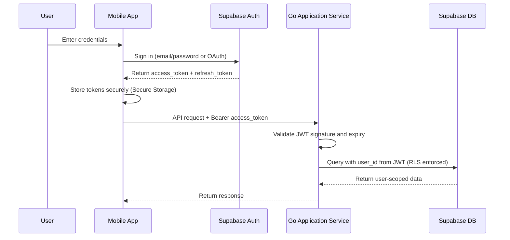
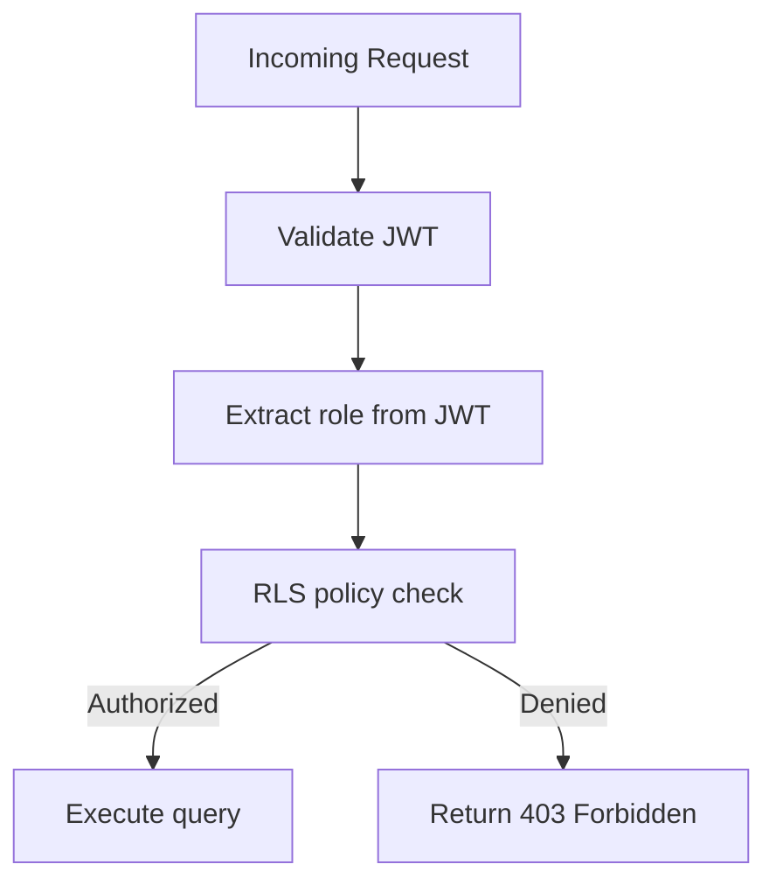
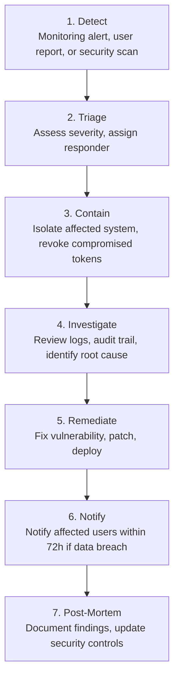
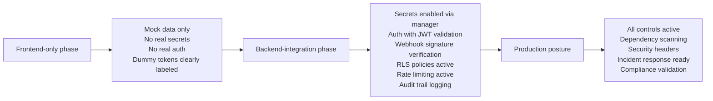

# Security Architecture And Compliance

| Field | Value |
| --- | --- |
| Project | HaloFin |
| Document Version | 2.0 |
| Status | Active |
| Last Updated | 2026-03-11 |

## Change Summary

| Date | Change |
| --- | --- |
| 2026-03-11 | Expanded from phase-based posture into full security architecture: threat model (STRIDE), data classification, encryption standards, auth flow diagram, UU PDP compliance checklist, incident response procedure, dependency scanning, and security testing. |
| 2026-03-09 | Initial version with security posture by delivery phase. |

## 1. Purpose

Dokumen ini menjelaskan security architecture HaloFin secara menyeluruh, meliputi threat model, data classification, encryption standards, auth flows, compliance requirements, dan incident response. Security posture dipecah berdasarkan delivery phase karena tidak semua kontrol relevan pada setiap tahap.

## 2. Security Principles

1. **Defense in depth** — multiple layers of security controls, bukan bergantung pada satu mekanisme.
2. **Least privilege** — setiap komponen dan user hanya mendapat akses yang benar-benar dibutuhkan.
3. **Secure by default** — default configuration harus restrictive, bukan permissive.
4. **No-credential policy** — HaloFin tidak pernah menyimpan credential finansial pengguna.
5. **Audit everything** — setiap aksi yang mengubah state atau mengakses data sensitif harus tercatat.
6. **Fail safely** — jika terjadi error, sistem default ke state yang aman (deny access, rollback transaction).

## 3. Threat Model (STRIDE Analysis)

### 3.1 Spoofing (Identity)

| Threat | Target | Likelihood | Impact | Mitigation |
| --- | --- | --- | --- | --- |
| Attacker impersonates user | Auth endpoint | Medium | High | JWT token validation, token expiration, refresh token rotation |
| Attacker impersonates consultant | Consultant app | Medium | High | Separate roles, verified badge only after admin approval |
| Stolen session token | All clients | Medium | High | Short-lived access tokens (15 min), secure storage on device |

### 3.2 Tampering (Data)

| Threat | Target | Likelihood | Impact | Mitigation |
| --- | --- | --- | --- | --- |
| Modified transaction amount | API request | Medium | Critical | Server-side validation, input sanitization, audit trail |
| Tampered webhook payload | Webhook endpoint | Medium | High | Signature verification, idempotency checks |
| Modified consent scope | Consent API | Low | High | Server-side consent validation, immutable consent records |

### 3.3 Repudiation

| Threat | Target | Likelihood | Impact | Mitigation |
| --- | --- | --- | --- | --- |
| User denies confirming transaction | Draft → Transaction flow | Medium | Medium | Audit trail with timestamp, user action logging |
| Consultant denies accessing data | ClientVault access | Low | High | Immutable access log, consent grant chain |

### 3.4 Information Disclosure

| Threat | Target | Likelihood | Impact | Mitigation |
| --- | --- | --- | --- | --- |
| Leaked financial data | Database, API responses | Medium | Critical | RLS, encryption at-rest and in-transit, sanitized logs |
| Exposed API keys in client | Mobile app | Medium | High | No API keys in client; all sensitive ops go through Go service |
| Over-exposed error messages | API responses | Medium | Medium | Generic error messages to client, detailed errors only in server logs |

### 3.5 Denial of Service

| Threat | Target | Likelihood | Impact | Mitigation |
| --- | --- | --- | --- | --- |
| API flooding | Go Application Service | Medium | High | Rate limiting (Redis), request throttle per user |
| Webhook flood | Webhook endpoint | Medium | Medium | Signature verification first, rate limit, idempotency |

### 3.6 Elevation of Privilege

| Threat | Target | Likelihood | Impact | Mitigation |
| --- | --- | --- | --- | --- |
| User accesses admin functions | Admin API | Low | Critical | Role-based access control, separate app surfaces |
| Consultant accesses other user data | ClientVault | Medium | Critical | Consent-bound data access, RLS policies |

## 4. Data Classification

| Classification | Definition | Examples | Storage Requirements |
| --- | --- | --- | --- |
| **Critical** | Data yang jika bocor menyebabkan kerugian finansial langsung | Transaction records, wallet balances, payment info | Encrypted at-rest, encrypted in-transit, RLS, audit trail |
| **Sensitive** | Data pribadi yang dilindungi regulasi | Email, nama, avatar, notification preferences | Encrypted at-rest, encrypted in-transit, access controlled |
| **Confidential** | Data bisnis internal | Consultant verification status, admin actions | Access controlled, audit trail |
| **Internal** | Data operasional non-sensitif | Feature flags, app configuration, cache data | Standard security controls |
| **Public** | Data yang bisa diakses tanpa auth | Landing page content, consultant public profile | No special controls |

### Data That Must NEVER Be Stored

1. Bank account passwords/PINs
2. Credit card numbers (full)
3. Provider auth credentials
4. Raw biometric data
5. Government ID numbers (kecuali jika ada kebutuhan KYC yang tervalidasi)

### Data That Must NEVER Be Logged

1. Auth tokens (full)
2. API keys
3. Financial account numbers (full)
4. Personal identification numbers
5. AI prompts containing personal financial detail (sanitize before logging)

## 5. Encryption Standards

| Layer | Standard | Implementation |
| --- | --- | --- |
| In-transit | TLS 1.2 minimum, TLS 1.3 preferred | Enforced on all HTTP endpoints, managed load balancer |
| At-rest (database) | AES-256 | Provided by Supabase/managed Postgres encryption |
| At-rest (storage) | AES-256 | Provided by Supabase Storage |
| At-rest (Redis) | Depends on provider | Use TLS connection to Redis; provider-managed encryption |
| Webhook signatures | HMAC-SHA256 | Verify all incoming webhooks |
| JWT tokens | RS256 or HS256 | Supabase auth default; validate server-side |

## 6. Authentication And Authorization Flow

### 6.1 End User Auth Flow

### 6.2 Token Lifecycle

| Token Type | Lifetime | Storage | Refresh |
| --- | --- | --- | --- |
| Access token | 15 minutes | Secure storage (mobile), httpOnly cookie (web) | Via refresh token |
| Refresh token | 7 days | Secure storage (mobile), httpOnly cookie (web) | Rotated on each use |

### 6.3 Role-Based Access Control

| Role | Access Scope | Auth Surface |
| --- | --- | --- |
| `end_user` | Own data only (RLS enforced), all mobile features | Mobile app |
| `consultant` | Own profile + consented client data only | Consultant app |
| `admin` | Operational data, consultant management, audit views | Admin app |

## 7. Frontend-Only Phase Security

Pada phase frontend-only:

1. Tidak boleh ada real secret production.
2. Tidak boleh ada provider credential.
3. Tidak boleh ada real auth integration.
4. Tidak boleh ada direct access ke production data.
5. Gunakan mock data, local fixtures, dan dummy tokens bila perlu untuk UI state saja.
6. Dummy tokens HARUS menggunakan format yang jelas berbeda dari production tokens.
7. No `.env` files with real secrets committed to repository.

## 8. Backend-Integration Phase Security

Saat phase backend/integration dimulai, aturan ini aktif:

1. Secret dikelola melalui secret manager atau environment management yang aman.
2. Auth integration harus mengikuti access model yang disetujui.
3. Provider webhook wajib diverifikasi signature-nya.
4. Audit trail mulai menjadi requirement implementasi, bukan sekadar target dokumen.
5. Consent enforcement menjadi bagian dari real data access path.
6. RLS policies must be implemented before any user data is accessed.
7. Rate limiting must be active on all public-facing endpoints.

## 9. Production Security Targets

1. No-credential policy untuk provider finansial.
2. Role-based access control untuk admin dan consultant.
3. Consent-based access untuk ClientVault.
4. Enkripsi in transit dan at-rest melalui managed platform dan transport aman.
5. Audit trail untuk perubahan draft, consent, booking, dan aksi administratif.
6. Automated security scanning in CI pipeline.
7. Regular dependency vulnerability scanning.
8. Security headers on all HTTP responses.

## 10. UU PDP (Personal Data Protection) Compliance Checklist

| # | Requirement | Implementation Status | Notes |
| --- | --- | --- | --- |
| 1 | **Consent** — data collection requires user consent | Planned | Auth sign-up includes consent; ConsultationSession requires explicit consent |
| 2 | **Purpose limitation** — data used only for stated purpose | Planned | Data classification defines purpose per data type |
| 3 | **Data minimization** — collect only necessary data | Planned | Minimal required fields per entity |
| 4 | **Accuracy** — data must be accurate and updatable | Planned | User can edit transactions, wallet info, profile |
| 5 | **Storage limitation** — data not kept longer than necessary | Planned | Define retention policy per data type |
| 6 | **Integrity and confidentiality** — appropriate security | Planned | Encryption, RLS, audit trail |
| 7 | **Right to access** — user can view their data | Planned | All user data accessible via mobile app |
| 8 | **Right to rectification** — user can correct data | Planned | Edit functionality on all user-entered data |
| 9 | **Right to erasure** — user can delete their data | Planned | Account deletion feature needed |
| 10 | **Right to portability** — user can export data | Planned | Data Export feature (CSV/PDF) |
| 11 | **Data breach notification** — notify within 72 hours | Planned | Incident response procedure covers this |
| 12 | **Data Protection Officer** — appoint if required | Open | Evaluate if DPO appointment is required by scale |

## 11. Incident Response Procedure

### Severity Levels

| Level | Definition | Response Time | Example |
| --- | --- | --- | --- |
| **P0 (Critical)** | Data breach, financial data exposure, complete service outage | < 30 minutes | Database leak, unauthorized fund access |
| **P1 (High)** | Partial service outage, auth failure, significant data integrity issue | < 1 hour | Payment processing down, JWT validation bypass |
| **P2 (Medium)** | Degraded service, non-critical feature failure | < 4 hours | Sync provider down, AI service timeout |
| **P3 (Low)** | Minor issue, cosmetic, no data or security impact | Next business day | UI bug, non-critical notification delay |

### Incident Response Steps

### Communication Plan

| Audience | When | Channel |
| --- | --- | --- |
| Engineering team | Immediately on detection | Internal Slack/Discord channel |
| Product Owner | Within 15 minutes of P0/P1 | Direct message + call |
| Affected users | Within 72 hours if data breach | In-app notification + email |
| Legal/Compliance | Within 24 hours if data breach | Direct communication |

## 12. Dependency Security Scanning

| Tool | Purpose | Frequency | Environment |
| --- | --- | --- | --- |
| GitHub Dependabot | Auto-detect vulnerable dependencies | Continuous | All repos |
| `govulncheck` | Go vulnerability scanning | Every CI run | Go service |
| `npm audit` / `pnpm audit` | Node.js vulnerability scanning | Every CI run | Web apps |
| `flutter pub outdated` | Dart dependency health check | Weekly | Mobile app |
| Container image scanning | Scan Docker images for CVEs | Every build | Go service |

### Rules

1. Critical and high severity vulnerabilities must be patched within 7 days.
2. Medium severity within 30 days.
3. Low severity tracked and addressed in regular maintenance.
4. No vulnerable dependency should be deployed to production knowingly.

## 13. Security Headers

All HTTP responses from Go Application Service must include:

| Header | Value | Purpose |
| --- | --- | --- |
| `Strict-Transport-Security` | `max-age=31536000; includeSubDomains` | Force HTTPS |
| `X-Content-Type-Options` | `nosniff` | Prevent MIME type sniffing |
| `X-Frame-Options` | `DENY` | Prevent clickjacking |
| `X-XSS-Protection` | `0` | Disable legacy XSS filter (use CSP instead) |
| `Content-Security-Policy` | Configured per surface | Prevent XSS and injection |
| `Referrer-Policy` | `strict-origin-when-cross-origin` | Control referrer information |

## 14. Security Phase Diagram

## 15. Security Testing

| Type | Tool | When | What to Test |
| --- | --- | --- | --- |
| Static analysis | `gosec`, ESLint security rules | Every CI run | Code-level vulnerabilities |
| Dependency scanning | Dependabot, govulncheck, npm audit | Every CI run | Known CVEs in dependencies |
| API security testing | Manual + automated scripts | Before each release | Auth bypass, injection, IDOR |
| Penetration testing | External vendor | Before production launch | Full application security |
| RLS policy testing | Integration tests | Every CI run | Data isolation between users |

## 16. Security Risks To Watch

1. Dummy credential atau sample secret masuk ke repo saat frontend-only phase.
2. Provider integration diuji terlalu dini tanpa security controls siap.
3. Consent rule baru dipikirkan setelah consultant flow sudah dibangun.
4. RLS policies tidak diuji dengan cross-user test scenarios.
5. Audit trail gaps mempersulit incident investigation.
6. Push notification tokens exposed or leaked.
7. Currency rate provider API key exposed in client-side code.
8. AI provider receiving unsanitized user financial data.
