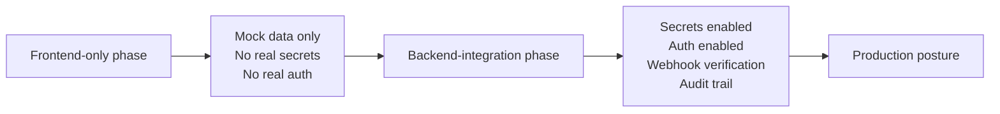

# Security Posture By Delivery Phase

| Field | Value |
| --- | --- |
| Project | HaloFin |
| Document Version | 1.0 |
| Status | Active |
| Last Updated | 2026-03-09 |

## 1. Purpose

Dokumen ini menjelaskan security posture HaloFin berdasarkan delivery phase, bukan hanya target production state.

## 2. Frontend-Only Phase Security

Pada phase frontend-only:

1. Tidak boleh ada real secret production.
2. Tidak boleh ada provider credential.
3. Tidak boleh ada real auth integration.
4. Tidak boleh ada direct access ke production data.
5. Gunakan mock data, local fixtures, dan dummy tokens bila perlu untuk UI state saja.

## 3. Backend-Integration Phase Security

Saat phase backend/integration dimulai, aturan ini aktif:

1. Secret dikelola melalui secret manager atau environment management yang aman.
2. Auth integration harus mengikuti access model yang disetujui.
3. Provider webhook wajib diverifikasi.
4. Audit trail mulai menjadi requirement implementasi, bukan sekadar target dokumen.
5. Consent enforcement menjadi bagian dari real data access path.

## 4. Production Security Targets

1. No-credential policy untuk provider finansial.
2. Role-based access control untuk admin dan consultant.
3. Consent-based access untuk ClientVault.
4. Enkripsi in transit dan at-rest melalui managed platform dan transport aman.
5. Audit trail untuk perubahan draft, consent, booking, dan aksi administratif.

## 5. Security Phase Diagram

## 6. Security Risks To Watch

1. Dummy credential atau sample secret masuk ke repo saat frontend-only phase.
2. Provider integration diuji terlalu dini tanpa security controls siap.
3. Consent rule baru dipikirkan setelah consultant flow sudah dibangun.
