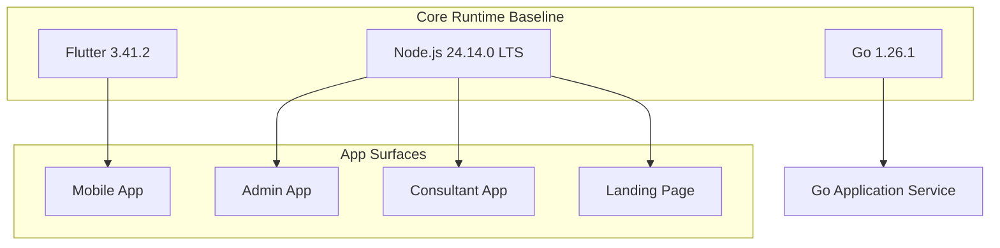
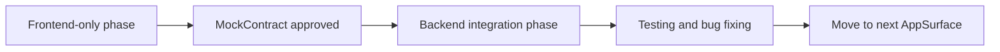
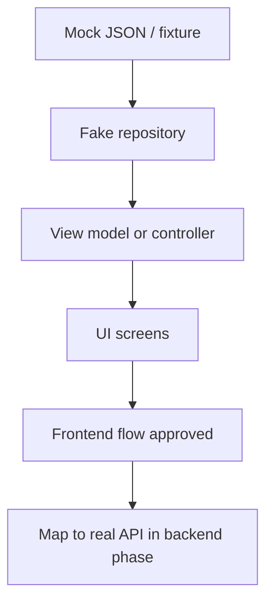

# Technology Stack

| Field | Value |
| --- | --- |
| Project | HaloFin |
| Document Version | 2.2 |
| Status | Baseline For Phase-Based MVP Delivery |
| Last Updated | 2026-03-09 |
| Audience | Engineering, DevOps, AI Coding Agent |

## Change Summary

| Date | Change |
| --- | --- |
| 2026-03-09 | Synced mobile stack capabilities and concrete mock surfaces with frontend-approved mobile screen clusters. |
| 2026-03-09 | Split stack by app surface, added phase usage rules, mocking strategy, and delivery compatibility rules. |
| 2026-03-08 | Rewrote tech stack as a compatibility matrix, pinned core runtime baselines, separated selected versus candidate tools, and added upgrade policy. |

## 1. How To Read This Document

Dokumen ini adalah sumber tunggal untuk keputusan teknologi yang signifikan pada MVP. Prinsip utamanya:

1. Runtime dan framework inti dipin di dokumen ini.
2. Managed platform dan provider eksternal ditulis dengan status keputusan yang jujur.
3. Library sekunder harus tetap dipin di manifest proyek saat repo aplikasi dibuat.
4. Stack harus dibaca bersama delivery phase, bukan hanya sebagai daftar tool global.
5. Jika ada konflik antara dokumen ini dan lockfile masa depan, lockfile adalah source of truth operasional, lalu dokumen ini harus diperbarui.

## 2. Canonical Delivery Terms

| Term | Meaning |
| --- | --- |
| `AppSurface` | Salah satu aplikasi: `mobile`, `admin`, `consultant`, `landing` |
| `DeliveryPhase` | Fase delivery resmi yang sedang aktif |
| `MockContract` | Placeholder request or response yang dipakai frontend sebelum backend implementation |
| `Frontend-Only Phase` | Fase saat UI dan mock state dikerjakan tanpa backend implementation |
| `Backend-Integration Phase` | Fase saat backend, auth, database, dan provider integration mulai dikerjakan |

## 3. Versioning Policy

| Rule | Policy |
| --- | --- |
| Core runtimes | Pin exact version di dokumen ini |
| Managed services | Catat mode penggunaan dan version policy, bukan angka semu |
| App dependencies | Pin exact version di manifest dan lockfile tiap app |
| Upgrades | Hanya naik minor atau patch setelah lulus smoke test lint, test, build, dan integrasi inti |
| Breaking upgrade | Wajib update dokumen ini, changelog, dan compatibility notes |

## 4. Core Environment Baseline

Versi di bawah adalah baseline yang harus dipakai saat bootstrap proyek aplikasi dilakukan.

| Environment | Baseline | Status | Notes |
| --- | --- | --- | --- |
| Flutter SDK | `3.41.2` | Selected | Gunakan channel stable |
| Dart SDK | Bundled with Flutter `3.41.2` | Selected | Jangan pin terpisah sebelum toolchain final dipilih |
| Node.js | `24.14.0` LTS | Selected | Baseline untuk seluruh app web dan JS tooling |
| Go | `1.26.1` | Selected | Baseline untuk application service |
| Docker Desktop / Engine | Record actual installed version at team bootstrap | Selected | Wajib konsisten per tim, tetapi bukan bagian dari shipped runtime |

## 5. Repository And Package Management

| Decision | Choice | Status | Notes |
| --- | --- | --- | --- |
| Repository model | Single repository with app-per-directory layout | Selected | `apps/mobile`, `apps/admin`, `apps/consultant`, `apps/landing`, `services/api`, `docs` |
| JS package manager | `pnpm` | Selected | Exact CLI version dicatat di field `packageManager` saat web apps dibuat |
| Go package manager | Go modules | Selected | Gunakan standard tooling Go |
| Flutter package manager | `pub` | Selected | Ikuti tooling resmi Flutter |
| Dependency update policy | Manual and reviewed | Selected | Tidak ada auto-merge dependency upgrade untuk MVP |

## 6. Phase Usage Rules

Aturan ini menentukan stack mana yang boleh dipakai pada fase tertentu.

### 6.1 `mobile_frontend`

Allowed:

1. Flutter UI layer
2. Navigation
3. State management
4. Mock repositories
5. Local fixtures
6. MockContract placeholders

Not allowed:

1. Backend implementation
2. Real Supabase integration
3. Real provider integration
4. Production secret handling

### 6.2 `mobile_backend_integration`

Allowed:

1. Go service implementation
2. Supabase integration
3. Auth integration
4. Provider integration
5. Mapping MockContract ke real API

### 6.3 Subsequent Web Phases

Setelah mobile selesai, pola yang sama dipakai ulang untuk `admin`, `consultant`, lalu `landing`.

## 7. AppSurface Stack Matrix

| AppSurface | UI Framework | State Strategy | Data Strategy During FE Phase | Data Strategy During Integration |
| --- | --- | --- | --- | --- |
| `mobile` | Flutter | Riverpod-first | Local state, mock repositories, fixtures | Real API and auth integration |
| `admin` | Next.js | Query-first, minimal client state | Mock contracts and dashboard fixtures | Real API and role-based access |
| `consultant` | Next.js | Query-first, minimal client state | Mock contracts and consent-driven fixtures | Real API and consent-backed data |
| `landing` | Next.js | Mostly static | Static content and local copy source | Optional CMS or internal content source later |

## 8. Mobile Stack

| Layer | Technology | Baseline | Status | Notes |
| --- | --- | --- | --- | --- |
| Framework | Flutter | `3.41.2` | Selected | Single codebase untuk Android dan iOS |
| State management | `flutter_riverpod` | `3.2.1` | Selected | Compile-safe, testable, cocok untuk feature-first architecture |
| Navigation | `go_router` | `17.1.0` | Selected | Deep linking dan nested route support |
| Networking abstraction | Interface plus mock repository | Selected | Pada phase frontend-only jangan pakai client real ke backend |
| Real networking | `dio` | Pin in manifest at bootstrap | Selected | Aktif pada phase backend/integration |
| Local database | `drift` | Pin in manifest at bootstrap | Selected | Aktif bila butuh local relational store saat integration |
| Forms | `flutter_form_builder` | Pin in manifest at bootstrap | Candidate | Pakai jika form complexity benar-benar membutuhkan |
| Error monitoring | Sentry Flutter SDK | Pin in manifest at bootstrap | Selected | Aktif minimal pada staging dan production |

### Mobile Notes

1. Riverpod menjadi standar dependency injection ringan; `get_it` tidak dipilih sebagai baseline awal.
2. Draft review flow dan wallet state harus dimodelkan sebagai domain-first state, bukan widget-local state.
3. Pada fase `mobile_frontend`, seluruh external dependency diproksi lewat mock repository atau local adapters.
4. Mobile phase aktif membutuhkan dukungan UI untuk dashboard card-heavy, segmented tabs pada planning cluster, filter chips, search state, sticky CTA bar, dan dense list or card layout.
5. `wallet` route harus mampu menampilkan `asset distribution` sebagai konten screen tanpa mengubah label navigasi final `Wallet`.

## 9. Admin App Stack

| Layer | Technology | Baseline | Status | Notes |
| --- | --- | --- | --- | --- |
| Framework | Next.js | `16.1.1` | Selected | App Router only |
| Language | TypeScript | Strict mode | Selected | Pin exact version di `package.json` |
| Styling | Tailwind CSS | `4.1` | Selected | Shared styling baseline untuk seluruh app web |
| Server state | `@tanstack/react-query` | `5.x` with exact package pin | Selected | Query-first approach |
| Client state | `zustand` | Pin in manifest at bootstrap | Candidate | Hanya jika dashboard state menjadi kompleks |
| UI kit approach | `shadcn/ui` | Pin generated dependencies at bootstrap | Selected | In-repo components |

## 10. Consultant App Stack

| Layer | Technology | Baseline | Status | Notes |
| --- | --- | --- | --- | --- |
| Framework | Next.js | `16.1.1` | Selected | App Router only |
| Language | TypeScript | Strict mode | Selected | Consistent with admin app |
| Styling | Tailwind CSS | `4.1` | Selected | Shared visual baseline |
| Server state | `@tanstack/react-query` | `5.x` with exact package pin | Selected | Consent-backed data screens |
| Client state | Minimal client state first | Selected | Jangan mulai dengan global store berat |
| Charts | `recharts` | Pin in manifest at bootstrap | Candidate | Aktif bila consultant membutuhkan visualisasi data |

## 11. Landing Page Stack

| Layer | Technology | Baseline | Status | Notes |
| --- | --- | --- | --- | --- |
| Framework | Next.js | `16.1.1` | Selected | Tetap satu keluarga stack dengan app web lain |
| Styling | Tailwind CSS | `4.1` | Selected | Shared utility baseline |
| State strategy | Mostly static | Selected | Hindari complexity yang tidak perlu |
| CMS integration | Deferred | Deferred | Hanya dipilih jika kebutuhan konten bertambah |

## 12. Backend Stack

| Layer | Technology | Baseline | Status | Notes |
| --- | --- | --- | --- | --- |
| Runtime | Go | `1.26.1` | Selected | Standard library tetap menjadi default pertama |
| HTTP framework | `gin-gonic/gin` | Pin in `go.mod` at bootstrap | Candidate | Dipakai hanya jika kebutuhan middleware melebihi `net/http` |
| Database driver | `pgx/v5` | Pin in `go.mod` at bootstrap | Selected | Driver Postgres utama |
| Query layer | `sqlc` | Pin in `go.mod` at bootstrap | Selected | Raw SQL plus generated type-safe access |
| Logging | `uber-go/zap` | Pin in `go.mod` at bootstrap | Selected | Structured JSON logging |
| Auth token validation | `golang-jwt/jwt` | Pin in `go.mod` at bootstrap | Selected | Untuk verifikasi token yang diterima service |
| AI SDK | `google.golang.org/genai` | Pin in `go.mod` at bootstrap | Selected | Gantikan SDK Gemini lama |
| Payment client | Provider-specific SDK or hardened HTTP client | Candidate | Putuskan setelah payment gateway final dipilih |
| Provider client | Hardened HTTP client | Selected | Lebih aman sampai provider final dipilih |
| Rate limiting and cache | Redis client pinned in `go.mod` | Selected | Library spesifik dipilih saat bootstrap service |

### Backend Notes

1. Jangan meng-hardcode nama model AI di kode atau dokumen tech stack; model dipilih lewat runtime configuration.
2. Mulai dari `net/http` adalah opsi valid. `gin` hanya dipromosikan menjadi selected jika ada alasan nyata.
3. Query bisnis finansial harus tinggal di SQL yang dapat direview, bukan ORM-heavy abstraction.
4. Backend baru aktif sebagai implementation target saat phase integration dimulai.

## 13. Data And Platform Stack

| Capability | Technology | Baseline | Status | Notes |
| --- | --- | --- | --- | --- |
| Primary data platform | Supabase managed platform | Managed service | Selected | Auth, Postgres, Realtime, Storage |
| Postgres version | Record exact major version at project provisioning | Selected | Jangan menulis `15+` atau angka tak terverifikasi |
| Local platform tooling | Supabase CLI | Minimum `1.69.0`, exact version pinned once repo exists | Selected | Dipakai untuk init, migrations, and local workflows |
| Row level access | Supabase RLS | Managed capability | Selected | Wajib untuk data multi-tenant |
| Realtime | Supabase Realtime | Managed capability | Selected | Untuk update draft, chat, dan booking event |
| Object storage | Supabase Storage | Managed capability | Selected | Untuk receipt image dan berkas pendukung |
| Cache / rate limit | Redis | Provider chosen at infra setup | Selected | Upstash atau Redis Cloud tetap candidate provider |
| Database extensions | `pgvector`, `pg_cron` | Enable only when needed | Deferred | Jangan aktifkan sebelum ada use case jelas |

## 14. Mocking Strategy

Mocking strategy adalah bagian resmi dari tech stack, bukan workaround sementara.

### Approved Mocking Techniques

1. Mock JSON fixture
2. Fake repository implementation
3. Local in-memory data source
4. UI state adapters untuk loading, error, empty, success
5. Placeholder request and response contracts

### Rules

1. Mocking dipakai pada frontend-only phase.
2. Mocking harus meniru intent API yang realistis, bukan sekadar data acak.
3. Setelah integration phase dimulai, mock contract menjadi referensi backend mapping.

### Frontend-Approved Mock Surfaces

1. `dashboard_summary`
2. `recent_activity_preview`
3. `expert_help_preview`
4. `wallet_list`
5. `asset_distribution`
6. `budget_summary`
7. `budget_category_list`
8. `goal_list`
9. `bills_summary`
10. `bills_list`
11. `consultant_list`
12. `consultant_detail`
13. `transaction_create`
14. `transaction_history_query`

## 15. Delivery Compatibility Rules

1. Frontend contracts harus stabil sebelum backend implementation aktif.
2. Jika backend membutuhkan perubahan shape data, perubahan itu harus kembali disetujui di level frontend contract.
3. App surface berikutnya tidak boleh dimulai bila app surface aktif belum menyelesaikan testing and bug fixing sesuai target phase.
4. Shared web stack boleh dipakai ulang, tetapi delivery tetap berurutan per app surface.

## 16. Testing, Quality, And CI Baseline

| Area | Tooling | Status | Notes |
| --- | --- | --- | --- |
| Mobile unit/widget test | Flutter test tooling | Selected | Wajib untuk domain logic dan core UI states |
| Mobile integration test | `integration_test` | Selected | Untuk flow draft review dan provider connection happy path |
| Web unit/component test | Vitest plus Testing Library | Selected | Exact package versions dipin di web manifest |
| Web end-to-end test | Playwright | Selected | Untuk admin dan consultant workflow |
| Go test | Standard `testing` plus `httptest` | Selected | Default first choice |
| API integration test | Testcontainers or sandbox-backed integration suite | Candidate | Dipilih saat service repo dibuat |
| Lint and format | Flutter format/analyze, ESLint, Prettier, `gofmt`, `go vet` | Selected | Semua harus jalan di CI |
| CI platform | GitHub Actions | Selected | Pipeline minimal: lint, test, build |

## 17. Upgrade Guardrails

1. Patch upgrade boleh dilakukan jika semua lint, test, build, dan smoke flow lulus.
2. Minor upgrade framework inti harus diuji di staging sebelum dipromosikan.
3. Major upgrade hanya boleh dilakukan dengan compatibility note tertulis.
4. Jika vendor candidate berubah menjadi selected, dokumen ini wajib diperbarui pada hari yang sama.

## 18. Bootstrap Checklist

Saat repo aplikasi mulai dibuat, lakukan ini agar dokumen dan implementasi tetap sinkron:

1. Pin exact package versions di `pubspec.yaml`, `package.json`, dan `go.mod`.
2. Tambahkan `packageManager` untuk workspace web saat `pnpm` diinisialisasi.
3. Catat exact Postgres major version dan enabled extensions pada project Supabase yang dipakai.
4. Putuskan provider finansial dan payment gateway primary atau fallback.
5. Tetapkan app-per-directory layout sesuai app surface yang direncanakan.
6. Pastikan seluruh tim memahami phase aktif dan stack yang boleh dipakai pada phase tersebut.
