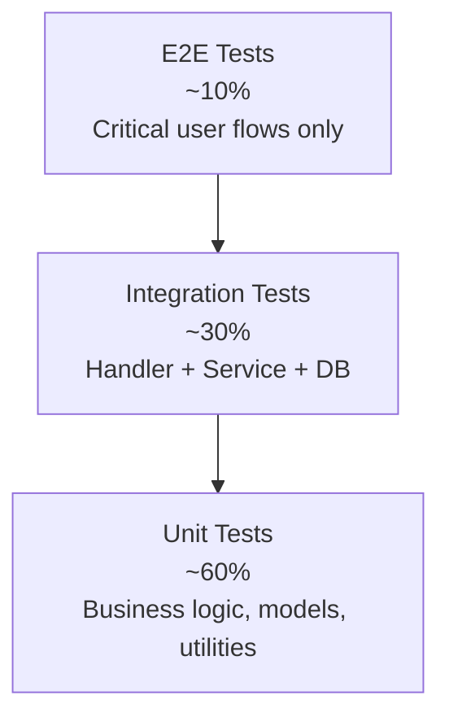
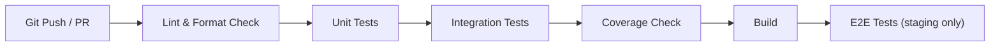

# Testing Strategy

| Field | Value |
| --- | --- |
| Project | HaloFin |
| Document Version | 1.0 |
| Status | Active |
| Last Updated | 2026-03-11 |

## 1. Purpose

Dokumen ini menetapkan strategi testing HaloFin lintas semua app surfaces dan backend service. Testing bukan afterthought; ia adalah bagian integral dari setiap delivery phase.

## 2. Testing Principles

1. **Test what matters** — prioritaskan testing pada logic finansial, state transitions, dan data integrity.
2. **Fast feedback** — unit tests harus berjalan dalam detik, bukan menit.
3. **Realistic mocks** — mock harus menyerupai behavior nyata, bukan sekadar happy path.
4. **Test isolation** — setiap test independent, tidak bergantung pada test lain.
5. **CI-enforced** — semua tests harus lulus sebelum merge.

## 3. Test Pyramid



| Level | Coverage Focus | Speed | Maintenance Cost |
| --- | --- | --- | --- |
| Unit | Pure functions, business logic, model validation | Fast (ms) | Low |
| Integration | Service + Repository + DB, API request/response | Medium (seconds) | Medium |
| E2E | Full user flow across UI and API | Slow (minutes) | High |

## 4. Testing Per Surface

### 4.1 Mobile (Flutter)

| Type | Tool | Target | Coverage Target |
| --- | --- | --- | --- |
| Unit test | Flutter `test` | Domain models, Riverpod providers, business logic | > 80% for domain layer |
| Widget test | Flutter `test` | Individual components, screen rendering, state display | All critical components |
| Integration test | `integration_test` | End-to-end flows with mock backend | Happy path for all core journeys |

#### What To Test

1. **Balance calculations** — wallet balance after transaction create, transfer, void.
2. **Draft state transitions** — review_needed → confirmed/rejected/cancelled.
3. **Budget tracking** — spent calculation, over-budget detection.
4. **Notification badge** — count update when new notification arrives.
5. **Currency display** — correct formatting per currency type.
6. **Onboarding flow** — step progression, skip behavior, state persistence.
7. **Report aggregation** — correct income/expense calculation per period.

#### Mocking Strategy (Mobile)

1. **Repository pattern** — every data source behind an interface; mock implementation for tests.
2. **Riverpod overrides** — use `ProviderContainer` overrides for test isolation.
3. **Never mock Riverpod internals** — mock the data source, not the provider.

### 4.2 Web Apps (Next.js — Admin, Consultant, Landing)

| Type | Tool | Target | Coverage Target |
| --- | --- | --- | --- |
| Unit/Component | Vitest + Testing Library | React components, hooks, utility functions | > 70% for shared components |
| Integration | Vitest + MSW (Mock Service Worker) | API integration, query/mutation flows | Critical CRUD flows |
| E2E | Playwright | Full browser workflows | Admin consultant verification, consultant session management |

### 4.3 Backend (Go Service)

| Type | Tool | Target | Coverage Target |
| --- | --- | --- | --- |
| Unit | `testing` | Service layer, business logic, model validation | > 80% for service layer |
| Integration | `testing` + `httptest` | Handler → Service → Repository | All critical endpoints |
| Database | Testcontainers | SQL queries, migrations | All sqlc-generated queries |
| Adapter | `testing` + mocks | External provider error handling | All adapter methods |

#### What To Test (Backend)

1. **Financial calculations** — balance update correctness, no double-counting.
2. **Draft deduplication** — provider_event_id uniqueness enforcement.
3. **RLS simulation** — test that user A cannot access user B's data.
4. **Error handling** — every error code has a test.
5. **Rate limiting** — Redis-backed limits enforced correctly.
6. **Consent enforcement** — consultant access blocked without active consent.
7. **Notification rules** — correct trigger conditions, no spam.

## 5. Test Data Strategy

| Principle | Implementation |
| --- | --- |
| Fresh per test | Each test creates its own data; no shared fixtures between tests |
| Realistic shape | Test data matches production data shape and constraints |
| Deterministic | No random data that could cause flaky tests |
| Namespaced | Test data uses recognizable prefixes (`test_`, `fixture_`) for easy cleanup |

### Test Factories

```go
// Example Go test factory
func NewTestUser(t *testing.T) *model.User {
    return &model.User{
        UserID:      uuid.New(),
        Email:       fmt.Sprintf("test_%s@halofin.test", uuid.New().String()[:8]),
        DisplayName: "Test User",
        PreferredCurrency: "IDR",
    }
}
```

```dart
// Example Flutter test factory
User createTestUser({String? name}) => User(
    id: const Uuid().v4(),
    email: '${const Uuid().v4().substring(0, 8)}@test.com',
    displayName: name ?? 'Test User',
    preferredCurrency: 'IDR',
);
```

## 6. Coverage Targets

| Surface | Layer | Target | Enforced In CI |
| --- | --- | --- | --- |
| Mobile | Domain/Service | > 80% | Yes |
| Mobile | UI Components | > 60% | Yes |
| Web Apps | Shared Components | > 70% | Yes |
| Backend | Service Layer | > 80% | Yes |
| Backend | Handler Layer | > 60% | Yes |
| Backend | Repository (sqlc) | > 90% | Yes |

Coverage thresholds are enforced in CI. PR cannot merge if coverage drops below threshold.

## 7. CI Testing Pipeline



### Pipeline Rules

1. All tests must pass before merge.
2. Coverage must not decrease from baseline.
3. Lint and format errors are blocking.
4. E2E tests run on staging deployment only, not on every PR.
5. Test duration target: < 5 minutes for unit + integration in CI.

## 8. Mocking Boundaries

| What To Mock | When | How |
| --- | --- | --- |
| External AI provider | Always in tests | Mock adapter returns predefined response |
| External payment provider | Always in tests | Mock adapter simulates success/failure |
| External sync provider | Always in tests | Mock adapter returns sample webhook payload |
| Database | Unit tests only | In-memory implementation or mock repository |
| Database | Integration tests | Real database (Testcontainers) |
| Redis | Unit tests only | In-memory implementation |
| Redis | Integration tests | Real Redis (Testcontainers) |
| Auth (Supabase) | Frontend tests | Mock auth state via provider override |
| Auth (Supabase) | Backend tests | Generate test JWT tokens locally |

## 9. Testing Anti-Patterns To Avoid

1. ❌ Testing implementation details instead of behavior.
2. ❌ Shared mutable state between tests.
3. ❌ Sleeping to wait for async operations (use proper async utilities).
4. ❌ Testing library internals (Riverpod internals, React Query internals).
5. ❌ Snapshot tests for frequently changing UI (use explicit assertions).
6. ❌ E2E tests for edge cases (use unit tests).
7. ❌ Mocking things you don't own without also having integration tests.

## 10. Pre-Release Testing Checklist

Before each release to staging/production:

1. [ ] All unit tests pass.
2. [ ] All integration tests pass.
3. [ ] Coverage thresholds met.
4. [ ] E2E tests pass on staging.
5. [ ] Manual smoke test of critical flows (onboarding, transaction create, draft review, booking).
6. [ ] Performance profiling shows no regression.
7. [ ] Security scan shows no new vulnerabilities.
